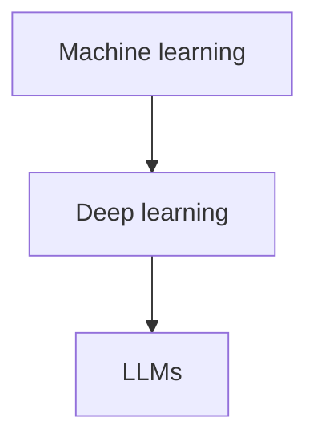

AI101 — visão geral
**Inteligência artificial** neste curso abrange **o uso de AI no trabalho diário**, **aprendizado de máquina**, **aprendizado profundo** e **LLMs** — desde sugestões práticas até como os modelos funcionam.

## Mapa de AI101

| Submenu | Foco | Público |
|--------|--------|----------|
| [**AI Engenharia**](ai-engineering/i-overview.md) | Solicitações, agentes, ferramentas, habilidades, assistentes personalizados, confiança | **Todos que usam ChatGPT, Claude, Cursor, Copilot** |
| [Aprendizado de máquina](machine-learning/i-overview.md) | Supervisionado/não supervisionado, avaliação, recursos | Construtores e leitores curiosos |
| [Aprendizagem profunda](deep-learning/i-overview.md) | Redes neurais, CNNs, RNNs, transformadores | Profundidade técnica |
| [LLMs](llms/i-overview.md) | Pré-treinamento, alinhamento, RAG, ajuste fino | Engenheiros integrando LLMs |

##Qual caminho seguir

```mermaid
flowchart LR
  Start[Your goal] --> Applied[AI Engineering]
  Start --> ML[Machine learning]
  ML --> DL[Deep learning]
  DL --> LLM[LLMs]
  LLM --> RAG[RAG patterns]
```

| Você quer… | Comece aqui |
|-------------|------------|
| Escreva avisos melhores, use agentes e mantenha-se seguro | [AI Visão geral da engenharia](ai-engineering/i-overview.md) |
| Aprenda sklearn, métricas, fluxos de trabalho | [Visão geral do aprendizado de máquina](machine-learning/i-overview.md) |
| Entenda os transformadores e GPT | [Aprendizagem profunda](deep-learning/i-overview.md) → [LLMs](llms/i-overview.md) |

## Ordem de estudo (faixa técnica)

Use **AI Engineering** em paralelo ou primeiro se você interage principalmente com produtos, e não treina modelos.

## Como isso se relaciona com outras faixas

| Acompanhar | Sobreposição |
|-------|---------|
| [Python](../../swe101/python/i-basics-and-syntax.md) | pandas, scikit-learn, PyTorch |
| [Projeto do sistema](../../swe101/sysdesign/i-core-building-blocks.md) | Servindo modelos, RAG, índices de pesquisa |
| [CS101 estruturas de dados](../../CS101/data-structures/i-array.md) | Vetores, matrizes intuição |

**Relacionado:** [Solicitação de loop](ai-engineering/loop-prompting/i-overview.md), [Habilidades e instruções do agente](ai-engineering/skills-and-agent-instructions/i-overview.md), [Solicitação eficaz](ai-engineering/effective-prompting/i-overview.md), [Agentes e fluxos de trabalho de agentes](ai-engineering/agents-and-agentic-workflows/i-overview.md).
