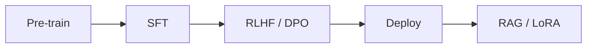

LLMs — visão geral
**Modelos de linguagem grande (LLMs)** são **transformadores somente decodificadores muito grandes** treinados em texto massivo para **prever o próximo token**. Após o pré-treinamento, **alinhamento** e **solicitações** tornam-nos assistentes úteis; **RAG** e **ajuste fino** adicionam conhecimento do domínio.

Pré-requisitos: [Transformadores e atenção](../deep-learning/iv-transformers-and-attention.md), [Avaliação de aprendizado de máquina](../machine-learning/iv-model-evaluation-and-metrics.md).

**Usando ChatGPT/Claude diariamente?** Consulte [AI Aplicado](../ai-engineering/i-overview.md) para orientações práticas, agentes e confiança - este submenu é **como LLMs funciona e envia produtos**.

## Mapa deste submenu

| Parte | Tópico |
|------|--------|
| **I — Visão geral** | Ciclo de vida LLM em uma página |
| **II — Pré-treinamento e tokenização** | Objetivo causal LM, escala, BPE, janela de contexto |
| **III — Alinhamento (SFT, RLHF, DPO)** | Comportamento útil, inofensivo e honesto |
| **IV — Engenharia imediata** | Zero/poucos disparos, CoT, funções, resultados estruturados |
| **V — RAG e ajuste fino** | Conhecimento de domínio sem reciclagem completa |
| **VI — Segurança e produção** | Injeção, monitoramento, serviço |

## LLM ciclo de vida

| Palco | Dados | Saída |
|-------|------|--------|
| **Pré-treinamento** | Texto em escala web | Modelo básico – conclusão, não bate-papo |
| **SFT** | Pares de perguntas e respostas selecionados | Segue instruções |
| **RLHF / DPO** | Classificações de preferência humana | Tom mais seguro e útil |
| **Produção** | Seus documentos + instruções | Respostas específicas do domínio |

## Modelos abertos vs fechados

| | Pesos abertos (Llama, Mistral) | API-somente (GPT-4, Claude) |
|---|---------------|-----------------------|
| **Implantar** | Auto-hospedeiro, ajuste fino | Anfitriões de fornecedores |
| **Custo** | Infra + operações | Por token |
| **Controle** | Completo | Limitado |

## Próximo

Continue com [Pré-treinamento e tokenização](ii-pretraining-and-tokenization.md).

**Relacionado:** [Visão geral do aprendizado profundo](../deep-learning/i-overview.md), [Solicitar pesquisa CDC](../../swe101/sysdesign/examples/viii-order-search-cdc.md) (padrão de índice RAG).
