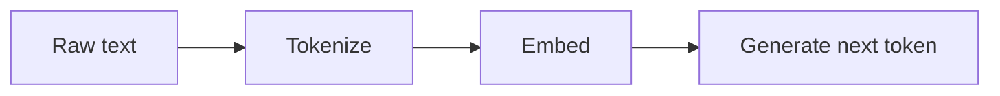

Pré-treinamento e tokenização
**Pré-treinamento** ensina um transformador a modelar texto por meio da **previsão do próximo token**. **Tokenização** mapeia texto bruto para **IDs de subpalavras** que o modelo consome.

## 1. Modelagem de linguagem causal

Dados os tokens **[t₁,…, tₙ]**, preveja **tₙ₊₁** (somente decodificador, da esquerda para a direita).

Perda = entropia cruzada sobre o vocabulário em cada posição. Treinado em **trilhões de tokens** → habilidades emergentes (raciocínio, código, multilíngue).

## 2. Leis de escala

O desempenho melhora de forma previsível com:

| Botão | Efeito |
|------|--------|
| **Parâmetros** | Capacidade |
| **Dados** | Cobertura |
| **Cálculo** | Etapas de treinamento |

Modelos maiores precisam de mais dados e FLOPs – as execuções de treinamento usam milhares de GPUs durante semanas.

## 3. Tokenização — BPE

**Codificação de pares de bytes:** mescla pares frequentes de bytes/caracteres → **subpalavra** vocabulário (30k–100k tokens).

| Texto | Tokens (exemplo) |
|------|------------------|
|`"tokenization"`|`["token", "ization"]`|
| Palavras raras | Dividido em pedaços conhecidos |

**Implicações:**

| Tópico | Detalhe |
|-------|--------|
| **Faturamento** | API custa frequentemente por **token**, não por palavra |
| **Limite de contexto** | Máximo de **tokens** na janela |
| **Erros de digitação/unicode** | Pode dividir-se estranhamente – afeta a robustez |

## 4. Janela de contexto

O modelo máximo de tokens atende de uma só vez – historicamente 2K – 4K; modelos modernos **128K–1M+** (com custo).

| Uso de contexto longo | Padrão |
|------------------|---------|
| Perguntas e respostas do documento completo | Documento de material + pergunta no prompt |
| Documentos muito longos | [RAG](v-rag-and-fine-tuning.md) — recuperar pedaços |

## 5. Modelo base versus modelo de instrução

| Modelo | Comportamento |
|-------|-----------|
| **Base** | Continua o texto – não é seguro para bate-papo |
| **Instruir / conversar** | Após SFT + alinhamento — segue as mensagens do usuário |

Sempre use pontos de verificação de **instrução** para produtos, a menos que você controle cuidadosamente as solicitações.

## 6. Perguntas de ensaio

- Qual é o objetivo de pré-treinamento dos modelos estilo GPT?
- Por que tokenização de subpalavras versus um token por palavra?
- Base vs instrução — qual para um bot de suporte ao cliente?

**Relacionado:** [Alinhamento](iii-alignment-sft-rlhf-dpo.md), [Transformadores](../deep-learning/iv-transformers-and-attention.md).
