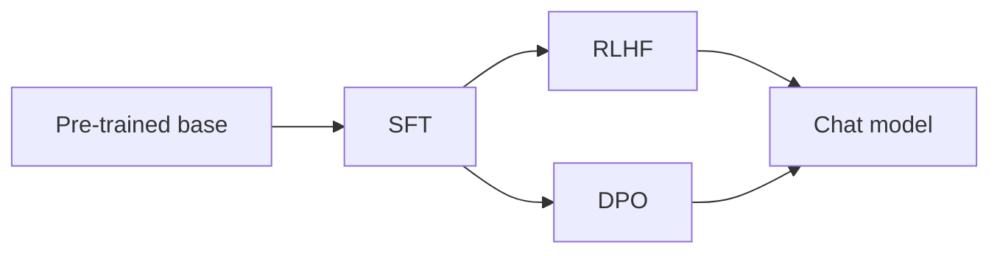

Alinhamento — SFT, RLHF e DPO
Modelos pré-treinados prevêem texto **provável** — não necessariamente **útil** ou **seguro**. **Alinhamento** treina o comportamento que os usuários esperam dos assistentes.

## 1. Ajuste fino supervisionado (SFT)

Ajuste os pares selecionados **(instrução, resposta)**.

| Entrada | Resposta alvo |
|-------|-----------------|
| "Resuma este artigo…" | Bom resumo |
| "Escreva SQL para…" | Consulta válida |

Ensina **formato** e **acompanhamento de tarefas** — base dos modelos de chat.

## 2. RLHF - Aprendizagem por reforço com feedback humano

| Etapa | Ação |
|------|--------|
| 1 | Modelo gera múltiplas respostas |
| 2 | **Classificação de humanos** resultados |
| 3 | Treinar **modelo de recompensa** em rankings |
| 4 | Ajuste LLM com **PPO** para maximizar a recompensa |

| Prós | Contras |
|------|------|
| Alinha-se com as preferências humanas | Etiquetas caras; risco de hacking de recompensa |
| Melhora o tom de segurança | Pipeline complexo (OpenAI, variantes de uso antrópico) |

## 3. DPO — Otimização de preferência direta

Treine diretamente em pares **(solicitados, escolhidos, rejeitados)** — **sem modelo de recompensa separado**.

| versus RLHF | DPO |
|--------|-----|
| Gasoduto | Mais simples – perda de preferência na política |
| Estabilidade | Muitas vezes mais fácil de reproduzir em pesquisas |

Comum em receitas de alinhamento de código aberto.

## 4. O que o alinhamento não corrige

| Limite | Mitigação |
|-------|------------|
| **Erros factuais** | RAG, ferramentas, revisão humana |
| **Conhecimento obsoleto** | RAG, ferramentas de navegação |
| **Jailbreaks** | Guarda-corpos em camadas, monitoramento |
| **Dados privados em pesos** | Não treine com segredos; usar RAG |

## 5. Avaliação além da perda

| Tipo de métrica | Exemplo |
|------------|---------|
| **Benchmarks automatizados** | MMLU, HumanEval (código) |
| **Avaliação humana** | Prestatividade, inocuidade |
| **Equipe vermelha** | Alertas adversários |

O mesmo espírito da [avaliação ML](../machine-learning/iv-model-evaluation-and-metrics.md) – escolha métricas vinculadas ao risco do produto.

## 6. Perguntas de ensaio

- SFT vs RLHF — o que cada um adiciona?
- Por que um modelo com baixa perda de treinamento ainda pode dar respostas ruins?
- O que DPO está simplificando em comparação com RLHF?

**Relacionado:** [Engenharia imediata](iv-prompt-engineering.md), [Segurança e produção](vi-safety-and-production.md).
