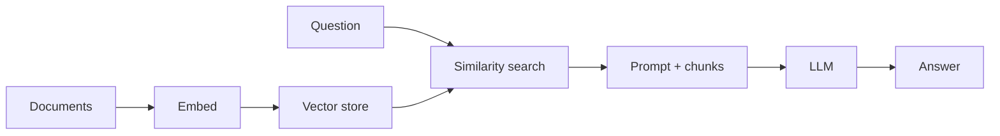
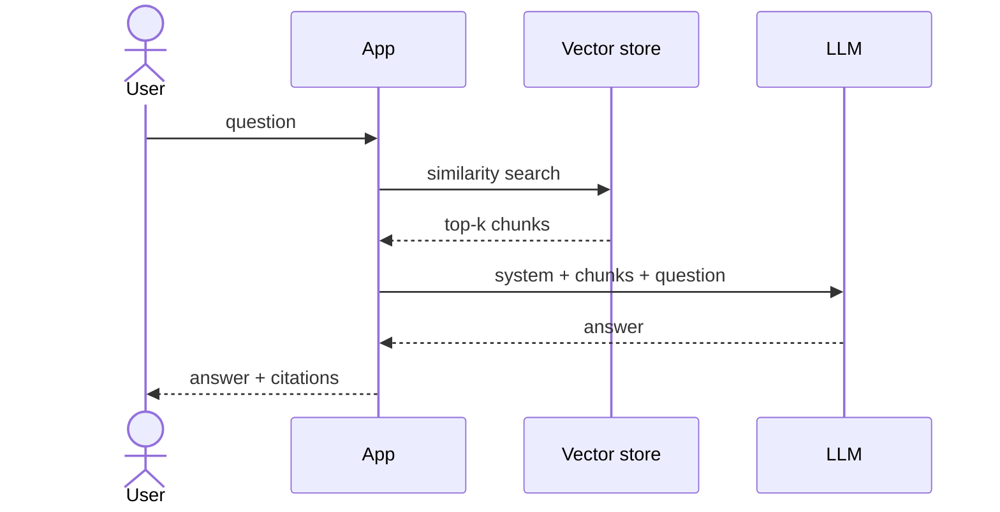

RAG e ajuste fino
Duas maneiras de adicionar **conhecimento de domínio** e **comportamento** sem pré-treinamento completo do zero.

## 1. RAG — Geração Aumentada de Recuperação

| Prós | Contras |
|------|------|
| Atualizar conhecimento alterando índice | Qualidade = qualidade de recuperação |
| Citações naturais | Latência extra (recuperação + prompt mais longo) |
| Sem reciclagem completa | A estratégia de fragmentação é importante |

**Chunking:** 256–512 tokens com sobreposição; metadados (título, seção) na incorporação de texto.

Mesmo padrão de [Pesquisa de pedido CDC](../../swe101/sysdesign/examples/viii-order-search-cdc.md) — OLTP vs índice de pesquisa.

## 2. Ajuste fino

Continue o treinamento (ou treinamento do adaptador) em pares de domínio **(instrução, resposta)**.

| Método | Detalhe |
|--------|--------|
| **Ajuste completo** | Atualizar todos os pesos — caro; esquecendo o risco |
| **LoRA** | Adaptadores de baixa classificação em camadas de atenção - treinar &lt;1% de parâmetros |
| **QLoRA** | LoRA + base quantizada — favorável ao consumidor GPU |

| Prós | Contras |
|------|------|
| Estilo e formato integrados | Precisa de conjunto de dados com curadoria |
| Nenhuma etapa de recuperação na inferência | Conhecimento congelado na hora do trem |
| Adaptadores implantáveis ​​menores | Esquecimento catastrófico se exagerado |

## 3. Quando usar qual

| Necessidade | RAG | Ajuste fino / LoRA |
|------|-----|------------------|
| Alteração de documentos (políticas, manuais) | **Sim** | Pobre sozinho |
| Tom fixo / formato JSON | Opcional | **Sim** |
| Longo corpus privado | **Sim** | Caro incorporar tudo em pesos |
| Baixa latência, sem vetor DB | Não | **Talvez** |

**Produção:** **ambos** — LoRA para formato + RAG para fatos.

## 4. Avaliação

| métrica RAG | Medir |
|------------|---------|
| **Recuperação de recuperação@k** | Pedaço correto no topo k? |
| **Responda com fidelidade** | Suportado pelo texto recuperado? |
| **De ponta a ponta** | Humano ou LLM como juiz em tarefa |

## 5. Perguntas de ensaio

- Por que RAG não corrige um modelo que ignora contexto?
- LoRA vs ajuste fino completo – compensação de parâmetros e operações?
- Como as citações ajudam a confiar na empresa RAG?

**Relacionado:** [Engenharia imediata](iv-prompt-engineering.md), [Segurança e produção](vi-safety-and-production.md).
