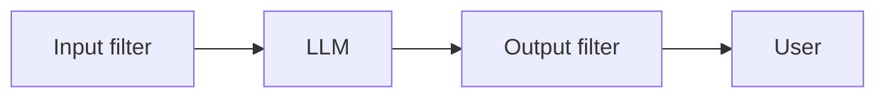

Segurança e produção
O envio LLMs requer **guarda-corpos**, **observabilidade** e disciplina de **serviço** — e não apenas bons avisos.

## 1. Modelo de ameaça (breve)

| Risco | Exemplo |
|------|---------|
| **Injeção imediata** | Conteúdo não confiável substitui o sistema |
| **Exfiltração de dados** | Modelo vaza segredos do contexto |
| **Conteúdo prejudicial** | Violência, instruções ilegais |
| **PII** | O modelo gera ou registra dados do cliente |
| **Abuso de custos** | Uso ilimitado de token |

Defesas de camada – nenhum filtro captura tudo.

## 2. Pilha de guarda-corpos

| Camada | Exemplos de ferramentas |
|-------|------------------|
| **Moderação de entrada** | Fornecedor APIs, classificadores abertos |
| **Prompt do sistema** | Recusas, limites de âmbito |
| **Caixa de areia de ferramentas** | SQL somente leitura, rede desligada |
| **Validação de saída** | Esquema JSON, lista de permissões |

## 3. Servindo arquitetura

| Componente | Função |
|-----------|------|
| **API gateway** | Autenticação, limites de taxa — [Limite de taxa](../../swe101/sysdesign/scalable-patterns/iv-rate-limiting.md) |
| **Servidor modelo** | vLLM, TGI, TensorRT-LLM — lote, cache KV |
| **Vetor DB** | Recuperação RAG |
| **Fila** | Trabalhos longos assíncronos |

Monitore **latência p99**, **tokens/seg**, **GPU utilitário**, **taxa de erro**.

## 4. Registro e privacidade

| Faça | Não |
|----|-------|
| Registrar hashes de prompt, contagens de tokens, latência | Registrar prompts completos com PII em texto simples |
| Amostras de traços para revisão de qualidade | Armazene segredos em prompts |
| Política de retenção + redação | Registros de bate-papo infinitos sem consentimento |

## 5. Controle de custos

| Alavanca | Efeito |
|-------|--------|
| **Modelo menor** para roteamento/classificação | Triagem mais barata |
| **Cache** consultas frequentes | Desduplicar embeddings |
| **Máximo de tokens** limite | Impedir a conclusão descontrolada |
| **Limites de tarifas por usuário** | Prevenção de abusos |

## 6. Humano no circuito

| Caso de uso | Padrão |
|----------|---------|
| Riscos elevados (médicos, jurídicos) | Aprovação humana antes de enviar |
| Comentários | Polegar para baixo → avaliação definida para o próximo alinhamento |
| Escalação | Limite de confiança → agente de suporte |

## 7. Perguntas de ensaio

- Cite três métricas de produção para um LLM API.
- Injeção imediata versus envenenamento de dados — diferença?
- Quando um modelo local menor é melhor que GPT-4 API?

**Relacionado:** [Engenharia imediata](iv-prompt-engineering.md), [RAG e ajuste fino](v-rag-and-fine-tuning.md), [fluxo de trabalho ML](../machine-learning/vii-ml-workflow-and-deployment.md).
