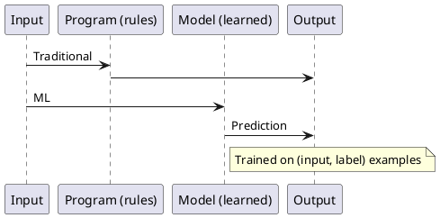
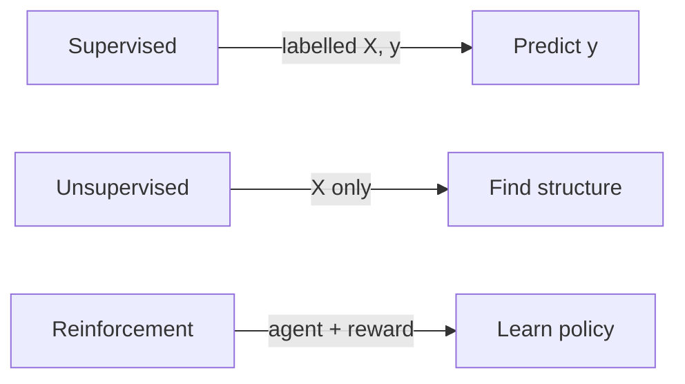

Aprendizado de máquina – visão geral
**Aprendizado de máquina (ML)** cria sistemas que **melhoram a partir de dados** em vez de depender apenas de regras escritas à mão. Você fornece **exemplos**; um algoritmo ajusta **parâmetros** para que as previsões melhorem em entradas **novas e invisíveis**.

## Mapa deste submenu

| Parte | Tópico |
|------|--------|
| **I — Visão geral** | Vocabulário, paradigmas, como essa trilha se encaixa AI101 |
| **II — Aprendizagem supervisionada** | Classificação, regressão, perda, algoritmos comuns |
| **III — Aprendizagem não supervisionada** | Clustering, redução de dimensionalidade, detecção de anomalias |
| **IV — Avaliação do modelo** | Treinar/avaliar/teste, métricas, validação cruzada |
| **V — Overfitting e regularização** | Viés-variância, L1/L2, ajuste |
| **VI — Engenharia de recursos** | Recursos numéricos, categóricos e de texto; vazamento |
| **VII — Fluxo de trabalho e implantação de ML** | Pipeline ponta a ponta, desvio, pontos de contato MLOps |

## Regras vs aprendizagem

| Programação tradicional | Aprendizado de máquina |
|-------------------------|------------------|
| Engenheiro escreve`if`-&#09;o`else`lógica | Modelo aprende padrões a partir de dados |
| O comportamento muda quando o **código** muda | O comportamento muda quando **dados** ou **treinamento** mudam |
| Funciona quando as regras são simples e conhecidas | Funciona quando as regras são muito complexas para serem especificadas |



## Vocabulário principal

| Prazo | Significado |
|------|---------|
| **Recurso (X)** | Entrada mensurável – coluna, pixel, leitura do sensor |
| **Rótulo/alvo (y)** | O que você prevê – classe, preço, classificação |
| **Modelo** | Função aprendida **f(X) ≈ y** |
| **Treinamento** | Ajustar parâmetros para minimizar **perdas** |
| **Inferência** | Execute o modelo treinado em novos dados |
| **Hiperparâmetro** | Escolhido antes do treinamento — taxa de aprendizagem, profundidade da árvore |

## Três paradigmas

| Paradigma | Dados | Meta |
|----------|------|------|
| **Supervisionado** | Exemplos rotulados | Prever rótulos para novos insumos |
| **Não supervisionado** | Não rotulado | Encontrar estrutura (clusters, componentes) |
| **Reforço** | Agente + ambiente | Maximize a **recompensa** cumulativa |

A maior parte da produção tabular ML é **supervisionada**. O pré-treinamento de linguagem e visão geralmente usa objetivos **auto-supervisionados** (rótulos derivados dos próprios dados).



## Experimento mínimo supervisionado

```python
from sklearn.model_selection import train_test_split
from sklearn.ensemble import RandomForestClassifier
from sklearn.metrics import classification_report

X_train, X_test, y_train, y_test = train_test_split(X, y, test_size=0.2, random_state=42)
model = RandomForestClassifier()
model.fit(X_train, y_train)
print(classification_report(y_test, model.predict(X_test)))
```

## O que você precisa

| Peça | Função |
|-------|------|
| **Python** | pandas, scikit-learn |
| **Estatísticas** | Distribuições, variância, confiança métrica |
| **Conhecimento do domínio** | Defina o rótulo e os recursos corretos |
| **Disciplina de avaliação** | Teste de resistência, sem vazamento |

## Próximo

Continue com [Aprendizagem supervisionada](ii-supervised-learning.md).

**Relacionado:** [Visão geral de AI101](../i-overview.md), [Visão geral do aprendizado profundo](../deep-learning/i-overview.md).
