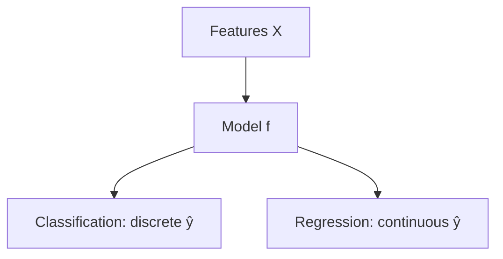

Aprendizagem supervisionada
Dados os dados rotulados **{(x₁, y₁), …, (xₙ, yₙ)}**, aprenda **f(x) → ŷ** que **generaliza** para **x** invisível. Dois tipos principais de tarefas: **classificação** (y discreto) e **regressão** (y contínuo).



## 1. Classificação

**y** é uma classe discreta — spam/não-spam, dígito 0–9, rotatividade sim/não.

| Variante | Exemplo |
|--------|---------|
| **Binário** | Fraude vs legítimo |
| **Multiclasse** | Categoria de imagem (rótulo único) |
| **Multi-rótulo** | Tags em um documento (muitos rótulos por linha) |

### Algoritmos comuns

| Algoritmo | Idéia | Quando tentar |
|-----------|------|-------------|
| **Regressão logística** | Limite linear + sigmóide | Linha de base forte; interpretável |
| **Árvore de decisão** | Divisões alinhadas ao eixo | Não linear; assistir overfitting |
| **Floresta aleatória** | Conjunto de árvores | Padrão robusto em dados tabulares |
| **Aumento de gradiente** (XGBoost, LightGBM, CatBoost) | Correção de erros sequencial | Muitas vezes ganha Kaggle tabular |
| **SVM** | Separador de margem máxima | Dados médios; truque do kernel para não linear |
| **k-NN** | Votação de k vizinhos mais próximos | Simples; lento em escala |
| **Rede neural** | Camadas empilhadas | Imagens, texto, grandes dados — consulte [Aprendizado profundo](../deep-learning/i-overview.md) |

## 2. Regressão

**y** é contínuo – preço, demanda, temperatura.

| Algoritmo | Notas |
|-----------|-------|
| **Regressão linear** | ŷ = w·x + b; interpretar coeficientes |
| **Cimista (L2)** | Penaliza grandes pesos |
| **Laço (L1)** | Seleção esparsa de recursos |
| **Aumento de gradiente** | Não linear; forte em dados estruturados |

## 3. Funções de perda

O treinamento **minimiza a perda** nos dados de treinamento (geralmente por meio de descida gradiente ou solução de formato fechado).

| Tarefa | Perda | Fórmula (intuição) |
|------|------|---------------------|
| Regressão | **MSE** | Erro quadrático médio — penaliza grandes erros |
| Regressão | **MAE** | Erro absoluto médio — robusto a valores discrepantes |
| Classificação | **Entropia cruzada** | Penaliza aulas erradas confiantes |
| Binário desequilibrado | **CE** ponderado ou **perda focal** | Classe rara de peso elevado |

```text
MSE  = (1/n) Σ (ŷ − y)²
CE   = − Σ y·log(ŷ)     (one-hot y)
```

## 4. Limites de decisão (intuição)

| Modelo | Forma limite |
|-------|----------------|
| Regressão logística | Linear (hiperplano) |
| Árvore/floresta | Regiões constantes por partes |
| k-NN | Regiões locais flexíveis |
| Rede neural | Altamente flexível |

Mais flexibilidade → menor **viés**, maior risco de **variância** — consulte [Overfitting e regularização](v-overfitting-regularization-and-tuning.md).

## 5. Linha de base primeiro

Antes de modelos complexos:

| Linha de base | Finalidade |
|----------|---------|
| **Turma majoritária** (classificação) | Vença isso ou seu modelo será inútil |
| **Previsão média** (regressão) | Mesmo |
| **Logística/linear** | Referência rápida e interpretável |

## 6. esboço do sklearn

```python
from sklearn.linear_model import LogisticRegression
from sklearn.pipeline import Pipeline
from sklearn.preprocessing import StandardScaler

clf = Pipeline([
    ("scale", StandardScaler()),
    ("model", LogisticRegression(max_iter=1000)),
])
clf.fit(X_train, y_train)
```

Use **pipelines** para que o pré-processamento se ajuste apenas aos dados de treinamento e evite vazamentos.

## 7. Perguntas de ensaio

- Classificação vs regressão — dê um exemplo de cada um no comércio eletrônico.
- Por que entropia cruzada para classificação em vez de MSE nos IDs de classe?
- Quando a floresta aleatória superaria a regressão logística no mesmo conjunto de dados?

**Relacionado:** [Avaliação do modelo](iv-model-evaluation-and-metrics.md), [Engenharia de recursos](vi-feature-engineering.md).
