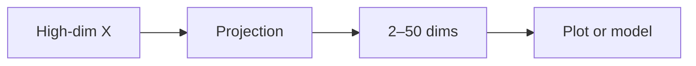

Aprendizagem não supervisionada
**Sem rótulos** — os algoritmos encontram **estrutura** apenas em **X**: grupos, visualizações de baixa dimensão ou valores discrepantes. Usado para exploração, segmentação, compactação e detecção de anomalias.

## 1. Agrupamento

Agrupe pontos semelhantes de forma que a distância intra-cluster seja pequena e a distância entre clusters seja grande.

### k-Meios

| Etapa | Ação |
|------|--------|
| 1 | Escolha **k** centróides (aleatório ou k-means++) |
| 2 | Atribua cada ponto ao centróide mais próximo |
| 3 | Recalcular centróides como médias de cluster |
| 4 | Repita até a convergência |

| Prós | Contras |
|------|------|
| Rápido, simples | Deve escolher **k**; assume aglomerados esféricos |
| Balanças com Minilote k-means | Sensível à escala — **padronizar recursos** |

**Casos de uso:** segmentos de clientes, agrupamento de documentos (com incorporações), quantização de cores de imagens.

### DBSCAN

Baseado em densidade — clusters de formato arbitrário; pontos em regiões esparsas rotuladas como **ruído**.

| Parâmetro | Função |
|-------|------|
| **eps** | Raio do bairro |
| **min_samples** | Limite de pontos principais |

Ideal quando os clusters não são esféricos ou quando você deseja detecção de valores discrepantes integrados.

### Clustering hierárquico

Construa um **dendrograma** – corte na altura para obter k clusters. Útil para exploração visual e pequena.

## 2. Redução de dimensionalidade

Comprima muitos recursos enquanto preserva a estrutura — visualização, velocidade, eliminação de ruído.

| Método | Tipo | Usar |
|--------|------|-----|
| **PCA** | Linear | Direções de variação superior; pré-processamento para ML |
| **t-SNE** | Não linear | Apenas visualização 2D — distâncias sem significado global |
| **UMAP** | Não linear | Mais rápido que t-SNE; melhor estrutura global frequentemente |



**Aviso:** ajuste PCA somente no **trem**; transforme val/test com os mesmos componentes.

## 3. Detecção de anomalias

Encontre pontos **raros** — fraudes, defeitos, invasões.

| Método | Idéia |
|--------|------|
| **Floresta de Isolamento** | Divisões aleatórias isolam anomalias em poucas etapas |
| **Autocodificador** | Erro de reconstrução elevado = anomalia |
| **Uma aula SVM** | Limite em torno dos dados de treinamento “normais” |
| **DBSCAN ruído** | Pontos rotulados como −1 |

Frequentemente **semi-supervisionado** na prática: treine principalmente com dados normais.

## 4. Não supervisionado vs supervisionado

| Pergunta | Não supervisionado | Supervisionado |
|----------|-------------|------------|
| Temos rótulos? | Não | Sim |
| Saída | Clusters, componentes, pontuações | Classe ou número por linha |
| Avaliação | Silhueta, revisão de domínio | Precisão, F1, RMSE |

Os rótulos dos clusters ainda precisam de **interpretação humana** — o “cluster 3” não é acionável até ser traçado o perfil.

## 5. esboço do sklearn

```python
from sklearn.cluster import KMeans
from sklearn.decomposition import PCA

kmeans = KMeans(n_clusters=5, random_state=42, n_init="auto")
labels = kmeans.fit_predict(X_scaled)

pca = PCA(n_components=2)
X_2d = pca.fit_transform(X_scaled)
```

## 6. Perguntas de ensaio

- Por que padronizar antes do k-means?
- PCA vs t-SNE — qual para um pipeline de recursos de produção?
- Cite um uso comercial para detecção de anomalias.

**Relacionado:** [Aprendizagem supervisionada](ii-supervised-learning.md), [Engenharia de recursos](vi-feature-engineering.md).
