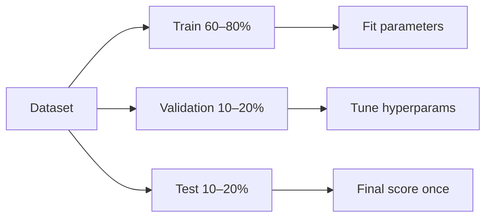

Avaliação e métricas do modelo
Um modelo só é útil se o desempenho em **novos dados** for conhecido e **honesto**. Esta nota cobre divisões, validação cruzada, métricas de classificação e regressão e armadilhas comuns.

## 1. Treinar/validação/teste

| Dividir | % típica | Finalidade |
|-------|-----------|--------|
| **Treinar** | 60–80% | Ajustar parâmetros do modelo |
| **Validação** | 10–20% | Ajustar hiperparâmetros; escolher modelo |
| **Teste** | 10–20% | **Uma vez**, estimativa final imparcial |

Nunca ajuste o conjunto de teste – ele se torna uma validação por acidente.

**Série temporal:** dividida por **tempo** — treine no passado, valide/teste no futuro. O embaralhamento aleatório vaza o futuro para o passado.

## 2. Validação cruzada (k-fold)

Quando os dados são escassos:

1. Divida em dobras **k**.
2. Treine em k-1 dobras, marque na dobra estendida.
3. Girar; **média** k pontuações.

| Variante | Usar |
|--------|-----|
| **K-dobra estratificada** | Preservar as proporções das classes (classificação) |
| **Grupo k-fold** | A mesma entidade nunca em train e val (por exemplo, mesmo usuário) |

Variação menor do que uma única divisão de val; mais computação.

## 3. Métricas de classificação

Matriz de confusão: **TP, FP, TN, FN**.

| Métrica | Fórmula | Quando importa |
|--------|---------|-----------------|
| **Precisão** | (TP+TN)/total | Apenas classes balanceadas |
| **Precisão** | TP / (TP+FP) | Custo elevado de alarme falso (filtro de spam) |
| **Lembrar** | TP / (TP+FN) | Custo da perda elevado (rastreio do cancro) |
| **F1** | 2PR/(P+R) | Balanço P e R |
| **AUC-ROC** | Área sob TPR vs FPR | Qualidade de classificação; independente de limite |

<figure class="notes-diagram"><svg xmlns="http://www.w3.org/2000/svg" viewBox="0 0 320 100" role="img" aria-label="Precision vs recall tradeoff">
  <text x="12" y="20" fill="#d4d4d8" font-size="11" font-weight="600">Imbalanced classes</text>
  <text x="12" y="42" fill="#a1a1aa" font-size="9">99% negative → predict all negative = 99% accuracy</text>
  <text x="12" y="58" fill="#86efac" font-size="9">Use precision, recall, F1, or PR-AUC instead</text>
  <text x="12" y="78" fill="#71717a" font-size="9">Choose threshold from business cost, not default 0.5</text>
</svg></figure>

### Ajuste de limite

Saída dos modelos **probabilidade**; classe = p > limite. Mova o limite para favorecer a precisão ou a recuperação.

## 4. Métricas de regressão

| Métrica | Fórmula | Notas |
|--------|---------|-------|
| **MAE** | significa \|ŷ − y\| | Mesmas unidades de y |
| **RMSE** | √(média (ŷ − y)²) | Penaliza mais erros grandes |
| **R²** | 1 − SS_res/SS_tot | Fração de variância explicada; pode ser negativo em modelos ruins |
| **MAPE** | significa \|(y−ŷ)/y\| | Erro percentual; quebra se y=0 |

Relatório **múltiplas métricas** — RMSE por si só esconde preconceitos sistemáticos.

## 5. Análise de erros

Após as métricas, inspecione **modos de falha**:

| Pergunta | Ação |
|----------|--------|
| Quais segmentos falham? | Divida as métricas por região, produto, tempo |
| Erros aleatórios ou sistemáticos? | Padrões de confusão, gráficos residuais |
| Ruído de etiqueta? | Auditar linhas de treinamento com rótulos incorretos |

## 6. Perguntas de ensaio

- Por que esperar um conjunto de testes até o fim?
- Quando a precisão é enganosa?
- Precisão versus recall — o que é importante para a detecção de fraudes?

**Relacionado:** [Sobreajuste e regularização](v-overfitting-regularization-and-tuning.md), [fluxo de trabalho ML](vii-ml-workflow-and-deployment.md).
