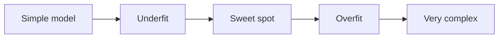
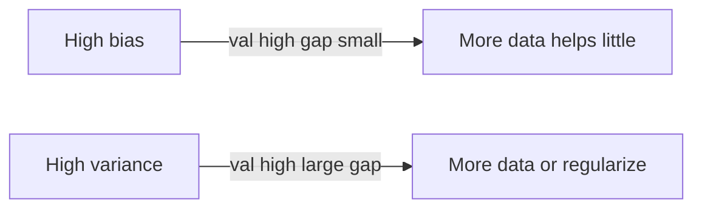

Overfitting, regularização e ajuste
Os modelos podem **memorizar ruído** (overfit) ou **perder sinal** (underfit). **Regularização** e **ajuste de hiperparâmetros** encontram o ponto ideal entre **viés** e **variância**.

## 1. Troca entre polarização e variância

| Sintoma | Diagnóstico | Erro de trem | Erro de teste |
|---------|-----------|-------------|------------|
| Ambos altos | **underfitting** (alto viés) | Alto | Alto |
| Treine baixo, teste alto | **Sobreajuste** (alta variância) | Baixo | Alto |
| Ambos baixos | Bom ajuste | Baixo | Baixo |

## 2. Regularização

Penalize a complexidade para que os pesos não explodam.

| Método | Efeito | Uso típico |
|--------|--------|-------------|
| **L2 (cumeeira)** | Encolhe pesos suavemente | Modelos lineares, estabilizador padrão |
| **L1 (Laço)** | Leva alguns pesos a **zero** | Seleção esparsa de recursos |
| **Rede elástica** | L1 + L2 | Recursos correlacionados |
| **Abandono** | Aleatoriamente zero ativações (NN) | [Aprendizagem profunda](../deep-learning/ii-neural-networks-and-training.md) |
| **Parada antecipada** | Pare quando a perda de val piorar | Árvores, redes neurais |
| **Profundidade máxima / amostras mínimas** | Limitar o crescimento das árvores | Floresta aleatória, aumentando |

Perda com L2: **Perda + λ Σ wᵢ²** — **λ** controla a força.

## 3. Ajuste de hiperparâmetros

Os hiperparâmetros **não** são aprendidos por gradiente em um lote – você os pesquisa.

| Método | Idéia |
|--------|------|
| **Pesquisa em grade** | Grade pequena exaustiva |
| **Pesquisa aleatória** | Combinações de amostras — muitas vezes melhores que a grelha para o mesmo orçamento |
| **Otimização bayesiana** | Modele a superfície de pontuação val (Optuna, Hyperopt) |

Sempre ajuste a **validação** (ou a dobra interna CV), nunca teste.

## 4. Mais dados versus modelo mais simples

| Corrigir overfitting | Corrigir subajuste |
|-----------------|------------------|
| Mais dados de treinamento | Mais recursos (cuidado com vazamentos) |
| Regularização | Modelo mais complexo |
| Seleção de recursos | Treinar por mais tempo (se não tiver treinamento suficiente NN) |
| Reduzir a capacidade do modelo | Reduzir a regularização |

## 5. Curvas de aprendizado

Plotar trem vs val métrica vs **tamanho do conjunto de treinamento**:

| Forma curva | Significado |
|------------|---------|
| Val alto, lacuna pequena | **Alto viés** – obter mais dados não ajudará muito; preciso de modelo mais rico |
| Val alto, grande lacuna | **Alta variação** — mais dados ou regularização |

## 6. Perguntas de ensaio

- L1 vs L2 — quando você quer pesos esparsos?
- Por que a parada antecipada é uma forma de regularização?
- O que significa se a perda de trem e val estiver estagnada?

**Relacionado:** [Avaliação do modelo](iv-model-evaluation-and-metrics.md), [Aprendizagem supervisionada](ii-supervised-learning.md).
