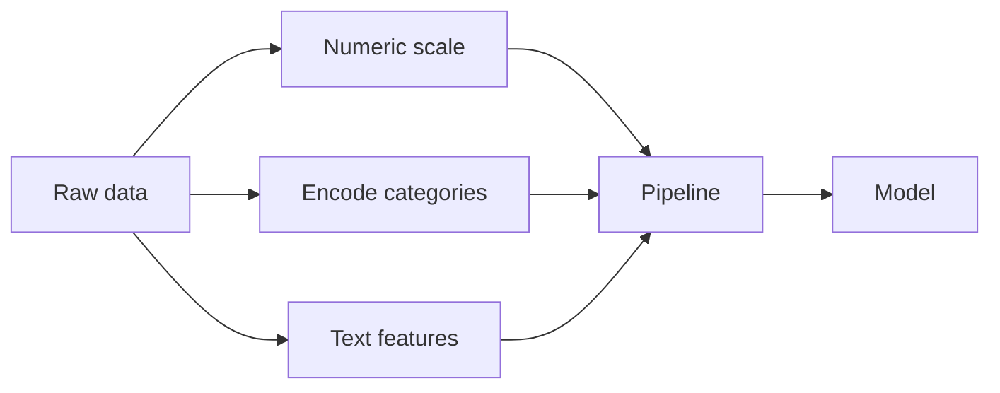

Engenharia de recursos
Os dados brutos raramente alimentam diretamente um modelo. **Recursos** são representações numéricas de entradas — dimensionamento, codificação e colunas derivadas que tornam os padrões aprendíveis.



## 1. Recursos numéricos

| Transformar | Quando |
|-----------|------|
| **Padronização** (pontuação z) | Média 0, padrão 1 — muitos modelos lineares, k-médias, PCA |
| **Escalonamento mínimo-máximo** | Limitado a [0, 1] — redes neurais, pixels de imagem |
| **Transformação de log** | Contagens distorcidas à direita (receita, visualizações de páginas) |
| **Binning** | Efeitos não lineares; cuidado com os limites |
| **Polinômio / interação** | X₁·x₂ explícito para modelos lineares |

## 2. Características categóricas

| Codificação | Usar |
|----------|-----|
| **Um-quente** | Categorias nominais — sem ordem falsa |
| **Ordinal / rótulo** | Somente pedido verdadeiro (pequeno, médio, grande) |
| **Codificação de destino** | Substituir categoria pela meta média — **risco de vazamento**; usar CV |
| **Codificação de frequência** | Categoria → contagem no conjunto do trem |

Categorias de alta cardinalidade (id de usuário, SKU): **embeddings**, **hashing** ou **grupo de níveis raros**.

## 3. Recursos de texto (ML clássico)

Antes dos transformadores:

| Método | Saída |
|--------|--------|
| **Saco de palavras** | Contagem de palavras por documento |
| **TF-IDF** | Palavras comuns de baixo peso |
| **Word2Vec/GloVe** | Vetores de palavras densas — média para documento |

O NLP moderno geralmente usa **embeddings pré-treinados** ou [LLMs](../llms/i-overview.md).

## 4. Valores ausentes

| Estratégia | Risco |
|----------|------|
| **Eliminar linhas** | Perder dados; preconceito se não for MCAR |
| **Imputar média/mediana/moda** | Linha de base simples |
| **Imputação baseada em modelo** | Melhorar; instalar o imputer apenas no trem |
| **Coluna do indicador ausente** | “Estava faltando” pode ser preditivo |

## 5. Vazamento de recursos

**Vazamento** — o recurso contém informações indisponíveis no momento da previsão ou codifica diretamente o rótulo.

| Mau exemplo | Por que |
|------------|-----|
| Coluna “Empréstimo aprovado” prevendo inadimplência | Etiqueta disfarçada |
| Estatísticas do conjunto de testes na normalização do trem | Colocar o escalador apenas no trem |
| Carimbo de data/hora futuro no modelo de rotatividade | Viagem no tempo |

Sintoma: métricas off-line **boas demais**; colapso da produção.

## 6. Seleção de recursos

| Método | Idéia |
|--------|------|
| **Filtro** | Correlação, informação mútua |
| **Invólucro** | Pesquisar subconjuntos com pontuação val |
| **Incorporado** | Laço, importância da árvore |

Remova recursos redundantes para obter velocidade e interpretabilidade – nem sempre para obter precisão.

## 7. Pipelines (sklearn)

```python
from sklearn.compose import ColumnTransformer
from sklearn.preprocessing import OneHotEncoder, StandardScaler

preprocess = ColumnTransformer([
    ("num", StandardScaler(), numeric_cols),
    ("cat", OneHotEncoder(handle_unknown="ignore"), categorical_cols),
])
```

Colocar **pipeline inteiro** no trem;`predict`no teste aplica as mesmas transformações.

## 8. Perguntas de ensaio

- Codificação one-hot vs label para`color: red, blue, green`?
- Dê um exemplo de vazamento alvo em um modelo de preços de imóveis.
- Por que ajustar o StandardScaler apenas nos dados de treinamento?

**Relacionado:** [Aprendizagem supervisionada](ii-supervised-learning.md), [fluxo de trabalho ML](vii-ml-workflow-and-deployment.md).
