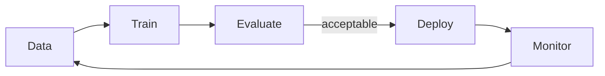

Fluxo de trabalho e implantação de ML
Da definição do problema à **inferência de produção** — os engenheiros de loop repetem para cada produto ML.

## 1. Fluxo de trabalho de ponta a ponta

| Etapa | Ações |
|------|---------|
| **1. Problema** | Definir métricas vinculadas ao negócio (receita, segurança, latência) |
| **2. Dados** | Coletar, rotular, documentar esquemas e preconceitos |
| **3. EDA** | Distribuições, faltas, valores discrepantes, verificações de vazamentos |
| **4. Recursos** | [Engenharia de recursos](vi-feature-engineering.md), dutos |
| **5. Linha de base** | Modelo simples ou heurística |
| **6. Treine e sintonize** | Iteração orientada para validação |
| **7. Teste** | Avaliação final de resistência — reportar este número |
| **8. Implantar** | Serviço em lote ou on-line |
| **9. Monitorar** | Deriva, desempenho, qualidade de dados |
| **10. Retreinar** | Programado ou acionado por desvio |

## 2. Inferência em lote vs online

| Modo | Padrão | Exemplo |
|------|---------|---------|
| **Lote** | Pontue a mesa inteira todas as noites | Pontuações de rotatividade para CRM |
| **On-line (tempo real)** | API por pedido | Verificação de fraude na finalização da compra |
| **Transmissão** | Pontuar eventos da fila | Classificação de cliques |

Online precisa de **latência SLA**, **modelos versionados** e **reserva** se o modelo falhar.

## 3. Versionamento e reprodutibilidade do modelo

| Artefato | Acompanhar |
|----------|-------|
| **Dados de treinamento** instantâneo ou hash | Quais linhas treinaram este modelo |
| **Código** | Git confirmar |
| **Hiperparâmetros** | Arquivo de configuração |
| **Métricas** | Pontuações de valor/teste nessa execução |
| **Pesos do modelo** | Cadastro (MLfluxo, W&B, S3) |

Mesmas entradas + mesmos artefatos → mesmas previsões (dentro da tolerância de flutuação).

## 4. Desvio de dados e desvio de conceito

| Tipo de deriva | Significado | Sinal |
|------------|---------|--------|
| **Desvio de dados** | Mudanças na distribuição de insumos | Mudança nas estatísticas de recursos |
| **Desvio de conceito** | Mudanças em P(y\|x) | A precisão cai com entradas estáveis ​​|

Monitore **distribuições de previsão**, **médias de recursos** e **métricas de fatias rotuladas** quando os rótulos chegam atrasados.

## 5. Pontos de contato MLOps (visão geral)

| Prática | Finalidade |
|----------|---------|
| **CI para pipelines de treinamento** | Retreinamento reproduzível |
| **Loja de recursos** | Recursos consistentes de treinar/servir |
| **A/B modelos de teste** | Compare métricas de negócios |
| **Modo sombra** | Novo modelo roda mas não afeta usuários |

Full MLOps é uma disciplina própria – este curso se concentra em **ML fundamentos**.

## 6. Justiça e governança (breve)

| Preocupação | Ação |
|--------|--------|
| **Atributos protegidos** | Medir métricas por grupo; evite recursos de proxy |
| **Explicabilidade** | SHAP, importância do recurso para domínios regulamentados |
| **PII** | Minimize recursos; armazenamento seguro |

## 7. Perguntas de ensaio

- Diferença entre validação e teste no fluxo de trabalho de produção?
- O que desencadeia uma reciclagem – calendário versus desvio?
- Lote vs online — quando o lote é suficiente?

**Relacionado:** [Avaliação do modelo](iv-model-evaluation-and-metrics.md), [Visão geral de AI101](../i-overview.md), [Observabilidade em escala](../../swe101/sysdesign/scalable-patterns/viii-observability-at-scale.md).
