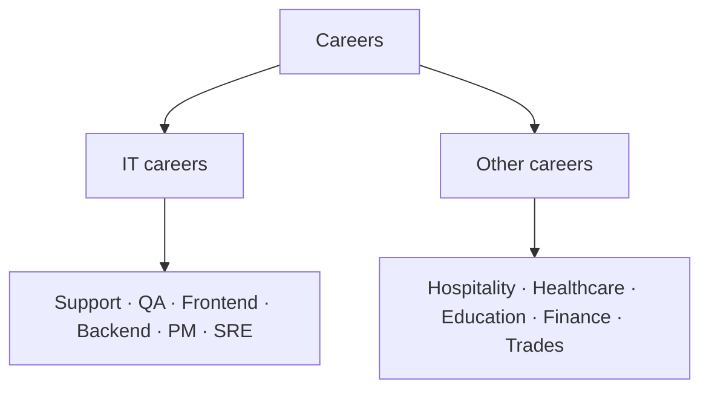

Carreiras - visão geral
Notas de carreira com lentes **orientadas para o Japão**: o que uma função realmente faz, como as pessoas **entram e progridem**, realidades de idioma e visto e faixas aproximadas de **compensação**. Não é aconselhamento sobre imigração, jurídico ou fiscal – sempre verifique com os empregadores e recrutadores atuais.

Esta trilha é dividida em dois ramos para que os caminhos tecnológicos e não tecnológicos sejam fáceis de navegar.

## Galhos

| Filial | Para | Iniciar |
|--------|-----|-------|
| **[IT carreiras](it/i-overview.md)** | Software, QA, SRE, produto e outras funções de tecnologia | [IT visão geral das carreiras](it/i-overview.md) |
| **[Outras carreiras](other/i-overview.md)** | Hotelaria, saúde, educação, finanças e comércio especializado | [Visão geral de outras carreiras](other/i-overview.md) |

## Como as notas são organizadas

Cada filial tem uma visão geral, além de notas de função ou de campo. A maioria das notas segue o mesmo formato:

- **Dia-a-dia** — o que o trabalho envolve.
- **Habilidades que importam** — core versus stretch.
- **Notas sobre o Japão** — idioma, tipo de empregador, visto e sinais de mercado.
- **Remuneração** — faixas ilustrativas; verifique com ofertas ao vivo.
- **Como entrar / progresso** — rotas de entrada e próximos movimentos.

## Qual filial?

| Você é… | Vá para |
|----------|-------|
| Desenvolvendo habilidades em software, dados ou infraestrutura | [IT carreiras](it/i-overview.md) |
| Explorando serviços, cuidados, ensino, negócios ou trabalho comercial | [Outras carreiras](other/i-overview.md) |
| Opções inseguras e comparativas | Dê uma olhada nas duas visões gerais e escolha uma nota de função |

## Próximo

Escolha um ramo: [IT carreiras](it/i-overview.md) ou [Outras carreiras](other/i-overview.md).
