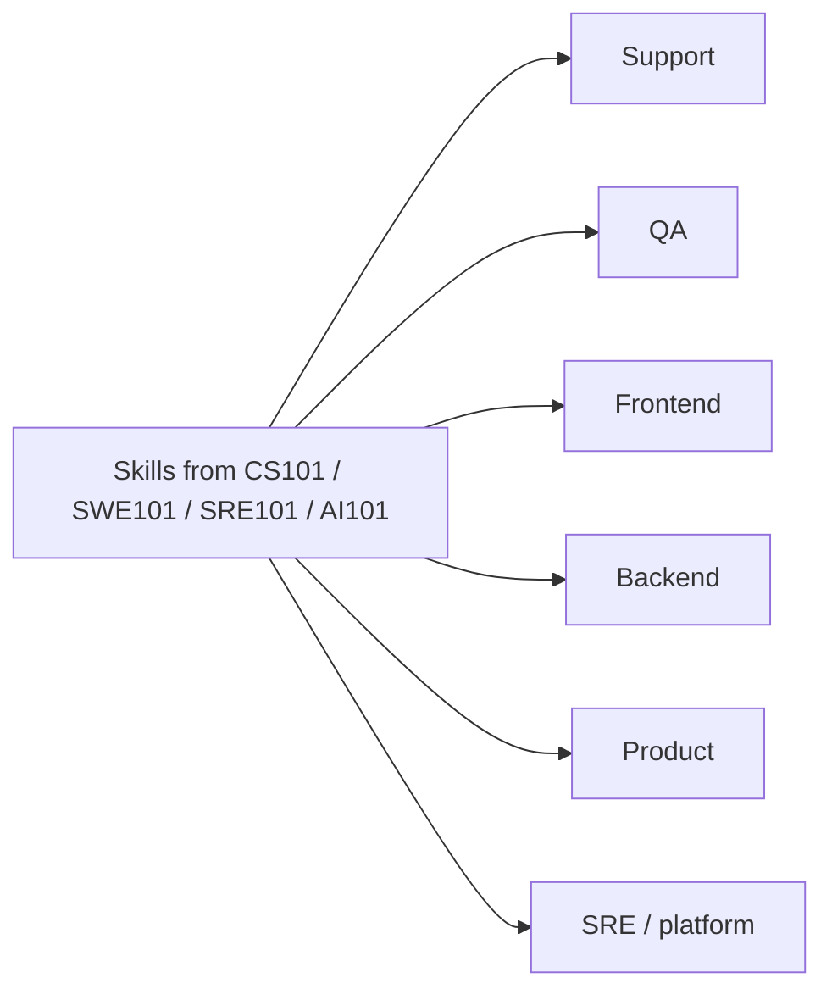

Carreiras IT - visão geral
Notas de carreira para **funções de tecnologia no Japão**: o que cada caminho realmente faz, como **estudar** para isso (usando este repositório) e faixas de **compensação**. Destinado a pessoas que desenvolvem habilidades em CS/SWE/AI que desejam um mapa realista orientado para o Japão - e não aconselhamento sobre imigração ou impostos.

Os números são **faixas ilustrativas** (principalmente Tóquio, empregadores amigos dos estrangeiros). Sempre verifique as ofertas atuais, [TokyoDev](https://www.tokyodev.com/), Levels.fyi e recrutadores. O tipo de empregador geralmente muda o pagamento mais do que apenas o título.

Pai: [Carreiras](../i-overview.md). Para caminhos não tecnológicos, consulte [Outras carreiras](../other/i-overview.md).

## Mapa desta trilha

| Nota | Foco |
|------|--------|
| [Mercado de tecnologia do Japão](ii-japan-tech-market.md) | Tipos de empregadores, idioma, vistos, sinais culturais |
| [Compensação](iii-compensation.md) | Como funciona; bandas; noções básicas de negociação |
| [Mapa de estudo](iv-study-map.md) | Quais currículos acompanham quais funções |
| [SDLC e funções](v-sdlc-and-roles.md) | Fases do ciclo de vida; onde cada função se encaixa; competências por fase |
| **[Caminhos](paths/i-overview.md)** | Suporte, QA, frontend, backend, PM e muito mais |

## Folha de dicas de funções

| Caminho | Dia-a-dia | Geralmente precisa |
|------|------------|---------------|
| [Engenheiro de suporte](paths/ii-support-engineer.md) | Ingressos, repros, confiança do cliente | Conhecimento do produto, redação clara, algum código |
| [QA / teste](paths/iii-qa.md) | Estratégia de qualidade, automação, risco | Design de teste, ferramentas, colaboração com engenharia |
| [Front-end](paths/iv-frontend.md) | UI, UX engenharia, desempenho web | JS/TS, React/etc., acessibilidade |
| [Back-end](paths/v-backend.md) | APIs, dados, confiabilidade | Uma linguagem de servidor, SQL, noções básicas de sistemas |
| [Gerente de produto](paths/vi-product-manager.md) | Roteiros, descoberta, compensações | Comunicação, métricas, alfabetização técnica |
| [SRE / plataforma](paths/vii-sre-platform.md) | Tempo de atividade, entrega, infra | Linux, nuvem, CI/CD, observabilidade |



## Ordem de leitura sugerida

```text
Overview → Japan tech market → Compensation → Study map → SDLC & roles → pick a Paths note
```

## Próximo

[Mercado de tecnologia do Japão](ii-japan-tech-market.md).
