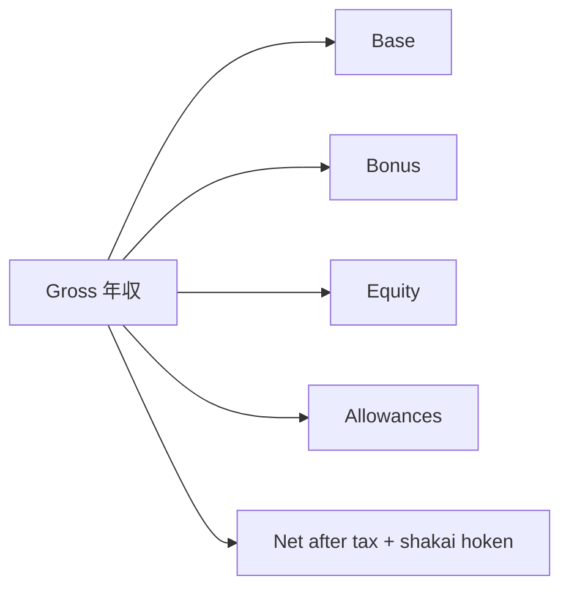

Compensação
Como **年収 (nenshū)** geralmente é citado no Japão, **bandas de Tóquio** por função e o que esclarecer em uma oferta. Não é aconselhamento fiscal, jurídico ou financeiro personalizado. As faixas são **aproximadas** (≈2025–2026 conversas de mercado para empregadores amigos dos estrangeiros) e variam com o iene, a empresa e o nível.

Fontes para verificação cruzada: pesquisas TokyoDev, Levels.fyi (Big Tech), gamas de recrutadores, ofertas escritas.

## 1. Como os pacotes são estruturados

| Peça | Significado |
|-------|---------|
| **Base (基本給)** | Fixo mensal × 12 |
| **Bônus (賞与)** | Freqüentemente verão + inverno; 0–6+ meses de base dependendo da empresa |
| **Subsídios** | Comutar quase sempre; habitação/família em algumas empresas |
| **Patrimônio / RSU** | Comum no global + alguns produtos cos; raro em empresas tradicionais de JP |
| **Horas extras consideradas** | Corrigido OT incluído no pagamento – pergunte quantas horas cobre |

**Sempre pergunte:** “Este valor é apenas base×12 ou base + bônus alvo (+ patrimônio líquido)?”

O valor aproximado para casa costuma ser ~**70–80%** do valor bruto para pessoas com renda média (imposto de residência do ano 2 incluído) - use uma calculadora para o seu caso.

## 2. Bandas de engenheiros (Tóquio, ilustrativo ¥M/ano total)

Empregadores amigos dos estrangeiros/com tendência para o produto (não as médias nacionais MHLW):

| Nível | Anos (ásperos) | Compromisso total ¥M |
|-------|---------------|---------------|
| Júnior | 0–2 | 4–7 |
| Médio | 2–5 | 7–11 |
| Sênior | 5–9 | 10–16 |
| Equipe / líder | 9+ | 14–22 |
| Diretor+ / Big Tech sênior | 12+ | 18–35+ (capital pesado) |

As medianas do estilo TokyoDev 2025 geralmente chegam perto de **~¥9–10M** no geral para engenheiros de pesquisa, com **medianas mais altas em empregadores estrangeiros/globais remotos** e **mais baixas em japoneses-HQ** — o tipo de empregador domina.

## 3. Por família de funções (nível médio, ilustrativo)

| Função | Banda média ¥M (áspero) | Notas |
|------|---------------------|--------|
| Suporte / CSE | 5–9 | Prêmio bilíngue; de plantão raro vs SWE |
| QA / SDET | 5–10 | Habilidades de automação aumentam o teto |
| Interface | 7–12 | Mesma escada que SWE no preço do produto |
| Back-end | 7–13 | Muitas vezes o maior volume de contratações |
| SRE / plataforma | 8–14 | Premium para nuvem + confiabilidade |
| Gerente de produto | 8–13 | Sênior PM 13–20+ em empregadores fortes |

A Big Tech Japan e os principais assentos ML/PM podem ficar **bem acima** dessas bandas intermediárias.

## 4. Noções básicas de negociação (amigável ao Japão)

| Faça | Não |
|----|-------|
| Aguarde uma oferta por escrito antes de números concretos | Invente ofertas concorrentes |
| Pergunte de 10 a 15% com comparações de mercado | Demanda 30% sem alavancagem |
| Negociar login, patrimônio, dias remotos | Ignorar garantia de bônus versus “alvo” |
| Esclarecer horas extras / 裁量労働制 | Suponha atualizações de estilo US- em todos os lugares |

## 5. Contexto do custo de vida

Os aluguéis de Tóquio e os custos das escolas internacionais podem anular um aumento nas manchetes. Compare **rede + deslocamento diário + moradia** entre ofertas, não apenas com base.

## Próximo

[Mapa de estudo](iv-study-map.md) - quais notas neste repositório alimentam cada caminho. Detalhe da função: [Visão geral dos caminhos](paths/i-overview.md).
