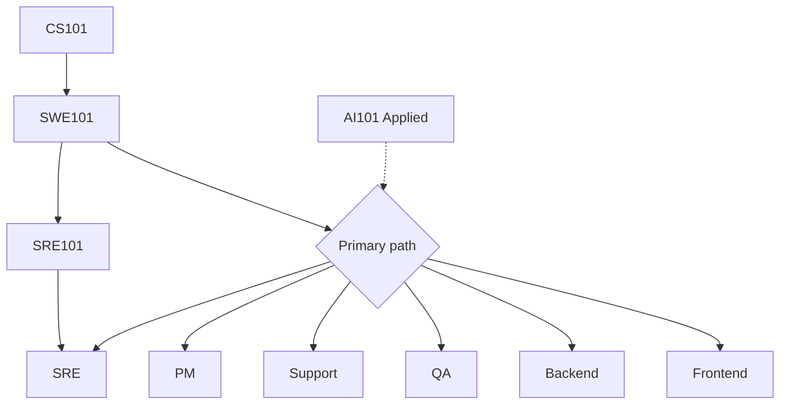

Mapa de estudo
Mapeie **este currículo** para planos de carreira. A profundidade supera os cursos aleatórios – escolha uma função principal, envie projetos e adicione habilidades adjacentes.

Pai: [IT visão geral das carreiras](i-overview.md). Funções: [Caminhos](paths/i-overview.md).

## 1. Base compartilhada (quase todos)

| Meta | Comece aqui |
|------|------------|
| Como funcionam os computadores + dados + redes | [CS101](../../cs101/i-overview.md) |
| Git, idiomas, APIs, design | [SWE101](../../swe101/i-overview.md) |
| Enviar + operar | [SRE101](../../sre101/i-overview.md) (mais leve para FE/PM) |
| Solicitação/agentes de produtividade | [AI101 Aplicado](../../ai101/ai-engineering/i-overview.md) |
| Língua japonesa (se necessário) | [Idiomas](../../languages/i-overview.md) |



## 2. Caminho → currículo (primário → secundário)

| Caminho | Estudo primário | Secundário |
|------|---------------|-----------|
| [Apoiar](paths/ii-support-engineer.md) | Produto + noções básicas de rede; escrita clara | SWE101 APIs; AI Solicitado para pesquisa/documentos |
| [QA](paths/iii-qa.md) | SWE101 + estratégia de teste; CI em SRE101 | Uma linguagem profundamente; API gateway / HTTP |
| [Front-end](paths/iv-frontend.md) | JS/TS + Reagir (SWE101) | CSS, CDN, acessibilidade, sentido de design |
| [Back-end](paths/v-backend.md) | Java/Python/Ir + Postgres + APIs | Kafka, Redis, projeto de sistema |
| [PM](paths/vi-product-manager.md) | Descoberta + alfabetização em métricas | Basta SWE101 para falar com o eng; AI Aplicado |
| [SRE](paths/vii-sre-platform.md) | SRE101 trilha completa | Rede SWE101 + CS |

## 3. Portfólio que os recrutadores do Japão entendem

| Função | Evidência |
|------|----------|
| FE / BE | repositórios GitHub, demonstrações implantadas, histórico de PR |
| QA | Planos de teste, repositórios de automação, registros de bugs |
| Suporte | Postagens públicas de solução de problemas, runbooks que você escreveu |
| PM | Estudos de caso: problema → métricas → trade-offs → resultado |
| SRE | Projetos Homelab/cloud com monitorização + IaC |

## 4. Limite de tempo

```text
Months 0–3   Foundation (CS + Git + one language)
Months 3–9   Path depth + 1–2 portfolio pieces
Months 9–12  Interview loops + Japanese if targeting domestic roles
```

## Próximo

Veja como as funções se enquadram no ciclo de vida: [SDLC & funções](v-sdlc-and-roles.md). Em seguida, escolha uma função em [Caminhos](paths/i-overview.md).
