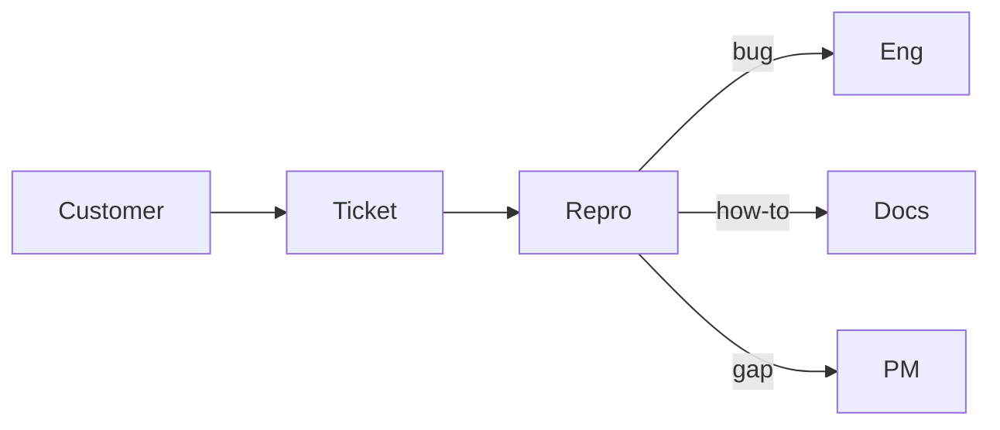

Engenheiro de suporte
Também chamado de **CSE**, **suporte técnico** ou **engenheiro do cliente**. Você mantém os clientes desbloqueados: reproduz problemas, explica o comportamento do produto, escala bugs e fornece insights para eng/PM.

## Dia a dia

| Atividade | Exemplos |
|----------|----------|
| Triagem | Priorize ingressos; interrupções pontuais versus erro do usuário |
| Reproduzir | Reprodução local/preparação; registros; Arquivos HAR |
| Comunicar | Limpar status em EN (e frequentemente em JP) |
| Escalar | Escreva relatórios de bugs que o engenheiro realmente usará |
| Melhorar | Macros, runbooks, FAQ, melhores mensagens de erro |

## Habilidades que importam

| Habilidade | Nível | Notas |
|-------|-------|-------|
| Profundidade do produto | Núcleo | Conheça o caminho feliz, limites, peculiaridades de cobrança/autenticação |
| Triagem de tickets | Núcleo | Gravidade, impacto, detecção de duplicatas |
| HTTP/navegador/registros | Núcleo | Códigos de status, HAR, logs de aplicativos |
| Ferramentas básicas de SQL / administração | Núcleo | Verificações somente leitura quando o produto permite |
| Atualizações escritas claras | Núcleo | Status, reprodução, próxima etapa — EN e frequentemente JP |
| Empatia sob pressão | Núcleo | Desescalar sem prometer demais |
| Qualidade do relatório de bug | Alongamento | O engenheiro de reprodução mínimo pode ser executado |
| Script leve | Alongamento | Python/JS para verificações em lote ou análise de logs |
| Japonês (negócios) | Mercado | Frequentemente necessário para suporte doméstico B2B |

## Notas do Japão

- O apoio bilíngue é escasso → **patrocínio de pagamentos e vistos** pode ser forte em relação ao nível de habilidades.
- Espere **japonês comercial** com mais frequência do que back-end em produtos com foco em inglês.
- Turno/plantão depende do produto; O suporte global de SaaS pode seguir o exemplo do sol.

## Caminho de estudo (este repositório)

| Prioridade | Acompanhar |
|----------|-------|
| 1 | [SWE101](../../../swe101/i-overview.md) — APIs, Git noções básicas |
| 2 | [CS101 rede](../../../cs101/networking/i-tcp-udp-and-transport-basics.md) — HTTP/TLS intuição |
| 3 | [AI Aplicado](../../../ai101/ai-engineering/i-overview.md) — pesquise cuidadosamente os documentos/respostas preliminares |
| 4 | [Idiomas](../../../languages/i-overview.md) se for direcionado a clientes JP |

Crie: um **runbook** pessoal para um produto que você usa (etapas de reprodução, erros comuns, modelo de escalonamento).

## Compensação (Tóquio ilustrativo)

Consulte [Compensação](../iii-compensation.md). Suporte médio / CSE geralmente aproximadamente **¥5–9M**; A profundidade bilíngue + técnica pode aumentar ainda mais no gaishikei. Geralmente abaixo do SWE sênior na mesma empresa.

## Movimentos de carreira

| Do suporte | Em direção |
|--------------|--------|
| Depuração forte | QA / SDET |
| Sentido do produto | PM / engenheiro de soluções |
| Sistemas profundos | Backend / SRE (precisa de mais sinal de codificação) |

## Próximo

[QA](iii-qa.md) ou [Mapa de estudo](../iv-study-map.md).
