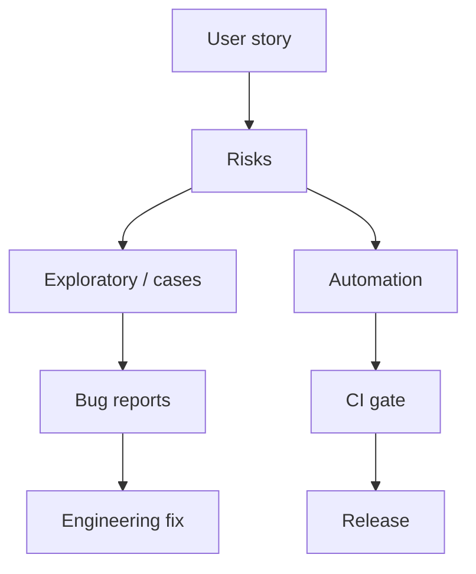

QA / engenharia de teste
**QA** protege os usuários contra lançamentos incorretos: testes baseados em risco, automação e relatórios claros de bugs. Os títulos variam – engenheiro QA, SDET, engenheiro de qualidade.

## Dia a dia

| Atividade | Exemplos |
|----------|----------|
| Plano | Estratégia de teste por recurso/versão |
| Explorar | Casos extremos, permissões, i18n (importante no Japão) |
| Automatizar | E2E / API / unidade onde ROI está claro |
| Portão | CI compilações vermelhas; aprovação de lançamento |
| Parceiro | Sente-se com FE/BE; comentários sobre shift-left |

## Habilidades que importam

| Habilidade | Nível | Notas |
|-------|-------|-------|
| Desenho de teste/análise de risco | Núcleo | O que cobrir versus o que pular |
| Testes exploratórios | Núcleo | Descubra o que falta nos scripts |
| Uma linguagem + estrutura de teste | Núcleo | pytest, JUnit, dramaturgo, Cypress… |
| Teste API | Núcleo | Contratos, autenticação, cargas úteis de borda |
| CI alfabetização | Núcleo | Portões, flocos, artefatos |
| Limpar relatórios de bugs | Núcleo | Etapas, esperadas/reais, ambiente |
| Arquitetura de automação | Alongamento | Objetos de página, fixtures compartilhados, paralelização |
| Desempenho / noções básicas do a11y | Alongamento | Fumaça para CWV, teclado, leitores de tela |
| Verificações de fumaça de segurança | Alongamento | Lacunas AuthZ, princípios básicos de injeção |
| Japonês | Mercado | Útil para problemas domésticos de UX/copy |

## Notas do Japão

- As empresas nacionais ainda podem usar **manual QA**; produto / gaishikei magro **SDET**.
- Forte automação + inglês podem conseguir cargos adequados para estrangeiros, mesmo sem N1.
- Jogos e incorporados possuem culturas QA especializadas.

## Caminho de estudo (este repositório)

| Prioridade | Acompanhar |
|----------|-------|
| 1 | [SWE101](../../../swe101/i-overview.md) — idioma + Git |
| 2 | [SRE101 CI/CD](../../../sre101/i-overview.md) — gasodutos |
| 3 | Faixa de front-end ou back-end correspondente ao produto |
| 4 | [Cibersegurança](../../../cybersecurity/i-overview.md) — pensamento básico sobre ameaças |

Build: automatizar login + caminho crítico para um aplicativo de código aberto; mostrar manuseio de flocos.

## Compensação (Tóquio ilustrativo)

Meados de QA / SDET aproximadamente **¥5–10 milhões**; a automação sênior em produtos fortes pode se aproximar das bandas SWE. Faixas somente manuais geralmente têm limite inferior.

## Movimentos de carreira

| De QA | Em direção |
|--------|--------|
| Profundidade de automação | SDET / ferreiro |
| Sentido de risco do produto | PM |
| Sistemas infra+ escamosos | SRE |
| Propriedade de recursos | Backend / FE (precisa de portfólio) |

## Próximo

[Front-end](iv-frontend.md) · [Back-end](v-backend.md).
