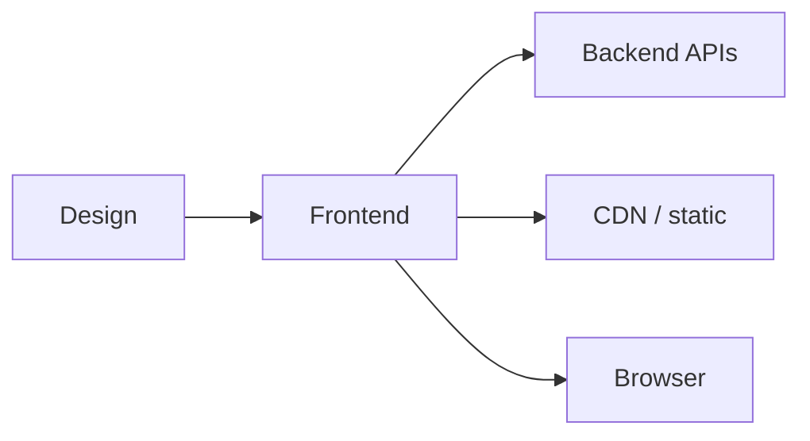

Engenheiro de front-end
Você cria o que os usuários **vêem e tocam**: UI web (e às vezes móvel), desempenho, acessibilidade e arquitetura do lado do cliente.

## Dia a dia

| Atividade | Exemplos |
|----------|----------|
| Implementar | Componentes, roteamento, formulários, estado |
| Integrar | Chame back-end APIs; lidar com erros |
| Polonês | Carregando estados, a11y, i18n (JP data/moeda) |
| Medir | Core Web Vitals, tamanho do pacote |
| Colabore | Designers, PM, contratos de back-end |

## Habilidades que importam

| Habilidade | Nível | Notas |
|-------|-------|-------|
| TypeScript (ou JS forte) | Núcleo | Tipos detectam bugs de contrato UI |
| Estrutura moderna UI | Núcleo | React/Next comum no produto JP cos |
| CSS / layout / sistemas de design | Núcleo | UI consistente e responsivo |
| HTTP + autenticação (cookies/JWT) | Núcleo | Integração real de aplicativos |
| Teste de componentes | Núcleo | Biblioteca Jest/Vitest/Teste |
| Acessibilidade | Núcleo | Teclado, semântica, contraste |
| Teste E2E | Alongamento | Dramaturgo/Cypress por caminhos críticos |
| Desempenho | Alongamento | Pacotes, CWV, carregamento lento |
| tipografia e formulários i18n / JP | Alongamento | Diferenciador no Japão |
| Colaboração de design | Alongamento | Transferência Figma, tokens de design |

## Notas do Japão

- **TypeScript + React/Next** é uma pilha comum em empresas de produtos modernas.
- i18n e **Tipografia/formulário japonês UX** são diferenciais.
- Existem funções FE que priorizam o inglês; a colaboração no design ainda pode ser JP- pesada.

## Caminho de estudo (este repositório)

| Prioridade | Acompanhar |
|----------|-------|
| 1 | [JavaScript/Reagir](../../../swe101/languages&frameworks/javascript/i-overview.md) |
| 2 | [CSS](../../../swe101/languages&frameworks/css/i-overview.md) |
| 3 | [CDN](../../../swe101/cdn/i-overview.md) |
| 4 | [CS101](../../../cs101/i-overview.md) básico + Git |

Build: um JP/EN UI bilíngue polido com autenticação contra um API público.

## Compensação (Tóquio ilustrativo)

Rastreia bandas SWE gerais: meados de aproximadamente **¥7–12 milhões** em custos de produtos adequados para estrangeiros; sênior superior. Mesma divisão por tipo de empregador que [Remuneração](../iii-compensation.md).

## Movimentos de carreira

| De FE | Em direção |
|--------|--------|
| Propriedade total do produto | Pilha completa |
| Sistemas de design | UX engenharia |
| Desempenho/plataforma | Plataforma web / SRE-adjacente |
| Resultados do usuário | PM |

## Próximo

[Back-end](v-backend.md).
