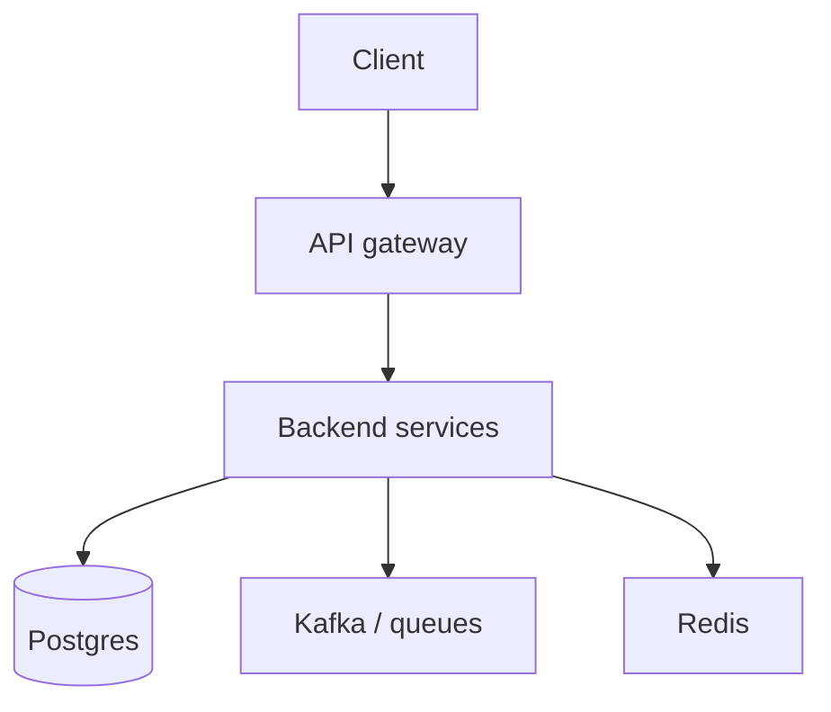

Engenheiro de back-end
Você possui **serviços e dados**: APIs, lógica de negócios, bancos de dados, filas e a confiabilidade de tudo por trás do UI.

## Dia a dia

| Atividade | Exemplos |
|----------|----------|
| Projeto | Endpoints, esquemas, migrações |
| Implementar | Serviços em Go / Java / Kotlin / Python / Ruby… |
| Operar | Logs, métricas, plantão para seus serviços |
| Integrar | Kafka, Redis, APIs de terceiros |
| Revisão | Segurança, desempenho, correção |

## Habilidades que importam

| Habilidade | Nível | Notas |
|-------|-------|-------|
| Uma linguagem de servidor profundamente | Núcleo | Vá, Java/Kotlin, Python, Node, Ruby… |
| SQL + modelagem de dados | Núcleo | Migrações, índices, transações |
| Projeto API | Núcleo | Autenticação, validação, versionamento, idempotência |
| Git + revisão de código | Núcleo | Colaboração diária |
| Testes (unidade/integração) | Núcleo | Confiança para enviar |
| Simultaneidade e modos de falha | Alongamento | Tempos limite, novas tentativas, falha parcial |
| Cache/mensagens | Alongamento | Redis, Kafka — consulte SWE101 |
| Projeto de sistema | Alongamento | Entrevista intermediária → sênior + design real |
| Observabilidade | Alongamento | Logs estruturados, métricas, rastreamentos |
| Noções básicas de segurança | Alongamento | AuthZ, segredos, conscientização sobre injeção |

## Notas do Japão

- **Go, Kotlin/Java, TypeScript (Node), Python** aparecem com frequência; Ruby permanece em algumas empresas de produtos; Java forte na empresa / SI.
- Trabalho doméstico de SI pode significar cascata + pilhas mais antigas — saiba que existe; produto-alvo porque se você deseja uma prática moderna de SWE.
- As primeiras funções de back-end em inglês são comparativamente comuns no gaishikei.

## Caminho de estudo (este repositório)

| Prioridade | Acompanhar |
|----------|-------|
| 1 | Faixa de idioma em [SWE101](../../../swe101/i-overview.md) (Java/Python/…) |
| 2 | [Postgres](../../../swe101/databases/postgres/i-overview.md) / bancos de dados |
| 3 | [Kafka](../../../swe101/kafka/i-overview.md), [Redis](../../../swe101/redis/i-overview.md) |
| 4 | [Projeto do sistema](../../../swe101/sysdesign/scalable-patterns/i-overview.md) |
| 5 | [CS101](../../../cs101/i-overview.md) |

Build: um pequeno serviço com autenticação, Postgres, testes e uma história de implantação.

## Compensação (Tóquio ilustrativo)

Escada principal SWE: meados de **¥7–13 milhões** em empregadores amigos dos estrangeiros; sênior **¥10–16M+**; equipe/Big Tech superior. O tipo de empregador domina — consulte [Remuneração](../iii-compensation.md).

## Movimentos de carreira

| Do back-end | Em direção |
|--------------|--------|
| Paixão infra | SRE / plataforma |
| Dados / ML | [AI101](../../../ai101/i-overview.md) / ML eng |
| Mercados | [Quanto SWE](../../../quant-swe/i-overview.md) |
| Liderança de pessoas | Gerente de Eng |

## Próximo

[Gerente de produto](vi-product-manager.md) · [SRE / plataforma](vii-sre-platform.md).
