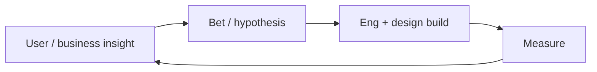

Gerente de produto
Os PMs decidem **o que construir e por quê**: descoberta, priorização, especificações e resultados — e não (normalmente) escrever código de produção.

## Dia a dia

| Atividade | Exemplos |
|----------|----------|
| Descubra | Entrevistas, dados, temas de apoio |
| Priorizar | Roteiros, compromissos, “agora não” |
| Especifique | PRDs, histórias de usuários, critérios de aceitação |
| Alinhar | Eng, design, vendas, executivos |
| Medir | Métricas de lançamento; iterar ou matar |

## Habilidades que importam

| Habilidade | Nível | Notas |
|-------|-------|-------|
| Descoberta (entrevistas, dados) | Núcleo | Encontre problemas reais |
| Priorização | Núcleo | Roteiros e “agora não” |
| Escrita de especificações | Núcleo | Critérios de aceitação que o engenheiro pode construir |
| Métricas/experimentação | Núcleo | Resultados em relação à produção |
| Comunicação com as partes interessadas | Núcleo | Alinhar engenheiros, design, vendas, executivos |
| Alfabetização técnica | Núcleo | Leia diagramas; respeitar restrições |
| Japonês (negócios) | Mercado | Frequentemente exigido para produtos nacionais |
| Facilitação de entrega | Alongamento | Desbloquear sem se tornar gerente de projeto |
| Sentido de preço/embalagem | Alongamento | Especialmente B2B SaaS |
| Redação para executivos | Alongamento | Folhas de uma página e memorandos de decisão |

## Notas do Japão

- A PM doméstica muitas vezes espera um **forte japonês** + gerenciamento das partes interessadas.
- Gaishikei/produto global pode contratar PMs com domínio do inglês primário.
- “PM” em SI/agencies pode significar gerente de projeto (cronograma) — esclareça **produto** vs **projeto**.

## Caminho de estudo (este repositório)

| Prioridade | Acompanhar |
|----------|-------|
| 1 | Chega [SWE101](../../../swe101/i-overview.md) para ler um diagrama de arquitetura |
| 2 | [Projeto do sistema](../../../swe101/sysdesign/scalable-patterns/i-overview.md) vocabulário |
| 3 | [AI Aplicado](../../../ai101/ai-engineering/i-overview.md) — pesquisa e redação |
| 4 | [Marketing digital](../../../digital-marketing/i-overview.md) se for orientado para o crescimento |
| 5 | [Idiomas](../../../languages/i-overview.md) se tiver como alvo organizações nacionais |

Construção: 2–3 **redações de caso** (problema, opções, métricas, decisão, resultado).

## Compensação (Tóquio ilustrativo)

Associado ~**¥5–8 milhões**; meados de ~**¥8–13 milhões**; seniores/grupo frequentemente **¥13–20M+** em empregadores fortes; diretores mais altos. Consulte [Compensação](../iii-compensation.md).

## Movimentos de carreira

| De PM | Em direção |
|--------|--------|
| Grupo / diretor | Liderança de produto |
| Habilidades do fundador | [Inicializações](../../../startups/i-overview.md) |
| Tecnologia profunda | Técnico PM / eng |

## Próximo

[SRE / plataforma](vii-sre-platform.md).
