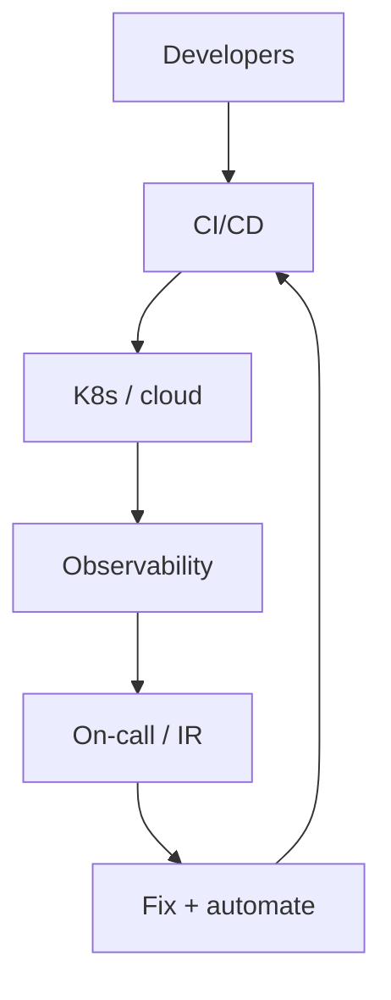

SRE / engenheiro de plataforma
Você torna a entrega **segura e enfadonha**: CI/CD, nuvem, Kubernetes, observabilidade, resposta a incidentes e plataformas internas que ajudam as equipes de produto a entregar.

## Dia a dia

| Atividade | Exemplos |
|----------|----------|
| Automatizar | Pipelines, IaC, caminhos dourados |
| Observar | Métricas, logs, rastreamentos, alertas |
| Responder | Incidentes, post-mortems |
| Endurecer | Linhas de base de segurança, privilégio mínimo |
| Habilitar | Plataformas de autoatendimento para engenharia |

## Habilidades que importam

| Habilidade | Nível | Notas |
|-------|-------|-------|
| Linux + redes | Núcleo | Depurar hosts e tráfego |
| Nuvem (AWS ou GCP) | Núcleo | Substrato padrão |
| Contêineres / Kubernetes | Núcleo | Tempo de execução comum |
| CI/CD | Núcleo | Lançamentos seguros e repetíveis |
| IaC (Terraform) | Núcleo | Ambientes reproduzíveis |
| Observabilidade | Núcleo | Métricas, logs, rastreamentos, alertas |
| Codificação para automação | Núcleo | Python/Vai/etc. — plataformas são software |
| Resposta a incidentes | Alongamento | Comando, cronogramas, postmortems |
| Linhas de base de segurança | Alongamento | IAM, segredos, política de rede |
| Experiência do desenvolvedor | Alongamento | Caminhos dourados, plataformas de autoatendimento |

## Notas do Japão

- A contratação é forte onde os produtos administram propriedades de nuvem sérias.
- O IT tradicional pode rotular trabalhos semelhantes como “インフラ” com mais operações/menos codificação — leia o JD com atenção.
- Ajuda com documentos em inglês (AWS/GCP); o bate-papo da empresa ainda pode ser japonês.

## Caminho de estudo (este repositório)

| Prioridade | Acompanhar |
|----------|-------|
| 1 | [SRE101](../../../sre101/i-overview.md) — faixa completa |
| 2 | [SWE101](../../../swe101/i-overview.md) — o suficiente para fazer parceria com back-end |
| 3 | [CS101 rede](../../../cs101/networking/i-tcp-udp-and-transport-basics.md) |
| 4 | [Cibersegurança](../../../cybersecurity/i-overview.md) noções básicas |

Build: Terraform + CI implantando um serviço com métricas e um alerta.

## Compensação (Tóquio ilustrativo)

Frequentemente nas bandas intermediárias de back-end ou acima: aproximadamente **¥8–14M** médias; sênior superior, especialmente com plantão + profundidade de nuvem. Consulte [Compensação](../iii-compensation.md).

## Movimentos de carreira

| De SRE | Em direção |
|----------|--------|
| Infraestrutura do produto | Líder de plataforma |
| Foco na segurança | SecEng |
| Sistemas profundos | Back-end da equipe |

## Rastreamento concluído

Retorne para [Visão geral dos caminhos](i-overview.md) ou [IT visão geral das carreiras](../i-overview.md).
