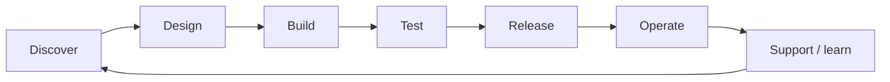
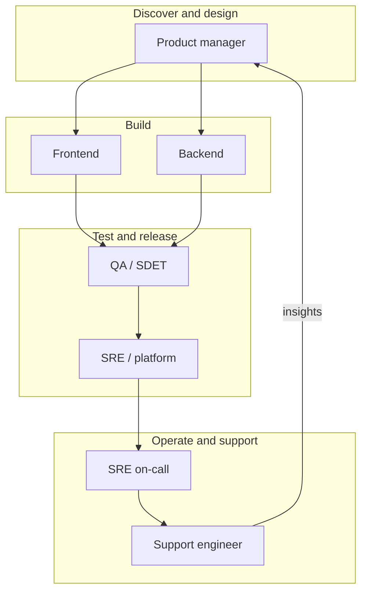
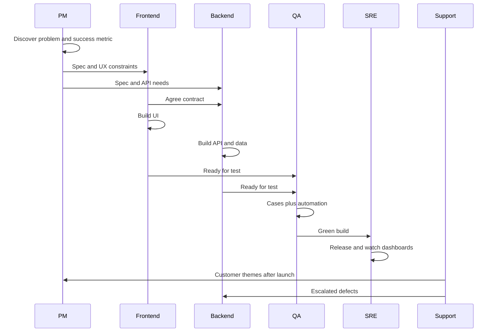

SDLC e funções
Onde cada plano de carreira se enquadra no **ciclo de vida de desenvolvimento de software (SDLC)** e quais **habilidades** são importantes em cada fase. As equipes de produto modernas usam um **loop** (não uma cascata unidirecional), mas os mesmos nomes de funções ainda se agrupam em torno de determinados estágios.

Pai: [IT visão geral das carreiras](i-overview.md) · Detalhe da função: [Caminhos](paths/i-overview.md).

## 1. SDLC como um loop

| Fase | Pergunta | Proprietários típicos |
|-------|----------|----------------|
| **Descubra** | Qual problema/resultado? | PM (+ insights de suporte, design) |
| **Projeto** | O que construir, como cabe | PM, FE/BE lidera, às vezes SRE |
| **Construir** | Torne isso real | Front-end, back-end |
| **Teste** | É seguro enviar? | QA (+ testes de redação de engenharia) |
| **Lançamento** | Leve aos usuários | SRE / plataforma, eng |
| **Operar** | Mantenha-o saudável | SRE, back-end de plantão |
| **Suporte** | Ajudar os usuários; alimentar aprendizagem | Suporte → PM / eng |

## 2. Quem aparece onde

A sobreposição pesada é normal: o backend grava testes de unidade; FE faz todas as verificações; PM junta-se às análises de lançamento; arquivos de suporte com bugs que se tornam itens do roteiro.

## 3. Visualização RACI-style (ilustrativa)

| Fase | PM | FE | BE | QA | SRE | Suporte |
|---|----|----|----|--------|-----|---------|
| Descubra | **A/R** | C | C | C | eu | **C** (temas) |
| Projeto | **A** | **R** | **R** | C | C | eu |
| Construir | C | **R** | **R** | C | C | eu |
| Teste | C | R | R | **A/R** | C | eu |
| Liberação | C | C | C | C | **A/R** | eu |
| Operar | eu | C | **R** | eu | **A/R** | C |
| Suporte | C | C | C | eu | C | **A/R** |

**R** = faz o trabalho · **A** = responsável · **C** = consultado · **I** = informado.

## 4. Habilidades por posição (lente SDLC)

### Gerente de produto

| Habilidade | SDLC usar |
|-------|----------|
| Descoberta / entrevistas | Descubra |
| Priorização e roteiro | Descobrir → Projetar |
| Escrevendo especificações/critérios de aceitação | Projetar → Construir |
| Métricas e experimentação | Liberar → Operar |
| Comunicação com as partes interessadas (geralmente em japonês em JP) | Todas as fases |
| Alfabetização técnica | Revisões de design com engenharia |

### Engenheiro de front-end

| Habilidade | SDLC usar |
|-------|----------|
| Estrutura TypeScript + UI (por exemplo, React) | Construir |
| CSS / sistemas de design / a11y | Projetar → Construir |
| Integração cliente-servidor (HTTP, autenticação) | Construir |
| Teste de componentes e E2E | Teste |
| Desempenho (CWV, pacotes) | Construir → Operar |
| detalhes de i18n / JP UX | Construir → Feedback de suporte |

### Engenheiro de back-end

| Habilidade | SDLC usar |
|-------|----------|
| Uma linguagem de servidor profundamente | Construir |
| SQL / modelagem de dados | Projetar → Construir |
| Design API (autenticação, idempotência, versionamento) | Projetar → Construir |
| Simultaneidade e modos de falha | Construir → Operar |
| Projeto de sistema | Projeto |
| Noções básicas de observabilidade (logs/métricas) | Operar |

### QA / SDET

| Habilidade | SDLC usar |
|-------|----------|
| Desenho de teste e análise de risco | Projeto → Teste |
| Automação (API / UI / ganchos de unidade) | Teste |
| CI alfabetização e controle de flocos | Teste → Liberar |
| Testes exploratórios | Teste |
| Limpar relatórios de bugs | Teste → Construir |
| Verificações de fumaça de segurança/privacidade | Teste |

### SRE / plataforma

| Habilidade | SDLC usar |
|-------|----------|
| CI/CD e engenharia de liberação | Liberação |
| Nuvem + contêineres / K8s | Liberar → Operar |
| IaC (Terraform) | Design → Liberação |
| Observabilidade e alertas | Operar |
| Resposta a incidentes/post-mortems | Operar |
| Habilitação de plataforma para eng | Construir → Liberar |

### Engenheiro de suporte

| Habilidade | SDLC usar |
|-------|----------|
| Conhecimento do produto | Suporte |
| Repro (logs, HTTP, SQL básico) | Suporte → Testar/Construir |
| Comunicação escrita | Suporte |
| Escalação e qualidade de bugs | Suporte → Construir |
| Empatia / desescalada | Suporte |
| Detecção de padrões para PM | Suporte → Descobrir |

## 5. Um recurso, todas as funções

## 6. Cascata vs entrega contínua (contexto do Japão)

| Modelo | Onde você ainda vê | Impacto da função |
|-------|-------------|------------|
| **Cachoeira / SI** | Grande empresa, alguns SIers | PM/gerenciamento de projeto mais pesado; QA como portão atrasado; menos SRE |
| **Ágil + CD** | Produto cos, gaishikei | As funções se sobrepõem mais; QA muda para a esquerda; SRE possui lançamento |

Saiba qual modelo a empresa usa — o mesmo título pode significar diferentes posicionamentos de SDLC.

## Próximo

Aprofunde uma função em [Caminhos](paths/i-overview.md) ou links de estudo em [Mapa de estudo](iv-study-map.md).
