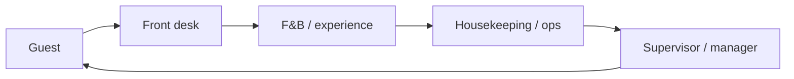

Hospitalidade
Hotéis, ryokan, restaurantes, cafés, turismo e serviços ao hóspede. A demanda turística do Japão torna a equipe de hotelaria multilíngue valiosa, especialmente em Tóquio, Kyoto, Osaka e áreas de resort.

Pai: [Outras carreiras](i-overview.md).

## Dia a dia

| Função | Exemplos |
|------|----------|
| Recepção / concierge | Check-in, solicitações de hóspedes, reservas, suporte multilíngue aos hóspedes |
| Alimentos e bebidas | Atendimento, hospedagem, bar, barista, apoio de cozinha |
| Limpeza / operações | Preparação da sala, padrões de qualidade, coordenação |
| Experiência do passeio/convidado | Orientação, planejamento, interpretação, apoio às atividades |
| Supervisor/gerente | Rotas, padrões de serviço, formação, recuperação de hóspedes |

## Habilidades que importam

| Habilidade | Nível | Notas |
|-------|-------|-------|
| Atendimento ao cliente / omotenashi | Núcleo | A barra de serviços do Japão é alta; atenção é importante |
| Japonês (conversacional+) | Núcleo | N4–N3 para atendimento aos hóspedes; mais para supervisão |
| Inglês / outros idiomas | Núcleo | Prêmio de turismo receptivo; Chinês/Coreano também valorizado |
| Compostura sob pressão | Núcleo | Atendimento de pico, reclamações, recuperação |
| POS / sistemas de reserva | Núcleo | Ferramentas de gestão e reserva de propriedades |
| Trabalho em equipe e comunicação | Núcleo | Coordenação estreita entre turnos |
| Conhecimento sobre vinho/comida ou atividade | Alongamento | Diferencial em espaços de alto padrão |
| Liderança de equipe | Alongamento | Caminho para supervisor e gerenciamento |

## Notas do Japão

- **Turismo receptivo** impulsiona forte demanda por pessoal multilíngue; os hotéis internacionais valorizam o inglês mais um terceiro idioma.
- **Redes internacionais versus pousadas locais (ryokan)** diferem em termos de remuneração, formalidade e expectativas japonesas.
- As funções sazonais e de resort (Hokkaido, Okinawa) podem incluir alojamento.
- Os padrões de serviço (身だしなみ, pontualidade, omotenashi) são levados a sério.

## Entrada e qualificações

| Rota | Notas |
|-------|-------|
| Trabalhador qualificado específico (SSW) — serviço de alimentação/alojamento | Habilidades + rota de teste de japonês para funções elegíveis |
| Visto de Trabalho Qualificado | Certas funções culinárias especializadas (por exemplo, cozinhas nomeadas) |
| Recém-licenciado/contratação em meio de carreira | Comum em grandes hotéis e redes |
| Férias de trabalho (nacionalidades elegíveis) | Entrada comum na hospitalidade sazonal |

Confirme a categoria atual do visto e a elegibilidade com o empregador.

## Remuneração (ilustrativa)

| Nível | Aproximadamente ¥M/ano |
|-------|-----------------|
| Atendimento de entrada/linha de frente | 2.8–4 |
| Atendimento experiente/bilíngue | 3,5–5,5 |
| Supervisor | 4,5–7 |
| Gerente de hotel / local | 6–12+ |

Gorjetas não são habituais no Japão; salário base, subsídios de turno e (às vezes) moradia são mais importantes. Propriedades internacionais de luxo pagam acima da média local.

## Como entrar / progredir

1. Desenvolva um japonês de conversação e um segundo idioma convidado.
2. Inicie a linha de frente (recepção, alimentos e bebidas) para aprender os padrões de serviço.
3. Aprenda sistemas de propriedade/reserva e recuperação de reclamações.
4. Passe para o supervisor e depois para o gerenciamento do local ou do departamento.
5. Especialize-se (luxo, MICE, receita/operações) para faixas mais altas.

## Relacionado

- [Idiomas](../../languages/i-overview.md) para estudo japonês.
- [Visão geral das carreiras](../i-overview.md) · [Outras carreiras](i-overview.md).

## Próximo

[Saúde e cuidados](iii-healthcare.md).
