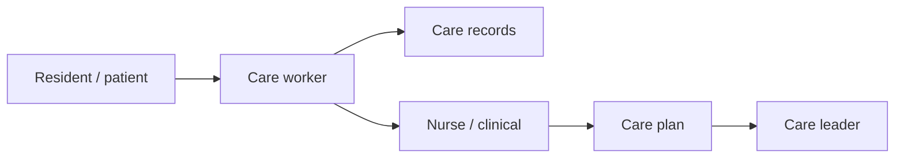

Cuidados de saúde e cuidados
Cuidados de enfermagem, idosos e deficientes (介護, kaigo) e apoio de saúde aliado. O envelhecimento da população do Japão faz com que a prestação de cuidados seja uma das áreas de maior procura, com rotas de visto dedicadas para trabalhadores estrangeiros.

Não é conselho médico. As regras de licenciamento são rigorosas e mudam – verifique com os empregadores e as autoridades japonesas relevantes.

Pai: [Outras carreiras](i-overview.md).

## Dia a dia

| Função | Exemplos |
|------|----------|
| Trabalhador de cuidados (介護職) | Apoio à vida diária, mobilidade, alimentação, banho, registos |
| Enfermeira (看護師) | Cuidados clínicos sob licença japonesa |
| Apoio/assistente de cuidados | Apoio às instalações, atividades, comunicação familiar |
| Assistência domiciliar (訪問介護) | Visitas domiciliares e cuidados pessoais |
| Líder / gestor de cuidados | Planejamento de cuidados, escalas, treinamento de pessoal, compliance |

## Habilidades que importam

| Habilidade | Nível | Notas |
|-------|-------|-------|
| Japonês (comunicação + leitura) | Núcleo | Registros de cuidados e segurança exigem um japonês sólido |
| Empatia e paciência | Núcleo | Dignidade e confiança com moradores e famílias |
| Resistência física e manuseio seguro | Núcleo | Transferências, apoio à mobilidade |
| Fundamentos de cuidados | Núcleo | Higiene, nutrição, observação, elaboração de relatórios |
| Trabalho em equipe e transferência | Núcleo | Continuidade dos cuidados por turnos |
| Resposta de emergência | Alongamento | Reconhecendo e escalando mudanças |
| Planejamento / liderança do cuidado | Alongamento | Caminho para funções de líder e gerente |

## Notas do Japão

- **介護 (kaigo)** a demanda é alta e crescente devido à demografia; trabalhadores estrangeiros são ativamente recrutados.
- A habilidade japonesa é essencial para segurança, registros e comunicação familiar – muitas vezes necessária para o visto.
- As qualificações nacionais (por exemplo, **介護福祉士 Certified Care Worker**) aumentam o salário e a estabilidade.
- Enfermagem (看護師) exige licenciamento japonês; enfermeiras estrangeiras geralmente precisam se qualificar no Japão.

## Entrada e qualificações

| Rota | Notas |
|-------|-------|
| Trabalhador qualificado específico (SSW) — cuidados de enfermagem (介護) | Habilidades + rota de teste de japonês |
| Visto para Cuidados de Enfermagem (介護) | Para aqueles que se tornam Profissionais de Cuidados Certificados |
| Programa EPA | Programas bilaterais (por exemplo, Indonésia, Filipinas, Vietname) com formação + exames |
| Programas de treinamento técnico | Entrada estruturada com apoio do empregador |

Normalmente são necessários testes de língua japonesa e de habilidades; confirmar o caminho atual.

## Remuneração (ilustrativa)

| Nível | Aproximadamente ¥M/ano |
|-------|-----------------|
| Trabalhador de cuidados de entrada | 2,8–3,8 |
| Cuidador certificado (介護福祉士) | 3,5–5 |
| Líder de cuidados | 4,5–6 |
| Gerente de instalações/cuidados | 5,5–8+ |
| Enfermeira licenciada (看護師) | 4,5–7+ |

Os subsídios e as qualificações do turno nocturno afectam materialmente os salários. Alguns empregadores fornecem moradia ou apoio ao estudo para a certificação.

## Como entrar / progredir

1. Alcance o japonês funcional (meta para N3+ para registros de cuidados e segurança).
2. Inscreva-se via SSW, EPA ou um programa de treinamento com um empregador de apoio.
3. Ganhe experiência e busque a certificação **介護福祉士**.
4. Progresso para líder de atendimento e gerenciamento de instalações ou especialização.

## Relacionado

- [Idiomas](../../languages/i-overview.md) para estudo japonês.
- [Visão geral das carreiras](../i-overview.md) · [Outras carreiras](i-overview.md).

## Próximo

[Educação e ensino](iv-education.md).
