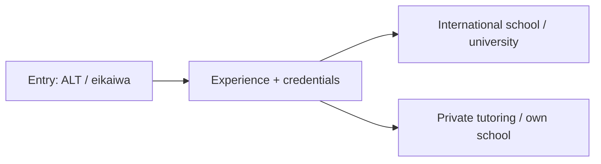

Educação e ensino
O ensino no Japão abrange conversação em inglês (eikaiwa), ensino assistente de idiomas (ALT) em escolas públicas, escolas internacionais, universidades e aulas particulares (cursinhos, 塾). É uma das vias de entrada mais comuns para estrangeiros.

Pai: [Outras carreiras](i-overview.md).

## Dia a dia

| Função | Exemplos |
|------|----------|
| ALT (professor assistente de línguas) | Apoiar professores de japonês em escolas públicas; aulas, pronúncia, cultura |
| Instrutor Eikaiwa | Aulas de conversação para crianças e adultos em escolas particulares |
| Professor de escola internacional | Ensino curricular completo (frequentemente licenciado) em inglês |
| Docente universitário | Inglês, ensino de disciplinas, pesquisa (requisitos mais elevados) |
| Cursinho (塾) / tutor | Preparação para exames, suporte de disciplinas, aulas particulares |

## Habilidades que importam

| Habilidade | Nível | Notas |
|-------|-------|-------|
| Comunicação clara e entrega de aulas | Núcleo | Envolver idades e níveis variados |
| Gestão de sala de aula | Núcleo | Principalmente com crianças |
| Paciência e sensibilidade cultural | Núcleo | Adaptando-se às normas escolares japonesas |
| Planejamento e avaliação | Núcleo | Currículo, materiais, feedback |
| Japonês (varia) | Mercado | Baixo para eikaiwa/ALT; superior para administração e coordenação |
| Licença/licenciatura | Alongamento | Obrigatório para escolas e universidades internacionais |
| Especialização temática | Alongamento | Aumenta salários e opções (IB, preparação para exames) |

## Notas do Japão

- **ALT e eikaiwa** são primeiros empregos comuns; normalmente é necessário um diploma de bacharel para o visto.
- **Escolas e universidades internacionais** esperam uma licença de ensino e/ou diplomas superiores e pagam significativamente mais.
- **Programa JET** é uma rota ALT bem conhecida administrada pelo governo.
- Ser um **falante nativo ou quase nativo de inglês** ajuda nas funções linguísticas, mas as qualificações separam as carreiras de períodos curtos.

## Entrada e qualificações

| Rota | Notas |
|-------|-------|
| Visto de instrutor | Comum para funções de ensino de idiomas |
| Engenheiro/Especialista em Ciências Humanas | Algumas funções de treinamento corporativo e adjacentes à educação |
| Programa JET | Colocação governamental ALT, muitas vezes fora das grandes cidades |
| Licença docente + experiência | Obrigatório para escolas internacionais; fortemente preferido nas universidades |

Geralmente é necessário um diploma de bacharel para vistos de ensino; confirmar os requisitos atuais.

## Remuneração (ilustrativa)

| Nível | Aproximadamente ¥M/ano |
|-------|-----------------|
| Eikaiwa / entrada ALT | 2,5–3,6 |
| Experiente ALT / eikaiwa sênior | 3–4,5 |
| Professor de escola internacional (licenciado) | 5–9+ |
| Docente universitário | 4–8+ (varia muito) |
| Coordenador/gestor escolar | 4,5–7 |

Escolas internacionais e algumas universidades pagam bem acima do valor de entrada eikaiwa/ALT; a renda de aulas particulares varia de acordo com as horas e a reputação.

## Como entrar / progredir

1. Inscreva-se via eikaiwa, ALT ou JET com diploma de bacharel.
2. Ganhe experiência em sala de aula e reúna referências.
3. Obtenha uma licença ou especialização de ensino (por exemplo, TEFL/CELTA e, em seguida, licenciamento formal).
4. Avançar para escolas, universidades ou funções de coordenação internacionais.
5. Opcionalmente, crie aulas particulares ou sua própria escola (consulte [Rota do Gerente de Negócios](v-finance-and-business.md)).

## Relacionado

- [Idiomas](../../languages/i-overview.md) para seu próprio estudo de japonês.
- [Visão geral das carreiras](../i-overview.md) · [Outras carreiras](i-overview.md).

## Próximo

[Finanças e negócios](v-finance-and-business.md).
