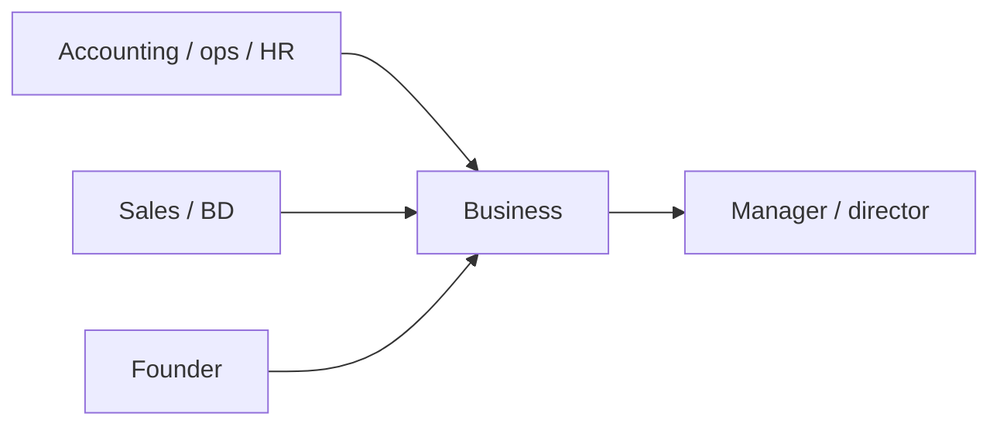

Finanças e negócios
Contabilidade, bancos, seguros, vendas, marketing, operações, HR e funções gerais de back-office - além de fundar uma empresa. Essas funções variam desde assentos gaishikei amigáveis ​​aos ingleses até cargos domésticos de grande peso japonês.

Não é aconselhamento financeiro ou jurídico. Verifique os detalhes do licenciamento e do visto com empregadores e profissionais licenciados.

Pai: [Outras carreiras](i-overview.md).

## Dia a dia

| Função | Exemplos |
|------|----------|
| Contabilidade/finanças | Escrituração, fechamento, elaboração de relatórios, coordenação tributária, FP&A |
| Banca / seguros | Atendimento ao cliente, análise, compliance, back office |
| Vendas/desenvolvimento de negócios | Pipeline, reuniões com clientes, propostas, gerenciamento de contas |
| Marketing/operações | Campanhas, coordenação de fornecedores, processos, logística |
| HR /administrador | Contratação, coordenação de folha de pagamento, suporte aos funcionários |
| Fundador/gerente de negócios | Administração de uma empresa, contratação, finanças, estratégia |

## Habilidades que importam

| Habilidade | Nível | Notas |
|-------|-------|-------|
| Japonês (negócios) | Núcleo–Mercado | Alto para funções domésticas; abaixe em alguns gaishikei |
| Numeração e atenção aos detalhes | Núcleo | Finanças, contabilidade, operações |
| Comunicação e construção de relacionamento | Núcleo | Vendas, trabalho com clientes, gestão de partes interessadas |
| Ferramentas de domínio | Núcleo | Excel, software de contabilidade, CRM, ERP |
| Conscientização sobre conformidade | Núcleo | Financiamento regulamentado e regras transfronteiriças |
| Certificações (簿記, CPA, CFA, etc.) | Alongamento | Aumentar salários e abrir cargos de especialistas |
| Reportagem bilíngue | Alongamento | Papel de ponte entre HQ e o Japão |

## Notas do Japão

- **Empresas Gaishikei (capital estrangeiro)** oferecem funções financeiras, de vendas e operações mais amigáveis ​​ao inglês; as empresas nacionais geralmente esperam **japoneses empresariais**.
- **Certificação de Escrituração Contábil (簿記)** é amplamente reconhecida para funções contábeis; credenciais globais (CPA/CFA) ajudam nas finanças internacionais.
- **Funções de ponte bilíngues** (conectando HQ no exterior e operações no Japão) são valorizadas.
- Fundar uma empresa utiliza o visto **Gerente de Negócios**, com requisitos de capital e substância.

## Entrada e qualificações

| Rota | Notas |
|-------|-------|
| Engenheiro/Especialista em Ciências Humanas | Comum para finanças, vendas, marketing, HR, operações |
| Transferência intra-empresa | Movendo-se dentro de uma multinacional |
| Visto de Gerente de Negócios | Para fundadores/gestores que cumpram as regras de investimento e de substância |
| Profissional Altamente Qualificado | Baseado em pontos; pode acelerar benefícios para perfis fortes |

Confirme o visto atual e quaisquer requisitos de licenciamento com o empregador ou advogado.

## Remuneração (ilustrativa)

| Nível | Aproximadamente ¥M/ano |
|-------|-----------------|
| Entrada backoffice / admin | 3–4,5 |
| Contador/analista (médio) | 4,5–8 |
| Vendas / BD (com comissão) | 4,5–10+ |
| Gerente / controlador | 8–15 |
| Finanças Gaishikei (sênior) | 12–25+ |

A capacidade e as certificações bilíngues alteram significativamente os salários; O gaishikei e as finanças globais situam-se bem acima das médias nacionais.

## Como entrar / progredir

1. Desenvolver o japonês para negócios (ou direcionar funções de gaishikei amigáveis ​​ao inglês).
2. Adicione uma credencial reconhecida (簿記 para contabilidade; CPA/CFA para finanças).
3. Ganhe experiência em uma função específica (finanças, vendas, operações).
4. Passe para funções de gerenciamento, especialista ou ponte bilíngue.
5. Para abrir uma empresa, planeje o visto **Gerente de Negócios** e veja [Startups](../../startups/i-overview.md).

## Relacionado

- [Inicializações](../../startups/i-overview.md) para financiar um orçamento.
- [Digital marketing](../../digital-marketing/i-overview.md) para caminhos de marketing.
- [Visão geral das carreiras](../i-overview.md) · [Outras carreiras](i-overview.md).

## Próximo

[Ofícios qualificados](vi-skilled-trades.md).
