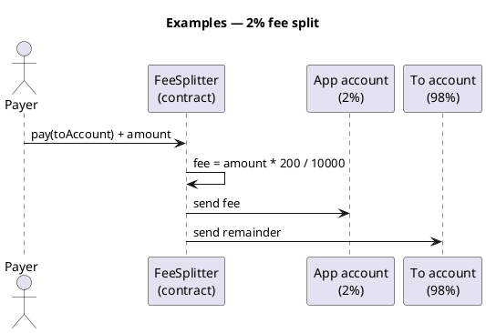

Criptomoeda101 – Exemplos
Orientações completas de **implantação e pagamento** para o [padrão de divisão de taxas] compartilhado(../v-fee-split-pattern.md): entrada de pagamento → **2%** para a **conta do aplicativo** (tesouraria) → **resto** para a conta **para** (destinatário).

Cada exemplo é um **layout de projeto de copiar e colar** — não um repositório agrupado. Audite e teste na **testnet** antes da mainnet.

## Mapa

| Exemplo | Rede | Idioma | Taxa |
|--------|---------|----------|-----|
| [Tron – implantação de divisão de taxa de 2%](ii-tron-two-percent-fee-split.md) | Tron (TVM) | Solidez + TronBox | 200 pontos base (2%) |
| [TON — implantação de divisão de taxa de 2%](iii-ton-two-percent-fee-split.md) | TON | Tato + Projeto | 200 pontos base (2%) |

## Regra compartilhada (ambos os exemplos)

```text
amount     = TRX or TON attached to pay()
fee        = amount × 200 / 10000    → appAccount (2%)
remainder  = amount - fee            → toAccount (recipient)
```



## Antes de começar

| Tópico | Onde |
|-------|--------|
| O que são criptografia/txs | [O que é criptomoeda?](../ii-what-is-cryptocurrency.md) |
| UTXO vs conta | [Como as transações são armazenadas](../iii-how-transactions-are-stored.md) |
| Verifique no testnet | [Verifique antes da transmissão](../viii-verify-before-broadcast.md) |
| Txs/gás falhados | [Falha nas transações e fundos](../vii-failed-transactions-and-funds.md) |

## Próximo

Comece com [Tron](ii-tron-two-percent-fee-split.md) se você já conhece Solidity, ou [TON](iii-ton-two-percent-fee-split.md) para Tato + Projeto.
