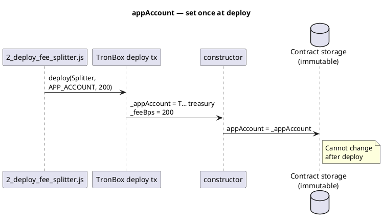
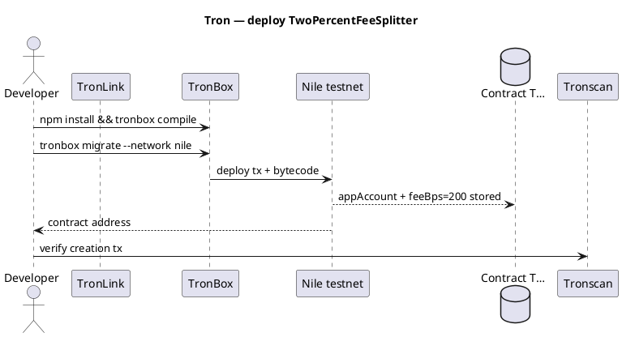

Exemplo - Tron: divisão de taxas de 2% (implantação completa)
Implante um contrato do **Solidity** no **Tron** (TVM) que aceita **TRX**, envia **2%** para sua **conta do aplicativo** e **98%** para uma conta **para**. Usa **TronBox** + **TronLink** na rede de teste **Nile**.

Pai: [Visão geral dos exemplos](i-overview.md) · Rede: [Visão geral do Tron](../networks/tron/i-overview.md).

**Não é aconselhamento financeiro.** Contrato mínimo para aprendizagem – auditoria antes da produção.

## 1. O que você está construindo

| Função | Endereço | Recebe |
|------|---------|----------|
| **Conta do aplicativo** | Sua carteira do tesouro (`T…`) | **2%** de cada pagamento (200 bps) |
| **Para conta** | Destinatário por chamada (`T…`) | **98%** restante |
| **Contrato** | Implantado`T…`| Contém apenas lógica - não deve acumular TRX |

```text
User calls pay(toAccount) with 100 TRX attached:
  appAccount  ← 2 TRX
  toAccount   ← 98 TRX
```

## 2. Layout do projeto

```text
tron-fee-split-2pct/
  package.json
  tronbox.js
  contracts/
    Migrations.sol                 # from `tronbox init`
    TwoPercentFeeSplitter.sol      # fee logic
  migrations/
    1_initial_migration.js
    2_deploy_fee_splitter.js     # deploy with app account + 200 bps
  scripts/
    call_pay.js                  # optional: test pay() from CLI
```

| Arquivo | Finalidade |
|------|---------|
| **`TwoPercentFeeSplitter.sol`** |`pay(toAccount)`divisões`msg.value`|
| **`tronbox.js`** | Nilo/mainnet RPC + chave privada para implantação |
| **`2_deploy_fee_splitter.js`** | Passa o endereço da **conta do aplicativo** e`feeBps = 200`|
| **`call_pay.js`** | Envia teste`pay()`após a implantação |

## 3. Contrato – fonte completa

(R)`contracts/TwoPercentFeeSplitter.sol`(R)

```solidity
// SPDX-License-Identifier: MIT
pragma solidity ^0.8.20;

/// @title TwoPercentFeeSplitter — 2% to app account, rest to recipient (Tron TVM)
contract TwoPercentFeeSplitter {
    /// Treasury / app wallet — immutable after deploy
    address public immutable appAccount;
    /// Basis points: 200 = 2.00%
    uint256 public immutable feeBps;

    event Paid(
        address indexed payer,
        address indexed toAccount,
        uint256 amount,
        uint256 fee,
        uint256 remainder
    );

    constructor(address _appAccount, uint256 _feeBps) {
        require(_appAccount != address(0), "zero app account");
        require(_feeBps <= 10_000, "fee too high");
        appAccount = _appAccount;
        feeBps = _feeBps;
    }

    /// @notice Send TRX: 2% to appAccount, remainder to toAccount
    /// @param toAccount Recipient (must accept TRX)
    function pay(address payable toAccount) external payable {
        require(msg.value > 0, "no trx");
        require(toAccount != address(0), "zero to account");

        uint256 fee = (msg.value * feeBps) / 10_000;
        uint256 remainder = msg.value - fee;

        (bool okApp, ) = appAccount.call{value: fee}("");
        require(okApp, "app transfer failed");

        (bool okTo, ) = toAccount.call{value: remainder}("");
        require(okTo, "to transfer failed");

        emit Paid(msg.sender, toAccount, msg.value, fee, remainder);
    }
}
```

Para uma implantação de mainnet **fixa de 2%**, o construtor usa`_feeBps = 200`.

### Onde`appAccount`obtém seu valor

`immutable`significa: **atribua exatamente uma vez no construtor**, então ele é inserido no bytecode do contrato para sempre. Não há setter posterior.

```text
1. You set env var     TRON_APP_ACCOUNT=TYourTreasuryWallet...
2. Migration runs      deployer.deploy(Splitter, APP_ACCOUNT, 200)
3. TronBox broadcasts  constructor(address _appAccount, uint256 _feeBps)
4. Constructor runs    appAccount = _appAccount;   ← ONLY assignment
5. On-chain forever    pay() reads appAccount for the 2% send
```



| Etapa | Localização do código | O que acontece |
|------|---------------|-------------|
| **Declarar** |`address public immutable appAccount;`| Nomeia o campo — **nenhum valor ainda** |
| **Passe** |`constructor(address _appAccount, …)`| Implantar tx inclui seu tesouro`T…`endereço |
| **Atribuir** |`appAccount = _appAccount;`(linha no construtor) | **O valor é definido aqui** |
| **Usar** |`appAccount.call{value: fee}("")`em`pay()`| Lê o endereço armazenado na implantação |
| **Verificar** | Tronscan → Ler contrato →`appAccount()`| Público`immutable`coletor automático |

(R)`toAccount`** é diferente — **não** está armazenado no contrato. Os chamadores passam a cada`pay(toAccount)`como destinatário desse pagamento.

```javascript
// migrations/2_deploy_fee_splitter.js — this address becomes appAccount
const APP_ACCOUNT = process.env.TRON_APP_ACCOUNT;
deployer.deploy(Splitter, APP_ACCOUNT, FEE_BPS);
//                      ^^^^^^^^^^^^
//                      constructor 1st argument → appAccount
```

## 4. Configuração do TronBox

(R)`package.json`(R)

```json
{
  "name": "tron-fee-split-2pct",
  "version": "1.0.0",
  "devDependencies": {
    "tronbox": "^3.1.0"
  }
}
```

(R)`tronbox.js`(R)

```javascript
module.exports = {
  networks: {
    nile: {
      privateKey: process.env.TRON_PRIVATE_KEY,
      userFeePercentage: 100,
      feeLimit: 1_000_000_000,
      fullHost: "https://nile.trongrid.io",
      network_id: "*",
    },
    mainnet: {
      privateKey: process.env.TRON_PRIVATE_KEY,
      userFeePercentage: 100,
      feeLimit: 1_000_000_000,
      fullHost: "https://api.trongrid.io",
      network_id: "*",
    },
  },
  compilers: {
    solc: { version: "0.8.20" },
  },
};
```

| Configuração | Significado |
|--------|---------|
| **`feeLimit`** | Max TRX queimou energia neste tx (contexto de unidades solares em TronBox) |
| **`TRON_PRIVATE_KEY`** | Carteira do implementador — **nunca se comprometa** com o git |

## 5. Migrações

(R)`migrations/1_initial_migration.js`(R)

```javascript
const Migrations = artifacts.require("Migrations");
module.exports = function (deployer) {
  deployer.deploy(Migrations);
};
```

(R)`migrations/2_deploy_fee_splitter.js`(R)

```javascript
const Splitter = artifacts.require("TwoPercentFeeSplitter");

// Your treasury Tron address (T…)
const APP_ACCOUNT = process.env.TRON_APP_ACCOUNT;
const FEE_BPS = 200; // 2%

module.exports = function (deployer) {
  deployer.deploy(Splitter, APP_ACCOUNT, FEE_BPS);
};
```

## 6. Fluxo de implantação



```text
# 0. Scaffold (adds Migrations.sol + migration 1)
npm install -g tronbox
mkdir tron-fee-split-2pct && cd tron-fee-split-2pct
tronbox init
# add TwoPercentFeeSplitter.sol, 2_deploy_fee_splitter.js, edit tronbox.js

# 1. Nile TRX from faucet (TronLink on Nile testnet)
# 2. Set env vars (PowerShell example)
$env:TRON_PRIVATE_KEY = "your-hex-private-key"
$env:TRON_APP_ACCOUNT = "TYourAppTreasuryAddress..."

npm install
npx tronbox compile
npx tronbox migrate --network nile
# Note contract address from output
```

| Etapa | Verifique |
|------|--------|
| Compilar | Sem erros de solidez |
| Migrar | Tronscan Nile mostra **Criação de Contrato** |
| Ler`appAccount()`| Corresponde ao seu tesouro`T…`|
| Ler`feeBps()`| Devoluções`200`|

## 7. Ligue`pay()`— enviar um pagamento de teste

**TronLink/TronIDE**

1. Abra o contrato no Nile Tronscan → **Escrever contrato**.
2.`pay(toAccount)`— definir **toAccount** = destinatário`T…`.
3. Anexe **Valor da chamada** = por exemplo.`10`TRX.
4. Confirme — a carteira deve conter **10 TRX + energia/largura de banda**.

(R)`scripts/call_pay.js`** (opcional)

```javascript
const TronWeb = require("tronweb");
const CONTRACT = "TContractAddressFromDeploy...";
const TO_ACCOUNT = "TRecipientAddress...";
const PAY_SUN = 10_000_000; // 10 TRX = 10 * 1e6 sun

const tronWeb = new TronWeb({
  fullHost: "https://nile.trongrid.io",
  privateKey: process.env.TRON_PRIVATE_KEY,
});

async function main() {
  const abi = [/* paste ABI from build/contracts/TwoPercentFeeSplitter.json */];
  const contract = await tronWeb.contract(abi, CONTRACT);
  await contract.pay(TO_ACCOUNT).send({
    callValue: PAY_SUN,
    feeLimit: 100_000_000,
  });
  console.log("pay() sent");
}

main().catch(console.error);
```

## 8. Verifique o pagamento concluído

| Verifique | Esperado |
|-------|----------|
| Tronscan tx **Resultado** |`SUCCESS`|
| Evento **Pago** |`fee`= 2% de`amount`,`remainder`= 98% |
| Saldo da conta do aplicativo | +2% |
| Para saldo da conta | +98% |
| Carteira do chamador | −quantidade − energia/largura de banda |

Exemplo com pagamento **100 TRX**:

```text
fee       = 100 × 200 / 10000 = 2 TRX   → appAccount
remainder = 98 TRX                    → toAccount
```

Consulte [Verificar segurança e conclusão](../ix-verify-safe-and-completed.md#4-tron-tvm).

## 9. Falhas comuns

| Erro | Causa | Correção |
|-------|-------|-----|
|`no trx`|`callValue`= 0 | Anexe TRX |
|`to transfer failed`| Contrato do destinatário rejeita TRX | Use EOA ou contrato a pagar |
|`insufficient funds`| TRX insuficiente para valor + energia | Completar; veja [Parte VII](../vii-failed-transactions-and-funds.md) |
| Implantar alta energia | Bytecode grande | Otimize o compilador; apostar TRX na mainnet |

## 10. Lista de verificação da rede principal

| # | Artigo |
|---|------|
| 1 | Execute o fluxo completo no **Nile** |
| 2 |`staticCall`/ simulação de contrato constante`pay()`|
| 3 | Definir`TRON_APP_ACCOUNT`para tesouraria de produção |
| 4 |`tronbox migrate --network mainnet`|
| 5 | Canário`pay()`com pequeno TRX |
| 6 | Salve o endereço do contrato de **seu** tx de implantação |

## 11. Relacionado

- [TON — implantação de divisão de taxa de 2%](iii-ton-two-percent-fee-split.md)
- [Visão geral da rede Tron](../networks/tron/i-overview.md)
- [Padrão de divisão de taxas](../v-fee-split-pattern.md)
