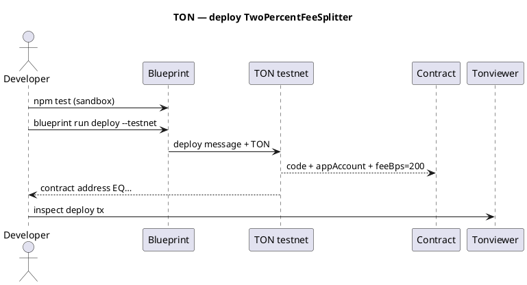

Exemplo — TON: divisão de taxas de 2% (implantação completa)
Implante um contrato do **Tact** em **TON** com **Blueprint** que aceita **TON**, envia **2%** para sua **conta do aplicativo** e **98%** para uma conta **para** passada em cada mensagem de **Pay**.

Pai: [Visão geral dos exemplos](i-overview.md) · Rede: [TON visão geral](../networks/ton/i-overview.md).

**Não é aconselhamento financeiro.** Contrato mínimo para aprendizagem – auditoria antes da produção.

## 1. O que você está construindo

| Função | Endereço | Recebe |
|------|---------|----------|
| **Conta do aplicativo** | Carteira do Tesouro (`EQ…`-&#09;o`UQ…`) | **2%** por pagamento |
| **Para conta** | Destinatário em cada`Pay`mensagem | **98%** restante |
| **Contrato** | Endereço da cadeia de trabalho implantada | Executa lógica dividida |

```text
User sends Pay{ toAccount } with 1 TON attached:
  appAccount  ← 0.02 TON
  toAccount   ← 0.98 TON
```

TON usa **mensagens**, não`msg.value`— o valor é **`context().value`** na mensagem recebida.

## 2. Layout do projeto (Blueprint)

```text
ton-fee-split-2pct/
  package.json
  tsconfig.json
  blueprint.config.ts
  contracts/
    two_percent_fee_splitter.tact
  scripts/
    deployTwoPercentFeeSplitter.ts
  tests/
    TwoPercentFeeSplitter.spec.ts
  wrappers/
    TwoPercentFeeSplitter.ts          # generated after build
```

| Caminho | Finalidade |
|------|---------|
| **`two_percent_fee_splitter.tact`** | Contrato: 2% para`appAccount`, descanse para`msg.toAccount`|
| **`deployTwoPercentFeeSplitter.ts`** | Implantar com endereço do aplicativo +`feeBps = 200`|
| **`TwoPercentFeeSplitter.spec.ts`** | Teste sandbox antes do testnet |
| **`wrappers/`** | Ligações TypeScript (`blueprint build`) |

## 3. Contrato – fonte completa do Tact

(R)`contracts/two_percent_fee_splitter.tact`(R)

```tact
import "@stdlib/deploy";

/// Incoming pay request — recipient is the "to" account
message Pay {
    toAccount: Address;
}

/// 2% (configurable bps) to app treasury, remainder to toAccount
contract TwoPercentFeeSplitter with Deployable {
    appAccount: Address;
    feeBps: Int as uint16; // 200 = 2%

    init(appAccount: Address, feeBps: Int) {
        require(feeBps >= 0 && feeBps <= 10_000, "fee too high");
        self.appAccount = appAccount;
        self.feeBps = feeBps;
    }

    receive(msg: Pay) {
        let amount: Int = context().value;
        require(amount > 0, "no value");

        let fee: Int = amount * self.feeBps / 10_000;
        let remainder: Int = amount - fee;

        // 2% → app account
        send(SendParameters{
            to: self.appAccount,
            value: fee,
            mode: SendPayGasSeparately,
            bounce: false,
            body: "fee".asComment(),
        });

        // 98% → to account
        send(SendParameters{
            to: msg.toAccount,
            value: remainder,
            mode: SendPayGasSeparately,
            bounce: false,
            body: "payout".asComment(),
        });
    }

    get fun app_account(): Address {
        return self.appAccount;
    }

    get fun fee_bps(): Int {
        return self.feeBps;
    }
}
```

| Constante | Valor para 2% |
|----------|----------------|
| **`feeBps`** |`200`|
| **Taxa sobre 1 TON** |`0.02 TON`nanotons internamente |

## 4. Configuração do pacote Blueprint

(R)`package.json`(R)

```json
{
  "name": "ton-fee-split-2pct",
  "version": "1.0.0",
  "scripts": {
    "build": "blueprint build",
    "test": "jest",
    "deploy:testnet": "blueprint run deployTwoPercentFeeSplitter --testnet"
  },
  "devDependencies": {
    "@ton/blueprint": "^0.22.0",
    "@ton/core": "^0.56.0",
    "@ton/crypto": "^3.3.0",
    "@ton/sandbox": "^0.20.0",
    "@ton/ton": "^14.0.0",
    "@types/jest": "^29.5.0",
    "jest": "^29.7.0",
    "ts-jest": "^29.1.0",
    "typescript": "^5.3.0"
  }
}
```

Andaime mais rápido com:

```text
npm create ton@latest ton-fee-split-2pct
# choose Blueprint + Tact, then replace contracts/ with the file above
```

## 5. Implantar script

(R)`scripts/deployTwoPercentFeeSplitter.ts`(R)

```typescript
import { toNano } from "@ton/core";
import { NetworkProvider } from "@ton/blueprint";
import { TwoPercentFeeSplitter } from "../wrappers/TwoPercentFeeSplitter";

// Treasury wallet — your app account (testnet or mainnet)
const APP_ACCOUNT = "EQAAAAAAAAAAAAAAAAAAAAAAAAAAAAAAAAAAAAAAAAAAAM9c"; // replace
const FEE_BPS = 200n; // 2%

export async function run(provider: NetworkProvider) {
  const splitter = provider.open(
    await TwoPercentFeeSplitter.fromInit(APP_ACCOUNT, FEE_BPS),
  );

  await splitter.send(
    provider.sender(),
    { value: toNano("0.05") }, // deploy + initial balance for sends
    { $$type: "Deploy", queryId: 0n },
  );

  await provider.waitForDeploy(splitter.address);
  console.log("TwoPercentFeeSplitter:", splitter.address.toString());
}
```

| Ambiente | Como |
|-----|-----|
| **Rede de teste** |`npx blueprint run deployTwoPercentFeeSplitter --testnet`|
| **Carteira** | Tonkeeper/TonConnect via Blueprint UI |
| **Mnemônico** |`.env`— nunca se comprometa |

## 6. Teste no sandbox (antes do testnet)

(R)`tests/TwoPercentFeeSplitter.spec.ts`(R)

```typescript
import { Blockchain } from "@ton/sandbox";
import { toNano } from "@ton/core";
import { TwoPercentFeeSplitter } from "../wrappers/TwoPercentFeeSplitter";

describe("TwoPercentFeeSplitter", () => {
  it("splits 2% to app and 98% to toAccount", async () => {
    const blockchain = await Blockchain.create();
    const app = await blockchain.treasury("app");
    const to = await blockchain.treasury("to");
    const payer = await blockchain.treasury("payer");

    const splitter = blockchain.openContract(
      await TwoPercentFeeSplitter.fromInit(app.address, 200n),
    );

    await splitter.send(
      payer.getSender(),
      { value: toNano("1") },
      { $$type: "Deploy", queryId: 0n },
    );

    await splitter.send(
      payer.getSender(),
      { value: toNano("1") },
      { $$type: "Pay", toAccount: to.address },
    );

    expect((await app.getBalance()) >= toNano("0.02")).toBe(true);
    expect((await to.getBalance()) >= toNano("0.98")).toBe(true);
  });
});
```

```text
npm install
npm test
```

## 7. Fluxo de implantação



```text
npm install
npm run build
npm test
npx blueprint run deployTwoPercentFeeSplitter --testnet
# copy contract address from output
```

## 8. Envie um pagamento (fluxo do usuário)

A carteira do usuário envia uma mensagem interna ao contrato:

| Campo | Valor |
|-------|-------|
| **Para** | Endereço do contrato |
| **Valor** | Pagamento + reserva de gás (por exemplo, 1,05 TON por 1 pagamento de TON) |
| **Carga útil** |`Pay { toAccount: <recipient EQ…> }`|

**Cliente TypeScript (após implantação)**

```typescript
import { Address, toNano } from "@ton/core";
import { TwoPercentFeeSplitter } from "./wrappers/TwoPercentFeeSplitter";

const contract = client.open(
  TwoPercentFeeSplitter.createFromAddress(Address.parse("EQContract...")),
);

await contract.send(
  sender,
  { value: toNano("1.05") },
  {
    $$type: "Pay",
    toAccount: Address.parse("EQToAccount..."),
  },
);
```

**Teste manual do Tonkeeper:** use um script dApp ou Blueprint — carteiras brutas precisam de um pequeno UI para codificar`Pay`.

## 9. Verifique no explorer

| Verifique | Esperado |
|-------|----------|
| Status do Tonviewer | **Sucesso** (não devolvido) |
| Mensagens enviadas | Um para **appAccount** (~2%), um para **toAccount** (~98%) |
|`get fee_bps`|`200`|
| Mensagem devolvida | **Não** — caso contrário, o pagamento falhou |

```text
1 TON payment:
  fee       = 1 × 200 / 10000 = 0.02 TON → app
  remainder = 0.98 TON                 → to
```

O contrato mantém pouco TON se **`SendPayGasSeparately`** — o gás provém do valor agregado; contrato de financiamento com pequeno float para tráfego pesado.

Consulte [Verificar segurança e conclusão](../ix-verify-safe-and-completed.md#5-ton).

## 10. Falhas comuns

| Sintoma | Causa | Correção |
|--------|-------|-----|
|`no value`| Mensagem enviada com 0 TON | Anexar valor |
| Devolvido`Pay`| Ruim`toAccount`ou taxa a termo insuficiente | Mais TON em anexo; endereço válido |
| Implantar caro | Células de código grandes | Otimizar; custo de teste na saída do Blueprint |
| Divisão errada | Errado`feeBps`na implantação | Reimplantar com`200`|

## 11. Lista de verificação da rede principal

| # | Artigo |
|---|------|
| 1 |`npm test`verde |
| 2 | Implante em **testnet**; enviar teste`Pay`|
| 3 | Confirme divisões no Tonviewer |
| 4 | Definir endereço de produção da **conta do aplicativo** |
| 5 |`blueprint run deploy --mainnet`|
| 6 | Canário com pequena quantidade de TON |

## 12. Tron vs TON (este exemplo)

| | **Exemplo de Tron** | **TON exemplo** |
|---|------------------|-----------------|
| Idioma | Solidez | Tato |
| Ligue |`pay(toAccount)`+ TRX |`Pay { toAccount }`mensagem + TON |
| Valor |`msg.value`|`context().value`|
| Ferramentas | TronBox | Projeto |
| Explorador | Tronscan | Visualizador de tons |

## 13. Relacionado

- [Tron – implantação de divisão de taxa de 2%](ii-tron-two-percent-fee-split.md)
- [TON visão geral da rede](../networks/ton/i-overview.md)
- [Verifique antes da transmissão](../viii-verify-before-broadcast.md)
