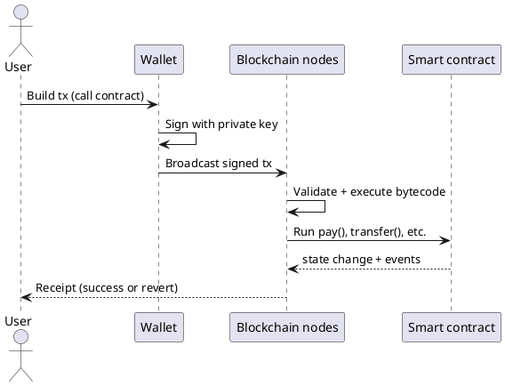

Cryptocurrency101 — Parte II: O que é criptomoeda?
**Criptomoeda** é um valor digital rastreado em um **razão compartilhado** (geralmente um **blockchain**) onde a propriedade é imposta por **criptografia**, e não por um único banco de dados da empresa. **A Parte III** cobre [como as transações são armazenadas](iii-how-transactions-are-stored.md); **Parte IV** cobre [tipos de blockchains](iv-types-of-blockchains.md).

Este curso é **conceitual e educacional**, não um aconselhamento financeiro.

## 1. Ideia central

| Prazo | Significado simples |
|------|----------------|
| **Criptomoeda** | Ativo digital cujas transferências são registradas em uma rede que muitas partes podem verificar |
| **Bloqueio** | Uma cadeia de blocos — cada bloco agrupa transações recentes e vincula-se ao bloco anterior |
| **Registro** | O registro de quem detém o quê (ou quais resultados não foram gastos) |
| **Nó** | Software que armazena uma cópia (ou subconjunto) do razão e segue as regras da rede |
| **Carteira** | Chaves + software que **assina** transações — não “guarda moedas” dentro do aplicativo; a cadeia faz |

```text
Traditional bank app          Cryptocurrency network
────────────────────          ────────────────────────
Bank's private database       Thousands of nodes share rules + ledger
You trust the bank            You verify rules via open protocol + crypto
Chargeback / reversal         Finality rules differ — often irreversible
```

Você não está comprando “um arquivo no seu stick USB”. Você controla **chaves** que autorizam movimentações em um registro de **toda a rede**.

## 2. Chaves, endereços e assinaturas

A propriedade é **criptografia de chave pública**:

```text
Private key  →  kept secret  →  signs transactions (proves authorization)
Public key   →  derived      →  often hashed into an "address"
Address      →  shared       →  where others send value
```

| Peça | Função |
|-------|------|
| **Chave privada** | Como uma senha que você nunca deve compartilhar – qualquer pessoa com ela pode gastar |
| **Assinatura** | Prova matemática de que o detentor da chave privada aprovou **esta exata** transação |
| **Endereço** | Rótulo de destino (0x… em EVM,`T…`em Tron,`addr1…`em Cardano, etc.) |

**Chaves perdidas = acesso perdido** para a maioria das redes — geralmente não há “redefinição de senha” em uma autoridade central.

## 3. Moeda nativa vs token

| | **Moeda nativa** | **Token** |
|---|-----------------|-----------|
| **Exemplos** | BTC, ETH, BNB, TRX, TON, ADA | USDT em BSC, BEP-20, TRC-20, Jettons |
| **Paga taxas de rede?** | **Sim** — taxa de gás/energia/tx | Normalmente **não** – você ainda precisa de moeda nativa para taxas |
| **Definido por** | Regras de protocolo da cadeia | Contrato inteligente ou regras de contabilidade no topo da cadeia |

```text
User wallet
  ├── BNB (native)     → pays gas on BNB Chain
  └── USDT (token)     → contract balance; transfer needs BNB for gas
```

Páginas específicas da rede ([BNB](networks/bnb/i-overview.md), [Tron](networks/tron/i-overview.md), [TON](networks/ton/i-overview.md), [Cardano](networks/ada/i-overview.md)) explicitam moedas nativas e padrões de tokens.

## 4. Contratos inteligentes (alto nível)

Um **contrato inteligente** é um **código de programa implantado no blockchain** que é executado quando os usuários enviam transações para ele. Pode:

- Manter o valor e liberá-lo quando as regras forem cumpridas
- Pagamentos divididos (consulte [Padrão de divisão de taxas](v-fee-split-pattern.md))
- Implementar tokens, swaps, votação, depósito



O contrato **está na cadeia** — você não o hospeda em um VPS. Você paga **uma vez para implantar** e depois **taxas por transação**. Consulte [Implantação e hospedagem](vi-deploy-pricing-and-hosting.md).

## 5. A descentralização é um espectro

| Estilo | Quem executa os nós | Exemplos |
|-------|----------------|----------|
| **Público sem permissão** | Qualquer um | Bitcoin, Ethereum, Cadeia BNB, Cardano |
| **Consórcio/permissionado** | Operadores aprovados | Algumas cadeias empresariais |
| **Lista centralizado** | Uma empresa | Não é a “cripto” clássica – é mais como DB interno |

“Descentralizado” **não** significa “sem humanos” — significa que **nenhuma parte** deve ser confiável para as **regras** do livro-razão, dentro dos limites do protocolo e do software cliente que você usa.

## 6. O que criptomoeda não é

| Equívoco | Realidade |
|---------------|---------|
| **Anônimo por padrão** | A maioria das redes são **pseudônimos** – os endereços são públicos nos exploradores |
| **Dinheiro grátis instantâneo** | Taxas, volatilidade, fraudes e transações malsucedidas são comuns |
| **Apoiado por todos os governos** | Varia — muitos ativos não têm curso legal |
| **Reversível como PayPal** | As transferências na rede geralmente são **finais** depois de confirmadas |
| **Armazenado dentro do aplicativo de carteira** | A carteira contém **chaves**; os saldos estão no **razão** |

## 7. Como esta faixa usa essas ideias

Partes posteriores e páginas de **rede** presumem que você sabe:

| Conceito | Usado para |
|--------|----------|
| **Transações assinadas** | Todo`pay()`ou transferência |
| **Moeda nativa para taxas** | [Fundos insuficientes](vii-failed-transactions-and-funds.md) |
| **Contratos inteligentes** | Exemplos de FeeSplitter em cada cadeia |
| **Conta vs UTXO** | [Tipos de blockchain](iv-types-of-blockchains.md) - Solidity vs Aiken parece diferente |

## 8. Relacionado

- **Parte I** — [Visão geral](i-overview.md) — mapa da trilha
- **Parte III** — [Como as transações são armazenadas](iii-how-transactions-are-stored.md)
- **Parte IV** — [Tipos de blockchains](iv-types-of-blockchains.md)
- [Cibersegurança — hashing e assinaturas](../cybersecurity/i-overview.md) (intuição)
- **Parte V** — [Padrão de divisão de taxas](v-fee-split-pattern.md)
