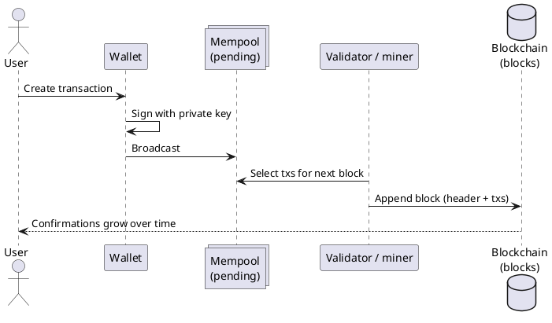
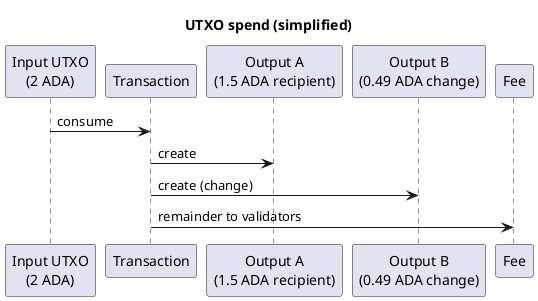
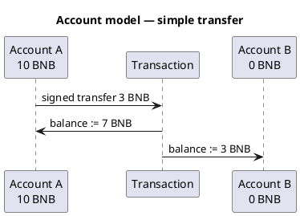

Cryptocurrency101 — Parte III: Como as transações são armazenadas
As transações não são linhas no banco de dados SQL de uma empresa. Elas são **mensagens assinadas** agrupadas em **blocos**, vinculadas em uma **cadeia** e copiadas entre **nós**. **A forma** de representação dos saldos difere: **UTXO** (saídas) vs **conta** (saldos globais).

Assume **Parte II** [O que é criptomoeda?](ii-what-is-cryptocurrency.md).

## 1. Ciclo de vida — da carteira à rede



| Palco | O que está armazenado | Onde |
|-------|----------------|-------|
| **Criado** | Tx não assinado ou assinado na memória da carteira | Seu dispositivo |
| **Transmissão** | Bytes tx assinados | **Mempool** em nós (pendente) |
| **Incluído** | Tx dentro de um **bloco** | On-chain — permanente para fins práticos |
| **Confirmado** | Bloco enterrado sob blocos mais novos | Mais profundo = mais difícil de reverter |

## 2. O que uma transação contém

Cada rede contém campos ligeiramente diferentes, mas o padrão é:

| Campo (conceitual) | Finalidade |
|--------------------|---------|
| **Entradas / de** | O que você gasta ou qual conta envia |
| **Saídas / para** | Destinatários e montantes |
| **Quantidade/valor** | Quantidade de moedas ou tokens nativos |
| **Taxa** | Pagamento aos validadores pela inclusão |
| **Nonce / sequência** | Evita repetição e pedidos de gasto duplo (cadeias de contas) |
| **Assinatura** | Comprova autorização |

```text
Signed transaction
  ├── "I authorize moving X from me to Y"
  ├── fee to validators
  └── signature = proof from private key
```

Se a assinatura for inválida ou as regras forem quebradas, os nós **rejeitam** o tx (mempool) ou marcam-no como **failed** quando executado em um bloco.

## 3. Blocos e a corrente

Um **bloco** é um lote de transações mais metadados:

```text
Block N
  ├── header
  │     ├── hash of previous block  ← links the chain
  │     ├── timestamp
  │     ├── merkle root of txs
  │     └── (consensus fields — PoS vote, etc.)
  └── body: list of transactions
```

```text
Genesis → Block 1 → Block 2 → Block 3 → …
            ↑         ↑
         prev hash  prev hash
```

| Propriedade | Significado |
|----------|---------|
| **Imutabilidade (prático)** | Alterar um bloco antigo quebra a cadeia de hash – os nós o rejeitam |
| **Transparência** | Blocos de índice Explorers (BscScan, Tronscan,…) para humanos |
| **Replicação** | Muitos nós armazenam cópias completas ou parciais |

**Confirmações** = número de blocos adicionados após o bloco que incluiu seu tx. Mais confirmações → mais caro reescrever a história.

## 4. Onde residem os dados - nós

| Tipo de nó | Lojas | Função |
|-----------|--------|------|
| **Nó completo** | Blocos completos + (geralmente) estado atual | Valida tudo |
| **Nó de arquivo** | História completa + estado antigo | Analytics, indexadores |
| **Cliente leve** | Cabeçalhos + provas | Verificação estilo carteira com menos disco |

Sua **carteira** se comunica com um provedor RPC ou com seu próprio nó — ela não precisa armazenar toda a cadeia localmente, a menos que você execute um nó.

## 5. Dois modelos de armazenamento — UTXO vs conta

Esta é a divisão mais importante para leitura de contratos e exploradores.

### UTXO (saída de transação não gasta)

Usado por **Bitcoin** e **Cardano (eUTXO)**.

```text
No single "balance" field per address on-chain.

Ledger = set of outputs:
  Output 1: 0.5 BTC to address A
  Output 2: 1.2 ADA to address B
  ...

Spend = consume whole outputs, create new outputs (change back to self)
```

| Idéia | Detalhe |
|------|--------|
| **UTXO** | Um pedaço discreto de valor com uma condição de bloqueio |
| **Transação** | Consome um ou mais UTXOs como **entradas**, cria novas **saídas** |
| **Saldo** | Soma de UTXOs que você pode desbloquear – o software da carteira calcula isso |



**Cardano** estende isso com **eUTXO** — as saídas carregam **dados** (dados) e os validadores verificam se as saídas da **próxima** transação são legais. Veja [Cardano](networks/ada/i-overview.md).

### Modelo de conta

Usado por **Ethereum**, **BNB Chain**, **Tron**, **TON** (mensagens baseadas em conta).

```text
Global state:
  address 0xABC…  →  balance: 10 BNB
  address 0xDEF…  →  balance: 0 TRX
  contract 0x123… →  bytecode + storage slots
```

| Idéia | Detalhe |
|------|--------|
| **Conta** | Um registro semelhante a uma linha por endereço |
| **Transação** | Atualiza saldos e/ou executa código de contrato |
| **`msg.value`** | Moeda nativa enviada com a chamada (EVM) |



**EVM cadeias (BNB, Tron)** parecem quase iguais no código – RPC, token de gás e ferramentas são diferentes. Consulte [BNB](networks/bnb/i-overview.md), [Tron](networks/tron/i-overview.md).

### Lado a lado

| | **UTXO /eUTXO** | **Conta** |
|---|------------------|---------|
| **Unidade estadual** | Resultados a gastar | Saldo por endereço + armazenamento de contrato |
| **“Equilíbrio”** | Derivado de resultados | Armazenado diretamente |
| **Contratos inteligentes** | Validadores de resultados | Bytecode no endereço |
| **Matemática de taxas** | Entradas − saídas = taxa |`gas_used × gas_price`|
| **Esta faixa** | Cardano | BNB, Tron, TON |

## 6. Armazenamento de contrato (cadeias de contas)

Nas cadeias EVM-style, um contrato implantado tem:

| Loja | Detém |
|-------|--------|
| **Bytecódigo** | Programa imutável (a menos que padrões de proxy) |
| **Slots de armazenamento** | Chave/valor mutável (mapeamento de saldos,`feeBps`,`owner`, …) |
| **Saldo** | Moeda nativa detida pelo endereço do contrato |

Transações que **chamam** o armazenamento de leitura/gravação do contrato de acordo com o código. Eventos (`Paid`,`Transfer`) são **logs** – indexados por exploradores, mas não “armazenamento” no mesmo sentido.

## 7. Mempool e pedidos

Antes da inclusão, os txs assinados aguardam no **mempool**:

| Comportamento | Efeito |
|----------|--------|
| **Taxa mais alta** | Frequentemente escolhido primeiro em congestionamentos |
| **Tx inválido** | Caiu – nunca armazenado na rede |
| **Substituído** | Algumas redes apoiam a substituição do aumento de taxas |

Se o seu tx nunca sair do mempool (taxa muito baixa), **sem registro na rede** – você não paga nada na rede.

## 8. Finalidade e reversões

| Resultado | Armazenado na rede? | Taxa cobrada? |
|--------|------------------|-----------|
| **Rejeitado no mempool** | Não | Não |
| **Incluído, falha na execução (reversão)** | Sim — registro de execução com falha | Normalmente **sim** (o trabalho foi feito) |
| **Incluído, sucesso** | Sim — estado atualizado | Sim |

Detalhes por rede: [Transações e fundos com falha](vii-failed-transactions-and-funds.md).

## 9. Como ler um explorador

| Coluna do explorador | Corrente UTXO (Cardano) | Cadeia de contas (BNB) |
|-----------------|----------------------|---------------------|
| **Entradas/saídas** | Lista UTXO | Freqüentemente “De / Para” |
| **Valor** | Soma das realizações |`Value`campo + txs internos |
| **Status** | Válido/falha na fase 2 | Sucesso/Falha (reverter) |
| **Registros** | Menos comum | Eventos de contratos |

Após a transmissão: [Verificar segurança e conclusão](ix-verify-safe-and-completed.md).

## 10. Relacionado

- **Parte II** — [O que é criptomoeda?](ii-what-is-cryptocurrency.md)
- **Parte IV** — [Tipos de blockchains](iv-types-of-blockchains.md)
- **Parte VII** — [Transações e fundos com falha](vii-failed-transactions-and-funds.md)
- **Parte IX** — [Verifique se está seguro e concluído](ix-verify-safe-and-completed.md)
