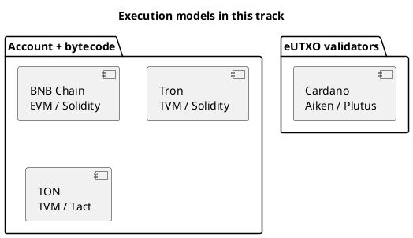

Cryptocurrency101 — Parte IV: Tipos de blockchains
Blockchains diferem por **quem pode aderir**, **como o acordo é alcançado**, **em que camada** eles se situam e **como o estado é modelado**. Esta página classifica a paisagem e mapeia **as redes desta trilha** para cada tipo.

Baseia-se na **Parte III** [Como as transações são armazenadas](iii-how-transactions-are-stored.md) (UTXO vs conta).

## 1. Permissão — quem pode ler e escrever

| Tipo | Leia | Escreva (envie txs) | Execute o validador | Exemplos |
|------|------|--------------------|---------------|----------|
| **Público sem permissão** | Qualquer um | Qualquer pessoa (pagar taxa) | Aberto ou baseado em estacas | Bitcoin, Ethereum, Cadeia BNB, Cardano, TON, Tron |
| **Permissão pública** | Qualquer um | Identidades aprovadas | Conjunto aprovado | Alguns pilotos “empresariais” |
| **Particular/consórcio** | Membros | Membros | Operadores conhecidos | Redes estilo Hyperledger |

Este curso se concentra em cadeias **públicas** onde você implanta contratos no estilo **FeeSplitter** e usa exploradores públicos.

## 2. Camada — L1, L2, cadeias laterais

```text
                    ┌─────────────────┐
  User / dApp  ────►│  L2 (rollup)    │───┐
                    │  cheaper txs    │   │ settles to
                    └─────────────────┘   ▼
                    ┌─────────────────┐
                    │  L1 (base chain) │  security + final settlement
                    │  Ethereum, BNB…  │
                    └─────────────────┘
```

| Camada | Função | Troca |
|-------|------|-----------|
| **L1 (camada base)** | Consenso, segurança, ativo nativo | Taxas mais altas, âncora de maior confiança |
| **L2** | Lotes de muitos txs, posta prova/estado em L1 | Mais barato; suposições extras de ponte/operador |
| **Cadeia lateral** | Cadeia separada com validadores próprios | Muitas vezes mais rápido; segurança não é idêntica a L1 |

| Rede nesta faixa | Camada | Notas |
|-----------------------|-------|-------|
| [BNB Cadeia](networks/bnb/i-overview.md) | **L1** (EVM) | Validadores próprios; EVM-compatível |
| [Tron](networks/tron/i-overview.md) | **L1** (TVM) | EVM-como Solidez; modelo energia/largura de banda |
| [TON](networks/ton/i-overview.md) | **L1** | Design fragmentado; contratos baseados em mensagens |
| [Cardano](networks/ada/i-overview.md) | **L1** | eUTXO; PoS (Ouroboros) |

## 3. Consenso — como o próximo bloco é escolhido

Você não precisa implementar o consenso para redigir contratos — mas isso explica a **finalidade** e as **taxas**.

| Família | Idéia | Usado por (exemplos) |
|--------|------|-------------------|
| **Prova de Trabalho (PoW)** | Mineiros gastam computação para encontrar bloco válido | Bitcoin (historicamente muitas cadeias) |
| **Prova de Participação (PoS)** | Validadores apostados propõem/votam em blocos | Pós-fusão Ethereum, Cardano, BNB (PoSA) |
| **PoS delegado (DPoS)** | Detentores de tokens votam em conjunto limitado de validadores | Tron (modelo SR) |
| **Outro/híbrido** | Combinações, comitês BFT | Vários L1s |

| Pergunta | Por que você se importa |
|----------|-------------|
| **Tempo de bloqueio** | Com que rapidez aparece “1 confirmação” |
| **Finalidade** | Quando a reversão se torna impraticável |
| **Conjunto validador** | Compensação entre centralização e descentralização |

## 4. Modelo de execução – como funcionam os contratos inteligentes

| Modelo | Correntes | Experiência do desenvolvedor |
|-------|--------|----------------------|
| **EVM** (pilha VM) | Ethereum, **BNB**, muitos L2s | **Solidity**, Capacete de Segurança, Fundição |
| **EVM-como TVM** | **Tron** | Solidez + TronWeb; energia/largura de banda |
| **TON VM** | **TON** | **FunC**, **Tato**; mensagens entre contratos |
| **eUTXO** | **Cardano** | **Aiken**, Plutus — validadores em resultados |



### Família EVM (BNB, Tron)

- Um **endereço de contrato** com funções de **armazenamento** e **a pagar**
- **`msg.value`** carrega moeda nativa
- **`call`-&#09;o`transfer`**enviar para outras contas
- Mesmo padrão de solidez de **divisão de taxas** com pequenas diferenças de implantação

### TON

- **Contas** e **mensagens** entre contratos
- Os contratos podem rejeitar ou devolver mensagens
- Jettons = token padrão (análogo a ERC-20)

### Cardano eUTXO

- A lógica valida **que as saídas** de uma transação estão corretas
- Não global`msg.value`— você cria **resultados** com quantidades corretas
- **Datum** carrega estado; **redentor** carrega argumentos de chamada

Veja a comparação em [Padrão de divisão de taxas](v-fee-split-pattern.md).

## 5. Padrões de token por tipo de cadeia

| Corrente | Moeda nativa | Padrão de token fungível |
|-------|-------------|-------------|
| BNB Cadeia | BNB | BEP-20 (ERC-20 compatível) |
| Tron | TRX | TRC-20 |
| TON | TON | Jettons |
| Cardano | ADA | Ativos nativos em UTXO |

A moeda nativa sempre paga **taxas de rede**; os tokens são movidos por meio de regras de contrato ou razão.

## 6. Comparação - redes nesta faixa

| | **BNB/Tron** | **TON** | **Cardano (ADA)** |
|---|----------------|---------|-------------------|
| **Modelo razão** | Conta | Conta + mensagens assíncronas | **eUTXO** |
| **Idioma** | Solidez | Tato (alto nível) | Aiken / Plutus |
| **Gás / taxas** | BNB gás / TRX energia | TON computação + armazenamento | ADA taxa de transferência + min-ADA por produção |
| **Ferramentas** | Capacete de segurança, MetaMask / TronLink | Projeto, Tonkeeper | Aiken, Lúcido |
| **Melhor caminho tutorial** | Mais próximo dos documentos do Ethereum | Modelo de mensagem diferente | Modelo mental diferente |

**Escolha uma rede** para aprender a implantação primeiro — [BNB Chain](networks/bnb/i-overview.md) é o mais próximo dos tutoriais convencionais do Ethereum.

## 7. Escolhendo uma corrente (lente de engenharia)

| Necessidade | Muitas vezes inclina-se para |
|------|-------------------|
| **Solidez + ferramentas EVM** | BNB Corrente, Tron |
| **Taxas baixas, ecossistema Telegram** | TON |
| **Métodos formais / UTXO história de auditoria** | Cardano |
| **Liquidez DeFi máxima** | Ethereum L1 ou grande L2 (não é uma página separada nesta faixa) |
| **Registro privado empresarial regulamentado** | Cadeia permitida — fora do escopo aqui |

Nenhuma dessas opções remove **auditoria**, **testnet** ou revisão **legal** — consulte [Visão geral — segurança](i-overview.md).

## 8. Relacionado

- **Parte III** — [Como as transações são armazenadas](iii-how-transactions-are-stored.md)
- **Parte V** — [Padrão de divisão de taxas](v-fee-split-pattern.md)
- **Parte VI** — [Implantação e hospedagem](vi-deploy-pricing-and-hosting.md)
- Aprofundamentos da rede: [BNB](networks/bnb/i-overview.md) · [Tron](networks/tron/i-overview.md) · [TON](networks/ton/i-overview.md) · [Cardano](networks/ada/i-overview.md)
