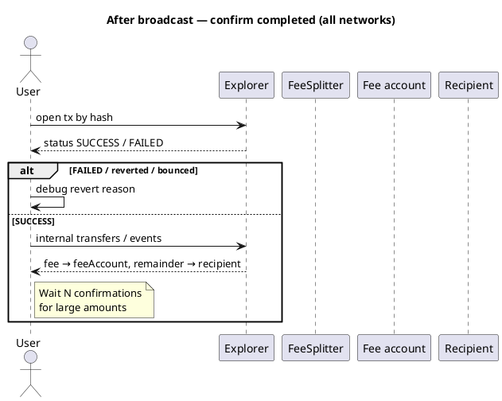

Cryptocurrency101 — Parte IX: Verifique se é seguro e concluído
**Seguro** = você está assinando a coisa certa (contrato, valor, destinatário corretos, sem fraude óbvia).  
**Concluída** = a transação foi **incluída em um bloco** e **sucedida** (não revertida/não devolvida/válida em Cardano).

```text
BEFORE sign     →  safe to send?   (simulation, address check, UI review)
AFTER included  →  completed?      (explorer status, receipt, balances, events)
```

Verificações pré-transmissão: [Verificar antes da transmissão](viii-verify-before-broadcast.md).

## 1. Duas fases

| Fase | Pergunta | Quem verifica | Custo se estiver errado |
|-------|----------|------------|---------------|
| **Pré-assinar (seguro)** | É isso que pretendo? | Carteira, dApp,`staticCall`| Normalmente **sem** taxa se a carteira for bloqueada |
| **Pós-mina (concluída)** | Teve sucesso na rede? | Explorer, recibo RPC, saldos | Gás **pago** se revertido |



## 2. Cheques compartilhados (FeeSplitter`pay()`)

| Verifique | Seguro (antes) | Concluído (depois) |
|-------|---------------|-------------------|
| Endereço do contrato | Seu endereço implantado (não phishing) | Mesmo “Para” em tx |
| Função |`pay(recipient)`| Decodificações de entrada para`pay`|
| Montante | UI`msg.value`= pretendido | O campo de valor Tx corresponde |
| Destinatário | Endereço correto | Os registros mostram o mesmo destinatário |
| Matemática de taxas |`fee = value × bps / 10000`| Conta de comissões + saldos dos destinatários |
| Resultado |`staticCall`consegue | Sucesso do Explorer + evento **pago** |

## 3. Cadeia BNB (BSC) — EVM

| | Detalhe |
|---|--------|
| **Explorador** | [BscScan](https://bscscan.com) |
| **Seguro antes de assinar** | **Cadeia ID 56**; **Para** = TaxaSplitter;`staticCall`|
| **Concluído** | Recibo **`status: 1`**; **`0`** = revertido |
| **Confirmações** | 1 = incluído; **12–15+** para grandes somas |
| **Prova extra** | **Registros** —`Paid`evento; **Txns internos** |

```javascript
const receipt = await provider.waitForTransaction(txHash, 1);
if (receipt.status !== 1) throw new Error('reverted');
```

Detalhes: [BNB Cadeia](networks/bnb/i-overview.md).

## 4. Tron (TVM)

| | Detalhe |
|---|--------|
| **Explorador** | [Tronscan](https://tronscan.org) |
| **Seguro antes de assinar** | Rede Principal vs Shasta;`T…`endereço; ensaio a seco |
| **Concluído** | **Resultado: SUCCESS** (não REVERT / OUT_OF_ENERGY) |
| **Confirmações** | **Mais de 19 blocos** para fins cautelosos |

```javascript
const info = await tronWeb.trx.getTransactionInfo(txId);
if (info.receipt.result !== 'SUCCESS') throw new Error('failed');
```

Detalhes: [Tron](networks/tron/i-overview.md).

## 5. TON

| | Detalhe |
|---|--------|
| **Explorador** | [Tonviewer](https://tonviewer.com) |
| **Seguro antes de assinar** | Rede principal`-239`; simular primeiro |
| **Concluído** | Sucesso; mensagens **não devolvidas** |
| **Confirmações** | Freqüentemente, 1–2 blocos para UX |

```text
Bounced message  →  NOT completed
Exit code 0      →  compute succeeded
```

Detalhes: [TON](networks/ton/i-overview.md).

## 6. Cardano (ADA) – eUTXO

| | Detalhe |
|---|--------|
| **Explorador** | [Cardanoscan](https://cardanoscan.io) |
| **Seguro antes de assinar** | Pré-produção vs mainnet;`transaction build`OK |
| **Concluído** | **Válido** tx; **resultados** esperados (comissão + destinatário) |
| **Confirmações** | Frequentemente **3–10+** em dApps |

Verifique **saídas na transação**, não`msg.value`.

Detalhes: [Cardano](networks/ada/i-overview.md).

## 7. Tabela de comparação

| Rede | Sinal “Concluído” | Explorador | Espera típica |
|---------|-------------------|----------|-------------|
| **BNB** | Recibo`status: 1`| BscScan | 1 rápido; 12+ grandes |
| **Tron** |`SUCCESS`| Tronscan | ~19 blocos |
| **TON** | Sucesso, sem salto | Visualizador de tons | 1–2 blocos |
| **Cardano** | Válido + saídas | Cardanoscan | 3–10+ |

## 8. Verificações de fraude

| Risco | Mitigação |
|------|------------|
| **Endereço de contrato errado** | Salve o endereço de **seu** tx de implantação |
| **Aprovação ilimitada de tokens** | Revise as aprovações separadamente de`pay()`|
| **DApp de phishing** | Carteira de hardware; ler tx decodificado |
| **“Sucesso” prematuro UI** | Aguarde o recebimento, não apenas “enviado” |

## 9. Padrão dApp

```text
1. user signs
2. show "Pending…" + explorer link
3. poll receipt until confirmed
4. success → show fee/remainder breakdown
5. reverted → failure + explorer link (gas spent)
```

## 10. Relacionado

- **Parte VIII** — [Verificar antes da transmissão](viii-verify-before-broadcast.md)
- **Parte VII** — [Transações e fundos com falha](vii-failed-transactions-and-funds.md)
