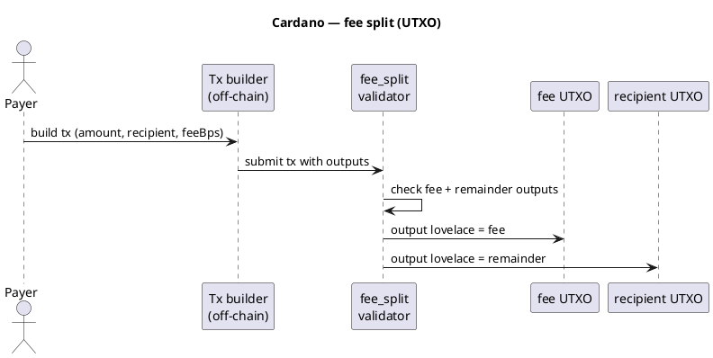

Cardano (ADA) — visão geral
**Cardano** usa o modelo **eUTXO** — o valor reside em **produtos**, não em um único saldo de contrato. Validadores (scripts on-chain) **verificam** se uma transação é permitida; **Aiken** é uma linguagem moderna para escrevê-los. **Plutus** (Haskell) é a linguagem original da plataforma.

Trilha principal: [Visão geral do Cryptocurrency101](../../i-overview.md).

## Perfil de rede

| | **Cardano** |
|---|-------------|
| **Tipo** | Camada 1, eUTXO |
| **Idiomas** | **Aiken** (recomendado), **Plutus Tx** (Haskell) |
| **Ferramentas** | cardano-cli, malha SDK, Blockfrost |
| **Moeda nativa** | ADA (amor: 1 ADA = 1_000_000 amor) |
| **Tokens** | Ativos nativos em UTXO (política ID + nome do ativo) |

## Como eUTXO difere de EVM

```text
EVM (BNB/Tron):  contract holds balance → pay() splits inside contract

Cardano:         transaction has INPUTS and OUTPUTS
                 validator ensures: sum(in) = sum(out) + fee
                 one output → feeAddress (fee)
                 one output → recipient (remainder)
```

Muitas vezes você **cria a transação fora da cadeia** (dApp ou carteira); o **validador** prova que a divisão está correta.

## Padrão de divisão de taxas



## Exemplo — Validador Aiken (esboço)

O validador verifica se os gastos provenientes da entrada do contrato dividem o valor corretamente. **Datum** contém configuração; **redentor** carrega a intenção do destinatário.

```aiken
use aiken/crypto.{VerificationKeyHash}
use cardano/transaction.{OutputReference, Transaction, InlineDatum}
use cardano/assets

pub type Config {
  fee_account: VerificationKeyHash,
  fee_bps: Int,
}

pub type Redeemer {
  recipient: VerificationKeyHash,
}

/// Simplified: ensure two outputs pay fee_account and recipient with correct lovelace split.
validator fee_split(config: Config) {
  spend(
    _datum: Option<Data>,
    redeemer: Redeemer,
    self: Transaction,
  ) {
    let Transaction { outputs, .. } = self

    // In production: locate script input value, sum outputs to fee + recipient,
    // assert fee == input * config.fee_bps / 10_000

    let expected_fee = /* computed from input lovelace */
    let expected_remainder = /* input - expected_fee */

    let fee_ok =
      outputs
        |> list.any(fn(out) {
          assets.lovelace_of(out.value) == expected_fee
            && out.address.payment_credential == config.fee_account
        })

    let pay_ok =
      outputs
        |> list.any(fn(out) {
          assets.lovelace_of(out.value) == expected_remainder
            && out.address.payment_credential == redeemer.recipient
        })

    fee_ok && pay_ok
  }
}
```

| Peça | Função |
|-------|------|
| **`Config`** | Dados on-chain – hash pubkey da conta de taxa,`fee_bps`|
| **`Redeemer`** | Quem recebe o restante desse gasto |
| **`spend`validador** | Devoluções`True`somente se os resultados corresponderem à matemática das taxas |

Validadores de produção completa também lidam com **um mínimo de ADA** por saída, **tokens nativos** e **entradas de referência** — consulte [documentos da Aiken](https://aiken-lang.org).

## Construção de transação fora da cadeia (conceito)

```text
1. Payer selects UTXO with amount lovelace
2. fee = amount * feeBps / 10000
3. remainder = amount - fee - tx_fee
4. Outputs:
     - fee_account:     fee lovelace
     - recipient:       remainder lovelace
     - change (payer):  optional
5. Attach datum + redeemer; sign; submit
```

Bibliotecas (**Mesh**, **Lucid**) automatizam a seleção e o balanceamento de UTXO.

## Plutus (Haskell) — mesma lógica

Plutus Tx compila no mesmo script on-chain; a sintaxe é mais pesada:

```haskell
-- Plutus: validator checks output values — same fee/remainder rules as Aiken
```

Novos projetos geralmente escolhem **Aiken** para maior clareza e tempos de compilação mais rápidos.

## Implantar preços

No Cardano você paga **ADA taxas de transação** para incluir o **script validador** em uma transação (cunhar/publicar). **Não há medidor de gás de implantação única no estilo EVM-** — escalas de custo com **tamanho da transação** e **bytes de script**. Ainda **não há servidor** para hospedar o script.

| Artigo | Faixa típica (2026) | Notas |
|------|----------------------|-------|
| **Publicar validador Aiken simples** | **~$2 – $15** USD | Tamanho do script + min ADA no script UTXO |
| **Script Plutus grande** | **$15 – $100+** | Bytecode pesado |
| **Cada gasto (usar validador)** | **~$0,15 – $0,50** | Taxa de Tx + min-ADA saídas |
| **Pré-produção/testnet de visualização** | **$0** | Torneira ADA |

### O que impulsiona o custo

```text
tx_fee_lovelace ≈ a + b × tx_size_bytes
min_ada         ≈  per output (script UTXO needs deposit)
```

| Fator | Efeito |
|--------|--------|
| **Tamanho do roteiro** | Maior Aiken/Plutus → maior tx → taxa mais alta |
| **Mín ADA** | Saídas com tokens/scripts bloqueiam ~1–3+ ADA até serem gastas |
| **Scripts de referência** | Reutilizar script on-chain – pague uma vez, consulte depois (CIP-33) |

| Validador FeeSplitter | Ordem de grandeza |
|-----------------------|-----|
| Publicar roteiro + endereço mint | ~1 – 5 ADA total (taxa + depósito) |
| Um tx de gasto validado | ~0,2 – 0,5 ADA |

**Estimativa:**

```text
cardano-cli transaction build … --testnet-magic 1
# inspect "fee" in build output before sign
```

Ou use **Mesh** / **Lucid**`complete()`— retorna a taxa antes de enviar.

### Implantar versus usar

| Etapa | Ação em cadeia | Pago uma vez por… |
|------|-----------------|----------------|
| **Compilar Aiken** | Fora da cadeia – grátis | — |
| **Publicar validador** | Transação inclui script | Implantar |
| **Usuário paga via parcelado** | Script de gastos Tx UTXO | Cada pagamento |

O **construtor tx** fora da cadeia pode ser executado sem servidor (sem host 24 horas por dia, 7 dias por semana) - o bytecode do validador permanece na cadeia.

## Comparar

| | **Cardano** | **BNB/Tron** |
|---|-------------|----------------|
| Modelo | UTXO | Conta |
| Execução dividida | Validador + construtor tx |`pay()`em contrato |
| Idioma | Aiken / Plutus | Solidez |

## Próximo

Retorne para [Visão geral do Cryptocurrency101](../../i-overview.md) ou compare [BNB Cadeia](../bnb/i-overview.md) (exemplo mais simples do Solidity).
