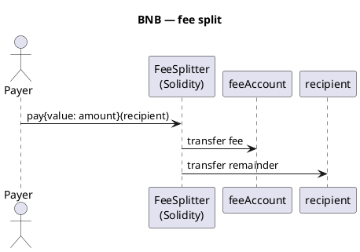

Cadeia BNB — visão geral
**BNB Smart Chain (BSC)** é uma rede **EVM-compatível** — mesmo modelo de conta e **Solidity** do Ethereum, mas o gás nativo é **BNB**. Projetos DeFi e token geralmente são implantados aqui por taxas mais baixas do que a rede principal Ethereum.

Trilha principal: [Visão geral do Cryptocurrency101](../../i-overview.md).

## Perfil de rede

| | **BNB Cadeia Inteligente** |
|---|----------------------|
| **Tipo** | Camada-1, EVM |
| **Idioma** | **Solidez** (primário) |
| **Ferramentas** | Capacete de segurança, fundição, remix, MetaMask |
| **Moeda nativa** | BNB |
| **Tokens** | BEP-20 (ERC-20 compatível) |
| **RPC exemplo** |`https://bsc-dataseed.binance.org`|

## Padrão de divisão de taxas

O pagador envia **BNB** para o contrato; o contrato envia **taxa** ao tesouro e **resto** ao destinatário.



## Exemplo - Solidez

```solidity
// SPDX-License-Identifier: MIT
pragma solidity ^0.8.20;

/// @notice Deduct feeBps from msg.value, send fee to feeAccount, rest to recipient.
contract FeeSplitter {
    address public immutable feeAccount;
    uint256 public immutable feeBps; // 100 = 1%

    event Paid(address indexed payer, address indexed recipient, uint256 fee, uint256 remainder);

    constructor(address _feeAccount, uint256 _feeBps) {
        require(_feeAccount != address(0), "zero fee account");
        require(_feeBps <= 10_000, "fee > 100%");
        feeAccount = _feeAccount;
        feeBps = _feeBps;
    }

    function pay(address payable recipient) external payable {
        require(msg.value > 0, "no value");
        require(recipient != address(0), "zero recipient");

        uint256 fee = (msg.value * feeBps) / 10_000;
        uint256 remainder = msg.value - fee;

        (bool feeOk, ) = feeAccount.call{value: fee}("");
        require(feeOk, "fee transfer failed");

        (bool payOk, ) = recipient.call{value: remainder}("");
        require(payOk, "recipient transfer failed");

        emit Paid(msg.sender, recipient, fee, remainder);
    }
}
```

| Linha | Função |
|------|------|
| **`feeBps / 10_000`** | Pontos base — 250 pontos base = 2,5% |
| **`call{value:}`** | Encaminhar nativo BNB |
| **`immutable`** | Configuração de taxa corrigida na implantação – use padrão de proxy se precisar de atualizações |

### BEP-20 variante (esboço)

Para **tokens**, use`IERC20.transferFrom`do pagador e depois dividir`amount`(não`msg.value`):

```solidity
function payToken(IERC20 token, address recipient, uint256 amount) external {
    require(token.transferFrom(msg.sender, address(this), amount), "pull failed");
    uint256 fee = (amount * feeBps) / 10_000;
    require(token.transfer(feeAccount, fee), "fee failed");
    require(token.transfer(recipient, amount - fee), "pay failed");
}
```

## Implantar e chamar (esboço do capacete de segurança)

```text
npx hardhat compile
npx hardhat run scripts/deploy.js --network bscTestnet
```

```javascript
// pay 1 BNB with 1% fee (100 bps)
await feeSplitter.pay(recipientAddress, { value: ethers.parseEther("1.0") });
```

## Implantar preços

Você paga **BNB gás uma vez** para publicar bytecode – sem taxa mensal de hospedagem. O contrato então fica em um **endereço** fixo em BSC.

| Artigo | Faixa típica (2026) | Notas |
|------|----------------------|-------|
| **Contrato simples** (FeeSplitter ~1–3 KB bytecode) | **~$0,50 – $5** USD | BSC piso de gás ~**0,05 gwei**; muito barato vs Ethereum |
| **DeFi complexo / proxy + lógica** | **$5 – $50+** | Mais argumentos de bytecode + construtor |
| **Cada`pay()`ligar** | **~$0,001 – $0,05** | Lógica de transferência simples, baixo teor de gás |
| **BSC rede de teste** | **$0** | Torneira BNB – sempre teste aqui primeiro |

### Como o custo é calculado

```text
deploy_cost_BNB = gas_used × gas_price_gwei × 1e-9
USD             ≈ deploy_cost_BNB × BNB_price
```

| Esboço de FeeSplitter | Gás aproximado |
|--------------------|-------------|
| Implantar | ~300.000 – 800.000 gás |
|`pay()`| ~50.000 – 80.000 gás |

**Estimativa antes da mainnet:**

```javascript
const gas = await ethers.provider.estimateGas({
  from: deployer.address,
  data: deployTx.data,
});
const fee = gas * gasPrice; // compare to wallet BNB balance
```

Ou no Hardhat: implantar script imprime gás usado. Use [rastreador de gás BscScan](https://bscscan.com/gastracker) para o gwei atual.

### O que não é uma taxa de implantação

| Custo | Parte da implantação? |
|------|-----------------|
| Auditoria de contrato | Não — serviços profissionais, $milhares |
| Domínio/site | Não — opcional fora da cadeia |
| Nó RPC (Alquimia, etc.) | Não — nível gratuito geralmente é suficiente para implantação |

## Comparar

| Rede | Mesma Solidez? |
|--------|----------------|
| [Tron](../tron/i-overview.md) | Muito semelhante (TVM) |
| [TON](../ton/i-overview.md) | Não - Tato |
| [Cardano (ADA)](../ada/i-overview.md) | Não - Aiken / UTXO |

## Próximo

[Tron](../tron/i-overview.md) — Solidez em TVM, ou retornar para [visão geral do Cryptocurrency101](../../i-overview.md).
