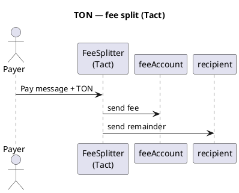

TON — visão geral
**A Rede Aberta (TON)** usa **TON VM**. Contratos de alto nível geralmente são escritos em **Tact** (recomendado) ou **FunC** de nível inferior. A moeda nativa é **TON**; tokens fungíveis são **Jettons**.

Trilha principal: [Visão geral do Cryptocurrency101](../../i-overview.md).

## Perfil de rede

| | **TON** |
|---|---------|
| **Tipo** | Camada 1, fragmentada (cadeias de trabalho) |
| **Idiomas** | **Tact** (principal para aplicativos), **FunC** (nível inferior) |
| **Ferramentas** | Projeto, TON SDK, Tonkeeper |
| **Moeda nativa** | TON (nanotons internamente) |
| **Tokens** | Jettons |

## Conta + modelo de mensagem

Os contratos se comunicam por **mensagens** (não apenas por chamadas externas). O valor recebido chega em **`context().value`**; você **envia** resultados com`send()`.

## Padrão de divisão de taxas



## Exemplo - Tato

```tact
import "@stdlib/deploy";

message Pay {
    recipient: Address;
}

/// Deduct feeBps from incoming TON, forward remainder to recipient.
contract FeeSplitter with Deployable {
    feeAccount: Address;
    feeBps: Int as uint16; // 100 = 1%

    init(feeAccount: Address, feeBps: Int) {
        self.feeAccount = feeAccount;
        self.feeBps = feeBps;
    }

    receive(msg: Pay) {
        let amount: Int = context().value;
        require(amount > 0, "no value");

        let fee: Int = amount * self.feeBps / 10_000;
        let remainder: Int = amount - fee;

        send(SendParameters{
            to: self.feeAccount,
            value: fee,
            mode: SendPayGasSeparately,
            bounce: false,
            body: empty()
        });

        send(SendParameters{
            to: msg.recipient,
            value: remainder,
            mode: SendPayGasSeparately,
            bounce: false,
            body: empty()
        });
    }

    // Optional: accept plain TON with default recipient in storage
    receive() {}
}
```

| Conceito | TON |
|--------|-----|
| **`context().value`** | TON anexado a esta mensagem |
| **`SendPayGasSeparately`** | Gás pago a partir do saldo do contrato — padrão comum |
| **Implantar** | Projeto:`npx blueprint run deployFeeSplitter`|

### FunC (nível inferior — esboço)

FunC usa mensagens **cell** e **send_raw_message** explícitas – mais clichê. Prefira o **Tact**, a menos que você mantenha contratos legados.

```text
;; FunC: same math — fee = amount * feeBps / 10000
;; two outbound messages with split values
```

## Divisão de taxas do Jetton (ideia)

1. O usuário envia a transferência do Jetton para a carteira do contrato.  
2. A carteira Contract Jetton recebe notificação.  
3. O contrato envia Jettons de taxa para a tesouraria e o restante para o destinatário (dois`transfer`mensagens).

Os fluxos Jetton adicionam contratos de carteira – comece primeiro com a divisão TON nativa.

## Implantar preços

TON cobra **gás** (computação) mais aluguel de **armazenamento** para código de contrato e dados na cadeia. Pago em **TON** — sem servidor separado.

| Artigo | Faixa típica (2026) | Notas |
|------|----------------------|-------|
| **Implantação de contrato Simple Tact** | **~$0,50 – $5** USD | Estilo FeeSplitter pequeno |
| **Jetton complexo + carteiras** | **$5 – $30+** | Vários contratos |
| **Cada entrada`Pay`mensagem** | **~$0,01 – $0,10** | Taxas futuras + atualização de armazenamento |
| **TON rede de teste** | **$0** | Torneira TON |

### Componentes de custo

```text
deploy  ≈  forward_fee + storage_fee (code cells) + execution
message ≈  gas for send() + value forwarded
```

| Componente | Significado |
|-----------|---------|
| **Taxa de armazenamento** | Custo único para armazenar bytecode na cadeia |
| **Taxa de cálculo** | VM etapas durante a implantação e cada mensagem |
| **Taxa de encaminhamento** | Pago por mensagens internas enviadas |

A saída de implantação do blueprint mostra **IT0__** estimado antes da transmissão:

```text
npx blueprint run deployFeeSplitter --testnet
# review "Total cost" in terminal
```

| FeeSplitter (Tato) | Ordem de grandeza |
|--------------------|-----|
| Implantar | ~0,05 – 0,5 TON |
| Um`Pay`manipulação | ~0,005 – 0,05 TON (excluindo valor encaminhado) |

Use [visualizador TON](https://tonviewer.com/) na testnet para inspecionar taxas de transação de implantação.

## Comparar

| | **TON** | **BNB /Tron** |
|---|---------|----------------|
| Idioma | Tato / DiversãoC | Solidez |
| Modelo | Mensagens + assíncronas | Chamada síncrona |

## Próximo

[Cardano (ADA)](../ada/i-overview.md) — UTXO / Aiken, [Exemplos — TON implantação de 2%](../../examples/iii-ton-two-percent-fee-split.md) ou [visão geral](../../i-overview.md).
