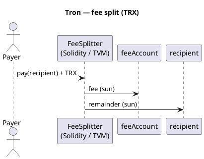

Tron – visão geral
**Tron** é uma rede **TVM** (Máquina Virtual Tron) — compatível com **Solidity** para a maioria dos contratos, com moeda nativa **TRX** e tokens **TRC-20**. Modelo de conta e espelho lógico de divisão de taxas [BNB Chain (EVM)](../bnb/i-overview.md).

Trilha principal: [Visão geral do Cryptocurrency101](../../i-overview.md).

## Perfil de rede

| | **Tron** |
|---|----------|
| **Tipo** | Camada-1, TVM (EVM-like) |
| **Idioma** | **Solidez** (0,5.x–0,8.x com ajustes Tron) |
| **Ferramentas** | Carteira TronBox, TronIDE, TronLink |
| **Moeda nativa** | TRX |
| **Tokens** | TRC-20 |
| **Energia / largura de banda** | TRX estaqueado ou TRX queimado para execução (não idêntico ao gás ETH) |

## Diferenças de BNB/Ethereum

| Tópico | Nota Tron |
|-------|-----------|
| **Formato de endereço** | Base58`T…`endereços (não`0x`em carteiras) |
| **`address payable`** | Mesmos padrões de solidez para transferência TRX |
| **Unidades** | 1 TRX = 1_000_000 sol |
| **Solidez** | Evite opcodes não suportados; teste na testnet do Nilo/Shasta |

## Padrão de divisão de taxas

Mesma regra de BNB: **taxa** → tesouraria, **resto** → destinatário.



## Exemplo — Solidez (TVM)

```solidity
// SPDX-License-Identifier: MIT
pragma solidity ^0.8.20;

contract TronFeeSplitter {
    address public immutable feeAccount;
    uint256 public immutable feeBps;

    constructor(address _feeAccount, uint256 _feeBps) {
        require(_feeAccount != address(0), "zero fee");
        require(_feeBps <= 10_000, "fee too high");
        feeAccount = _feeAccount;
        feeBps = _feeBps;
    }

    function pay(address payable recipient) external payable {
        require(msg.value > 0, "no trx");
        require(recipient != address(0), "zero recipient");

        uint256 fee = (msg.value * feeBps) / 10_000;
        uint256 remainder = msg.value - fee;

        (bool okFee, ) = feeAccount.call{value: fee}("");
        require(okFee, "fee failed");

        (bool okPay, ) = recipient.call{value: remainder}("");
        require(okPay, "pay failed");
    }
}
```

Implante com **TronBox** ou compile em **TronIDE** e depois chame`pay`com TRX anexado.

### TRC-20 divisão de taxas (esboço)

```solidity
function payTrc20(ITRC20 token, address recipient, uint256 amount) external {
    require(token.transferFrom(msg.sender, address(this), amount), "pull");
    uint256 fee = (amount * feeBps) / 10_000;
    require(token.transfer(feeAccount, fee), "fee");
    require(token.transfer(recipient, amount - fee), "pay");
}
```

## Fluxo de rede de teste

```text
1. TronLink wallet on Shasta / Nile testnet
2. Deploy FeeSplitter with feeAccount + feeBps (e.g. 100 = 1%)
3. pay(recipient) sending TRX — verify balances on Tronscan
```

## Implantar preços

Tron usa **Energia** e **Largura de banda**, não gás estilo ETH-. A implantação de um contrato **queima TRX** ou consome **energia apostada** — você ainda **não** executa um servidor para o contrato.

| Artigo | Faixa típica (2026) | Notas |
|------|----------------------|-------|
| **Implantação simples do Solidity** | **~$5 – $40** USD | Depende do tamanho do bytecode e do preço da energia |
| **Com TRX apostado para energia** | Menor queima de TRX | Participação TRX → cota diária de energia |
| **Cada`pay()`ligar** | **~$0,01 – $0,30** | Se o chamador não tiver largura de banda livre |
| **Rede de teste Shasta/Nilo** | **$0** | Torneira TRX |

### Modelo de energia (esboço)

```text
deploy_cost ≈ energy_used × energy_price (in TRX)
```

| Ação | Recurso |
|--------|----------|
| **Implantar contrato** | Alta **energia** (uma vez) |
| **TRC-20 transferência** | Energia + largura de banda |
| **TRX`call{value}`** | Energia para execução de TVM |

TronIDE / TronBox geralmente mostra **energia estimada** antes de confirmar. Verifique [Tronscan](https://tronscan.org/) para contabilizar energia e largura de banda.

| Esboço de FeeSplitter | Ordem de grandeza |
|--------------------|------------------|
| Implantar | ~50M – 150M de energia (varia de acordo com a otimização) |
|`pay()`| ~30k – 100k de energia |

**Dica:** Na testnet, solicite o faucet TRX e implante duas vezes – compare a energia no tx de criação do contrato Tronscan.

### versus BNB

| | **Tron** | **BSC** |
|---|----------|-----|
| Token de taxa | TRX / energia | BNB gás |
| Implantação simples | Frequentemente **maior** que BSC | Geralmente **mais barato** EVM-like |
| UX | Barra de energia TronLink | MetaMask gwei |

## Comparar

| | **Tron** | **BNB** |
|---|----------|-----|
| Idioma | Solidez | Solidez |
| Gás | Energia/largura de banda | BNB gás |
| Carteira UX | TronLink | MetaMask |

## Próximo

[TON](../ton/i-overview.md) - Tato, [Exemplos - implantação de Tron 2%] (../../examples/ii-tron-two-percent-fee-split.md) ou [Visão geral do Cryptocurrency101](../../i-overview.md).
