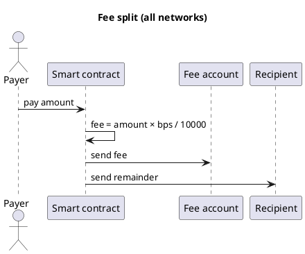

Cryptocurrency101 — Parte V: Padrão de divisão de taxas
Cada página de **rede** nesta faixa implementa a mesma regra de negócios: dividir um pagamento recebido em uma **taxa de protocolo** e um **resto do destinatário**.

## 1. A regra

```text
Incoming payment (amount)
  → fee       = amount × feeBps / 10000   → feeAccount
  → remainder = amount - fee              → recipient
```

| Prazo | Significado |
|------|---------|
| **`feeBps`** | Comissão em **pontos base** (100 pontos de base = 1%) |
| **`feeAccount`** | Carteira de tesouraria/protocolo |
| **`recipient`** | Fim do beneficiário |



## 2. Como as redes o implementam

| | **BNB / Tron (EVM/TVM)** | **TON** | **Cardano (eUTXO)** |
|---|--------------------------|---------|---------------------|
| **Modelo** | Conta -`msg.value`| Valor da mensagem + envios | **Saídas** devem dividir o valor |
| **Idioma** | Solidez | Tato | Aiken / Plutus |
| **Modo de falha** |`require`/ reverter | Código de rejeição/saída | Falha na validação da fase 2 |

**EVM cadeias (BNB, Tron)** parecem quase iguais no código - as diferenças são RPC, token de gás e ferramentas.

Os validadores **Cardano** **verificam** se as **saídas** de uma transação dividem o valor corretamente - a lógica parece diferente de`msg.value`em Solidez.

Veja [Tipos de blockchains](iv-types-of-blockchains.md) para o modelo mental conta vs UTXO.

## 3. Taxas matemáticas para usuários

Para valor de pagamento **A** e taxa de taxa **bps**:

```text
fee       = A × bps / 10000
remainder = A - fee
```

| O usuário envia | Comportamento contratual |
|------------|-------------------|
| **Muito pouco** (`msg.value < intended A`) | Ainda pode ser executado - dividido em **real**`msg.value`|
| **Zero** | Reverter —`require(msg.value > 0)`em EVM |
| **Valor suficiente, sem token de gás** | Falha na transferência — consulte [Transações e fundos com falha](vii-failed-transactions-and-funds.md) |

**UX dica:** Mostre **“Você paga: A + taxa de rede estimada ~X”** no dApp antes de confirmar.

## 4. Páginas de rede

| Rede | Página |
|--------|------|
| BNB Cadeia | [BNB — visão geral](networks/bnb/i-overview.md) |
| Tron | [Tron – visão geral](networks/tron/i-overview.md) |
| TON | [TON — visão geral](networks/ton/i-overview.md) |
| Cardano | [Cardano — visão geral](networks/ada/i-overview.md) |

## 5. Exemplos de implantação completa (2% aplicativo / 98% para)

| Exemplo | Pilha |
|--------|--------|
| [Tron – divisão de taxas de 2%](examples/ii-tron-two-percent-fee-split.md) | Solidez, TronBox,`pay(toAccount)`|
| [TON — divisão de taxas de 2%](examples/iii-ton-two-percent-fee-split.md) | Tato, Projeto,`Pay{ toAccount }`|

## 6. Relacionado

- **Parte IV** — [Tipos de blockchains](iv-types-of-blockchains.md)
- **Parte VI** — [Implantação e hospedagem](vi-deploy-pricing-and-hosting.md)
- **Parte VII** — [Transações e fundos com falha](vii-failed-transactions-and-funds.md)
