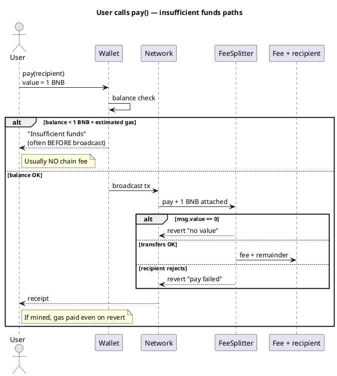

Cryptocurrency101 — Parte VII: Transações falhadas e fundos insuficientes
As falhas na rede muitas vezes **ainda custam taxas**. Os usuários precisam de **dois** baldes de dinheiro na maioria das redes: **valor do pagamento** e **taxa de rede** — confundi-los é o erro mais comum de “fundos insuficientes”.

Consulte **Parte III** [Como as transações são armazenadas](iii-how-transactions-are-stored.md) para mempool vs on-chain.

## 1. Transações falhadas – você ainda paga?

**Geralmente sim** para qualquer coisa que tenha alcançado a rede e consumido a execução — mas **o quanto** difere por cadeia e tipo de falha.

| Resultado | BNB / Tron (EVM/TVM) | TON | Cardano |
|--------|-----------|-----|--------|
| **Rejeitado antes da transmissão** | **Não** taxa na rede | **Não** | **Não** |
| **Revertido na cadeia** (`require`falhou) | **Sim** — gás utilizado para reverter | **Sim** — cálculo do trabalho realizado | **Sim** — taxa de transferência se incluída no bloco |
| **Tx inválido** (assinatura incorreta, nonce) | **Não** — não incluído | **Não** | **Não** |

```text
EVM rule of thumb:
  fee = gas_used × gas_price
  gas_used includes work done BEFORE revert
  "Out of gas" → still pay for gas attempted (capped)
```

| Exemplo | Quem paga | Por que |
|--------|----------|-----|
| Chamadas de usuário`pay()`mas`require(msg.value > 0)`falha | **Chamador** | Tx extraído, revertido |
| Implantar tx fica sem gás | **Implantador** | A implantação parcial ainda pode custar |
| Tx nunca sai do mempool (taxa baixa) | **Ninguém** | Não incluído no bloco |
| Falha na validação da fase 2 do Cardano | **Remetente** | Taxa frequentemente cobrada uma vez no bloco |

**Implicação de design:** falhou`pay()`as tentativas ainda custam gasolina – mantenha os cheques baratos e teste na testnet.

**Não é o mesmo que:** retenções de autorização de cartão de crédito — as taxas da rede geralmente **não são reembolsadas** na reversão.

## 2. Fundos insuficientes — dois baldes (EVM / BNB / Tron)

```text
wallet balance = BNB or TRX

To call pay(recipient) { value: 1 BNB }:
  need  1 BNB     → forwarded via contract to feeAccount + recipient
  plus  ~0.0001+ BNB → gas / energy (never reaches recipient)
```

| Situação | O que acontece | Taxa na rede cobrada? |
|-----------|--------------|------------|
| **Saldo < msg.valor** | Carteira **bloqueia** enviar | **Não** |
| **Saldo = msg.value exatamente** | Pode **falhar** (sem gás) | **Muitas vezes sim** se incluído |
| **Saldo abrange apenas gás, valor = 0** |`require`**reverter** | **Sim** se extraído |
| **Saldo do implantador < gás de implantação** | A implantação falha | Normalmente **não** se a carteira simular |



## 3. Por rede

| Rede | “Fundos insuficientes” geralmente significa | Mensagem típica |
|--------|----------------------------------|-----------------|
| **BNB/Tron** | BNB/TRX <`value`+ gás/energia | MetaMask/TronLink |
| **TON** | TON < valor da mensagem + encaminhamento + gás | Tonkeeper |
| **Cardano** | ADA < saídas + taxa + **min-ADA** | A compilação falha na carteira |

**Tron:** Baixa **energia** — pode queimar mais TRX; mantenha o buffer.

**Cardano:** O construtor falha **antes** de enviar se as entradas não puderem cobrir as saídas – muitas vezes **sem** taxa na cadeia.

## 4. Deficiências do desenvolvedor/implantador

| Função | Déficit | Resultado |
|------|-----------|--------|
| **Implantador** | Não é suficiente para implantar tx | Cancelado na carteira |
| **Usuário** | Não é suficiente para`pay()`| Veja tabelas acima |
| **Caminho do token** | Não`approve`| Reverter ativado`transferFrom`|

## 5. Lista de verificação de prevenção

| Verifique | Onde |
|-------|--------|
|`balance >= amount + estimateGas(...)`| dApp antes de assinar |
|`staticCall`/simular com o mesmo`value`| Capturas revertem |
| Mostrar detalhamento de taxas (protocolo + rede) | UI cópia |
| Teste`balance = amount + 1 wei`na rede de teste | Reproduz sem gás deixado |
| Símbolo:`approve`+ saldo ≥ valor | ERC-20 / TRC-20 |

## 6. Relacionado

- **Parte V** — [Padrão de divisão de taxas](v-fee-split-pattern.md)
- **Parte VIII** — [Verificar antes da transmissão](viii-verify-before-broadcast.md)
- **Parte IX** — [Verifique se está seguro e concluído](ix-verify-safe-and-completed.md)
