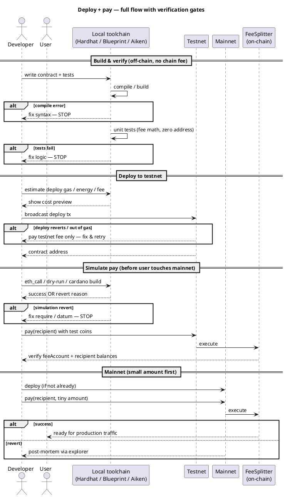
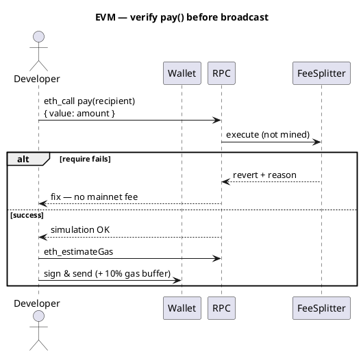
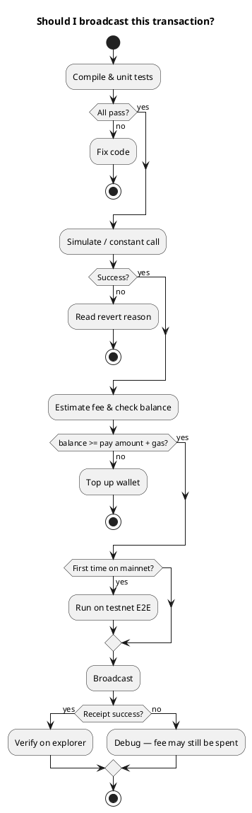

Cryptocurrency101 — Parte VIII: Verifique antes da transmissão
Capture a maioria dos erros de lógica e configuração **antes** de pagar as taxas da mainnet: **compilar → testar → simular → testnet → mainnet**.

Você não pode garantir **zero** falhas (congestionamento, bugs de carteira, MEV), mas tudo o que resta do **Broadcast** nos diagramas abaixo é **gratuito ou barato para testnet**.

## 1. Sequência de ponta a ponta



## 2. Lista de verificação pré-voo

| Etapa | O que você verifica | Ferramenta / como | Falha antes da cadeia? |
|------|-----------------|------------|---------------------|
| **1. Compilar** | Sintaxe, tipos, tamanho do bytecode |`hardhat compile`,`blueprint build`,`aiken build`| **Sim** |
| **2. Testes unitários** | Taxa matemática, endereço zero rejeitado | Capacete de segurança, fundição, Aiken | **Sim** |
| **3. Análise estática** | Reentrada, transbordamento | Slither, Mythril (opcional) | **Sim** |
| **4. Revisão de configuração** |`feeAccount`,`feeBps ≤ 10000`| Revisão de código | **Sim** |
| **5. Simular chamada** | Tx teria sucesso sem enviar |`eth_call`,`triggerConstantContract`,`cardano-cli build`| **Sim** |
| **6. Estimar custo** | Moeda nativa suficiente + margem de gás |`estimateGas`, estimativa de energia | **Sim** |
| **7. Carteira / nonce** | Rede correta, equilíbrio | MetaMask, TronLink, Tonkeeper | **Sim** se bloqueado |
| **8. Rede de teste E2E** | Implantar +`pay()`+ saldos | BSC testnet, Shasta, pré-produção | Barato |
| **9. Canário da rede principal ** | Um pequeno real`pay()`| Explorador da rede principal | Custa taxa real |

## 3. Simulação EVM (BNB / Tron)



```javascript
// Hardhat / ethers — dry-run before send
await contract.pay.staticCall(recipient, { value: amount });
const gas = await contract.pay.estimateGas(recipient, { value: amount });
await contract.pay(recipient, { value: amount, gasLimit: gas * 110n / 100n });
```

## 4. Ferramentas por rede

| Rede | Simular/ensaio | Rede de teste | Explorador |
|---------|-------------------|---------|----------|
| [BNB](networks/bnb/i-overview.md) |`eth_call`,`staticCall`, Fundição | BSC rede de teste | BscScan |
| [Tron](networks/tron/i-overview.md) |`triggerConstantContract`| Shasta / Nilo | Tronscan |
| [TON](networks/ton/i-overview.md) | Projeto,`@ton/sandbox`| TON rede de teste | Visualizador de tons |
| [ADA](networks/ada/i-overview.md) |`cardano-cli transaction build`, Lúcido | Pré-produção/visualização | Cardanoscan |

## 5. Motivos comuns de reversão (FeeSplitter)

| Verificação do contrato | Erro do usuário | Simulação pega? |
|----------------|-------------|---------------------|
|`msg.value > 0`| Envia 0 moeda nativa | **Sim** |
|`recipient != address(0)`| Endereço zero | **Sim** |
|`payOk`/falha na transferência | Destinatário rejeita | **Sim** na testnet |
| Sem gás | Limite de gás muito baixo | **estimateGas** ajuda |
| Rede errada | Rede principal vs rede de teste | Carteira UI |
| Saldo insuficiente | Valor + gás | **Muitas vezes antes** da transmissão — [Parte VII](vii-failed-transactions-and-funds.md) |

## 6. Portas de decisão



## 7. Relacionado

- **Parte VII** — [Transações e fundos com falha](vii-failed-transactions-and-funds.md)
- **Parte IX** — [Verifique se está seguro e concluído](ix-verify-safe-and-completed.md)
- **Parte VI** — [Implantação e hospedagem](vi-deploy-pricing-and-hosting.md)
