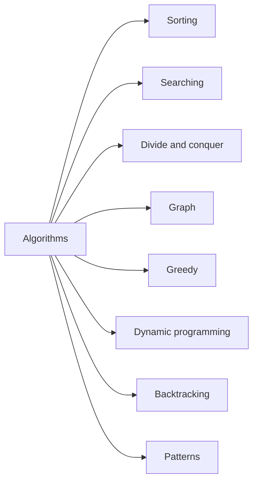

Algoritmos — visão geral
Um **algoritmo** é um procedimento finito passo a passo que recebe **entradas** e produz **saída**. Em CS101 você se preocupa com três perguntas: **Está correto?** **Quanto tempo?** **Quanta memória?**

**Java linha de base:** trechos de código usam **Java SE 22** (`javac --release 22`); eles também são executados em **JDK 21 LTS**.

## 1. Correção vs eficiência
- **Correção:** para cada entrada válida, a saída corresponde à definição do problema (geralmente provada por **invariante** ou **indução**).
- **Eficiência:** medida com **notação assintótica** — **O**, **Θ**, **Ω** — ignorando fatores constantes e termos de ordem inferior para grandes **n**.
- **O pior caso** é o padrão usual no curso, a menos que o problema solicite um custo **médio** ou **amortizado**.

| Símbolo | Significado (informal) |
|--------|-------------------|
| **O(f(n))** | Não cresce mais rápido que **f** (limite superior) |
| **Θ(f(n))** | Limite apertado - mesma ordem de **f** |
| **Ω(f(n))** | Cresce pelo menos tão rápido quanto **f** (limite inferior) |

## 2. Famílias de algoritmos comuns (mapa)



| Família | Idéia | Exemplos neste submenu |
|--------|------|------------------------|
| **Classificação** | Organizar as chaves em ordem | classificação por mesclagem, classificação rápida, heapsort |
| **Pesquisando** | Encontre um alvo | pesquisa linear, pesquisa binária |
| **Dividir e conquistar** | Dividir, resolver, combinar | classificação por mesclagem, pesquisa binária |
| **Gráfico** | Percorrer ou otimizar em **V, E** | BFS, DFS, Dijkstra |
| **Ganancioso** | Melhor escolha local | seleção de atividades, MST |
| **Programação dinâmica** | Subestrutura ótima + subproblemas sobrepostos | mochila, LCS, editar distância |
| **Retrocesso** | Explore escolhas, desfaça em caso de falha | N-queens, subconjuntos |
| **Padrões** | Reutilizar expressões idiomáticas em arrays/strings | dois ponteiros, janela deslizante |

**Estruturas de dados** (matriz, lista, pilha, fila, heap, tabela hash, armazenamento de gráfico) ficam no submenu **Estruturas de dados**; **algoritmos** são os **procedimentos** que os utilizam.

## 3. Como ler uma afirmação de complexidade
- **O(n log n)** comparações de classificação para classificações baseadas em comparação (limite inferior para classificações de comparação geral).
- **O(n)** BFS/DFS em um gráfico armazenado como listas de adjacência quando **n = |V|**, **m = |E|** — geralmente escrito **O(n + m)**.
- **Espaço** conta a memória **extra** além da entrada (a saída nem sempre é contada).

## 4. Aprenda o algoritmo, resolva com o JDK
1. **Estude** a versão enrolada à mão em cada nota (merge sort, loop BFS, tabela de mochila).
2. **Enviar** com **`java.util`** / **`Arrays`**:`Arrays.sort`,`Arrays.binarySearch`,`HashMap`,`ArrayDeque`,`PriorityQueue`.
3. O JDK fornece operações de mapa **O(1) amortizadas**, operações de heap **O(log n)** e classificação **O(n log n)** — você escreve o **loop específico do problema**, e não outro heap do zero.

**problema completo → API** tabelas e exemplos de copiar e colar: **[Resolvendo com o JDK](xi-solving-with-the-jdk.md)**.

## 5. Pseudocódigo → hábito Java
1. Indique **tamanho de entrada** **n** (ou **n, m** para gráficos).
2. Nomeie a **invariante de loop** ou **recorrência**.
3. Implementar com tipos claros; prefira estruturas de biblioteca ao ensinar ADTs (`Queue`,`PriorityQueue`,`Arrays.sort`).

```java
// Compile: javac --release 22 …
/** Return index of target in sorted arr, or -1. See iii-searching.md */
public static int binarySearch(int[] arr, int target) {
  int lo = 0;
  int hi = arr.length - 1;
  while (lo <= hi) {
    int mid = lo + (hi - lo) / 2;
    if (arr[mid] == target) {
      return mid;
    }
    if (arr[mid] < target) {
      lo = mid + 1;
    } else {
      hi = mid - 1;
    }
  }
  return -1;
}
```

## 6. Notas relacionadas
- **Resolvendo com o JDK** [Resolvendo com o JDK](xi-solving-with-the-jdk.md) — folha de dicas para produção Java.
- Submenu **Estruturas de dados** — pilhas, filas, heaps, gráficos.
- **Nível V — Paradigmas e limites** [Paradigmas e limites](../v-paradigms-and-limits.md) - teoria: provas gananciosas, DP vs dividir e conquistar, NP-dureza.
- **Nível III — Gráficos** (`iii-graphs.md`) — modelagem de gráficos em nível de curso.
