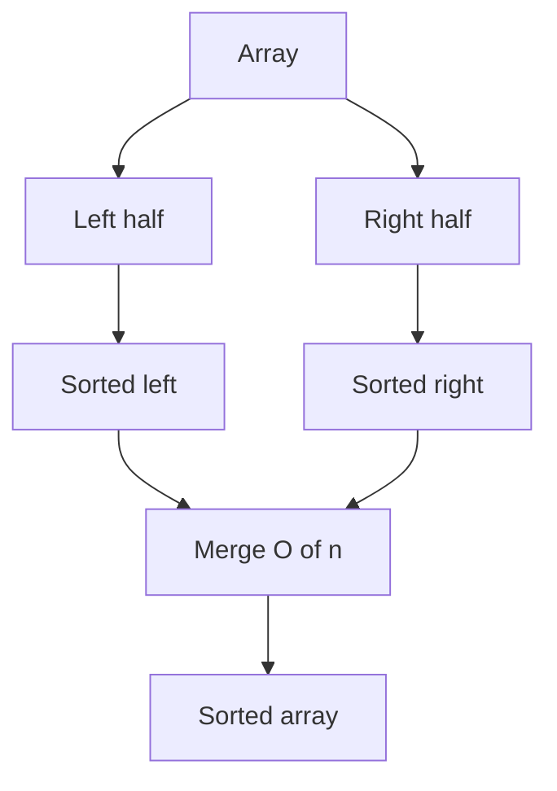
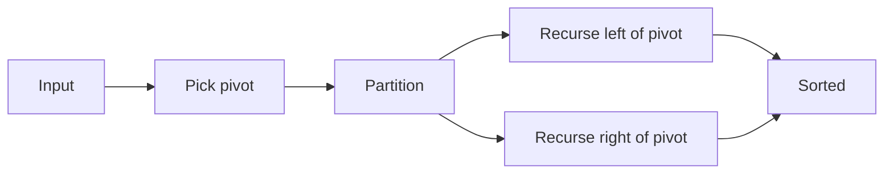

Classificando
Organize os elementos em ordem **não decrescente** (ou por um **`Comparator`**). **Classificações por comparação** usam apenas **comparar** — sem estrutura de chave especial.

## 1. Classificações de comparação (resumo)

| Algoritmo | Melhor | Média | Pior | Espaço extra | Estável? |
|-----------|------|---------|-------|-------------|---------|
| Bolha / inserção | Sobre(n) | O(n²) | O(n²) | O(1) | Sim |
| Seleção | O(n²) | O(n²) | O(n²) | O(1) | Não |
| Mesclar classificação | O(n log n) | O(n log n) | O(n log n) | Sobre(n) | Sim |
| Classificação rápida | O(n log n) | O(n log n) | O(n²) | Pilha O(log n) | Não |
| Sortimento | O(n log n) | O(n log n) | O(n log n) | O(1) | Não |

**Estável:** chaves iguais mantêm sua ordem de entrada relativa. **No local:** O(1) extra além da pilha de recursão.

**Java:**`Arrays.sort(int[])`usa **quicksort de pivô duplo**;`Arrays.sort(Object[])`usa **TimSort** (mesclagem + inserção, estável).

## 2. Classificação por mesclagem (dividir e conquistar)
1. **Divida** o array em metades até o tamanho 1.
2. **Conquistar** — os singletons são classificados.
3. **Combinar** — mescla duas metades classificadas em tempo **O(n)**.



**Tempo Θ(n log n)**; **espaço Θ(n)** para um buffer auxiliar típico.

```java
// Compile: javac --release 22 …
public static void mergeSort(int[] a, int[] buf, int lo, int hi) {
  if (hi - lo < 2) {
    return;
  }
  int mid = lo + (hi - lo) / 2;
  mergeSort(a, buf, lo, mid);
  mergeSort(a, buf, mid, hi);
  merge(a, buf, lo, mid, hi);
}

private static void merge(int[] a, int[] buf, int lo, int mid, int hi) {
  System.arraycopy(a, lo, buf, lo, hi - lo);
  int i = lo;
  int j = mid;
  int k = lo;
  while (i < mid && j < hi) {
    if (buf[i] <= buf[j]) {
      a[k++] = buf[i++];
    } else {
      a[k++] = buf[j++];
    }
  }
  while (i < mid) {
    a[k++] = buf[i++];
  }
  while (j < hi) {
    a[k++] = buf[j++];
  }
}
```

## 3. Classificação rápida
Escolha um **pivô**, **partição** para que os elementos ≤ pivô fiquem à esquerda, > pivô à direita, recursivos em ambos os lados.



- **Média Θ(n log n)**; **pior Θ(n²)** se o pivô for sempre mínimo/máximo (entrada classificada com regra de pivô incorreta).
- **Mitigação:** pivô aleatório, mediana de três ou mudança para classificação por inserção em intervalos pequenos.

```java
// Compile: javac --release 22 …
public static void quickSort(int[] a, int lo, int hi) {
  if (lo >= hi) {
    return;
  }
  int p = partition(a, lo, hi);
  quickSort(a, lo, p);
  quickSort(a, p + 1, hi);
}

private static int partition(int[] a, int lo, int hi) {
  int pivot = a[hi - 1];
  int i = lo;
  for (int j = lo; j < hi - 1; j++) {
    if (a[j] <= pivot) {
      int tmp = a[i];
      a[i] = a[j];
      a[j] = tmp;
      i++;
    }
  }
  int tmp = a[i];
  a[i] = a[hi - 1];
  a[hi - 1] = tmp;
  return i;
}
```

## 4. Heapsort
1. **Construa** um heap máximo na matriz (**O(n)** de baixo para cima).
2. Troque repetidamente a raiz pela última posição não classificada e **sink** root — **O(log n)** por etapa → **O(n log n)** total.

Usa o **heap binário** ADT [heap binário](../data-structures/viii-binary-heap.md); **no local** se você heapificar o próprio array.

## 5. Quando usar qual
- **Uso geral em Java:**`Arrays.sort`.
- **Precisa de estabilidade em objetos:**`Arrays.sort(Object[])`ou classificação de mesclagem explícita.
- **Classificação externa (dados no disco):** classificação por mesclagem — passagens sequenciais.
- **Top-k/ordem parcial:** heap ou`PriorityQueue`, não tipo completo.

## 6. Resolvendo com o JDK (já implementado)

Você raramente escreve mesclagem/classificação rápida no código do aplicativo — chame a biblioteca depois de escolher **primitivo vs objeto** e **estável vs instável**.

```java
// Compile: javac --release 22 …
import java.util.Arrays;
import java.util.Comparator;
import java.util.PriorityQueue;

int[] a = { 5, 2, 8, 2 };
Arrays.sort(a); // dual-pivot quicksort for primitives

Integer[] boxed = { 5, 2, 8 };
Arrays.sort(boxed, Comparator.reverseOrder()); // TimSort, stable

// Top-k largest without sorting entire array — O(n log k)
int k = 3;
PriorityQueue<Integer> minHeap = new PriorityQueue<>();
for (int x : a) {
  minHeap.offer(x);
  if (minHeap.size() > k) {
    minHeap.poll();
  }
}
```

| Necessidade | API |
|------|-----|
| Organizar`int[]`-&#09;o`double[]`|`Arrays.sort`|
| Organizar`Object[]`ou`List`|`Arrays.sort`,`list.sort(Comparator)`,`Collections.sort`|
| Pedido personalizado |`Comparator.comparing`,`comparingInt`,`reverseOrder`|
| Apenas k maior/menor |`PriorityQueue`tamanho **k** |

Mais exemplos: **[Resolvendo com o JDK](xi-solving-with-the-jdk.md)**.
