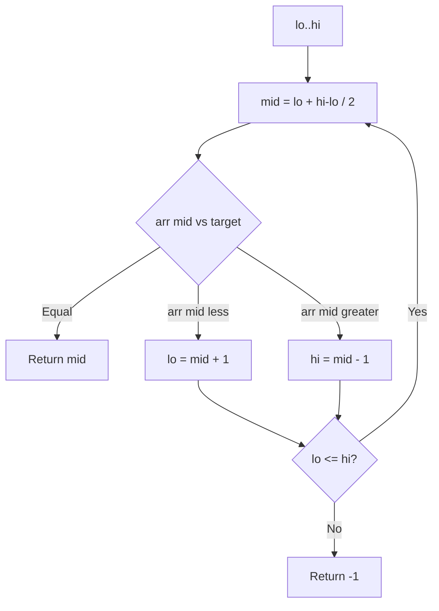

Procurando
Descubra se um **alvo** existe (ou onde ele está) em uma coleção.

## 1. Pesquisa linear
Digitalize de uma extremidade até encontrar o alvo ou esgotar a estrutura.

- **Tempo O(n)** — **n** elementos.
- **Espaço O(1)** extra.
- Funciona em **qualquer** pedido; funciona em listas **vinculadas** sem acesso aleatório.

```java
// Compile: javac --release 22 …
public static int linearSearch(int[] a, int target) {
  for (int i = 0; i < a.length; i++) {
    if (a[i] == target) {
      return i;
    }
  }
  return -1;
}
```

## 2. Pesquisa binária
Requer uma matriz **classificada** (ou ordenada por`Comparator`).

- **Tempo O(log n)** — reduza pela metade o intervalo de pesquisa em cada etapa.
- **Espaço O(1)** iterativo; **O(log n)** pilha de recursão se recursiva.

**Invariante:** se o alvo estiver presente, seu índice estará em`[lo, hi]`.



```java
// Compile: javac --release 22 …
import java.util.Arrays;

public static int binarySearchSorted(int[] sorted, int target) {
  int idx = Arrays.binarySearch(sorted, target);
  return idx >= 0 ? idx : -1;
}

/** Same logic without Arrays.binarySearch — useful for interviews. */
public static int binarySearchManual(int[] sorted, int target) {
  int lo = 0;
  int hi = sorted.length - 1;
  while (lo <= hi) {
    int mid = lo + (hi - lo) / 2;
    if (sorted[mid] == target) {
      return mid;
    }
    if (sorted[mid] < target) {
      lo = mid + 1;
    } else {
      hi = mid - 1;
    }
  }
  return -1;
}
```

**Erro comum:**`mid = (lo + hi) / 2`pode transbordar em alguns idiomas; usar **`lo + (hi - lo) / 2`**.

## 3. Pesquisa binária na resposta (padrão)
Quando o problema pede o **mínimo x** tal que um predicado`P(x)`muda de falso para verdadeiro (monótono), pesquisa binária em **x** em um intervalo - não em índices de array.

Exemplos: primeira versão ruim, capacidade de envio de pacotes em dias D, velocidade mínima de alimentação.

## 4. Pesquisa baseada em hash
Com uma **tabela hash** [tabela hash](../data-structures/x-hash-table.md), inserção e pesquisa média **O(1)** — nenhuma ordem de classificação é necessária; pior caso **O(n)** sem um bom hash.

| Método | Pré-condições | Tempo |
|--------|---------------|------|
| Linear | Nenhum | Sobre(n) |
| Binário | Ordenado | O(logn) |
| Hash | Chaves hasháveis ​​| O(1) média |

## 5. Resolvendo com o JDK (já implementado)

```java
// Compile: javac --release 22 …
import java.util.Arrays;
import java.util.HashMap;
import java.util.HashSet;
import java.util.List;
import java.util.Map;

int[] sorted = { 1, 3, 5, 7 };
int idx = Arrays.binarySearch(sorted, 5); // 2 if present

List<String> names = List.of("ada", "bob");
boolean has = names.contains("ada");           // O(n) on list
Map<String, Integer> index = new HashMap<>();  // O(1) average lookup
index.put("ada", 0);
index.get("ada");

Set<Integer> seen = new HashSet<>();
for (int x : data) {
  if (!seen.add(x)) {
    // duplicate
  }
}
```

| Tarefa | JDK |
|------|-----|
| Pesquisa de matriz classificada |`Arrays.binarySearch`(classificar primeiro) |
| Associação à lista |`list.contains`, ou`HashSet`para muitas consultas |
| Chave → valor |`HashMap.get`,`getOrDefault`,`containsKey`|
| Contar ocorrências |`Collections.frequency`(lista) ou`Map.merge`|

**Entrevista vs produção:** conheça o loop de pesquisa binária manual; em projetos ligue **`Arrays.binarySearch`** em dados classificados.
