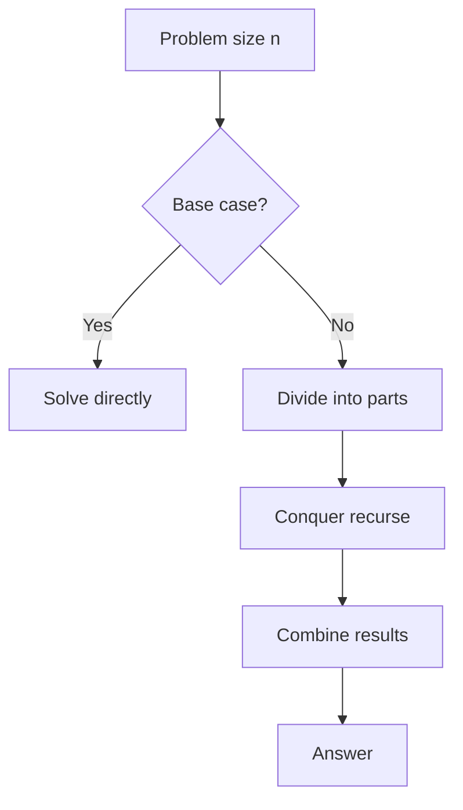

Dividir e conquistar
**Receita:** divida o problema em subproblemas menores, resolva-os (geralmente de forma recursiva), **combine** os resultados.

## 1. Modelo
1. **Caso base** — pequenos **n** resolvidos diretamente.
2. **Dividir** — divide a entrada em **a** partes de tamanho aproximadamente **n/b**.
3. **Conquistar** — recursão em cada parte.
4. **Combinar** — mesclar respostas parciais em **O(n)** ou similar.



Exemplos: **merge sort**, **pesquisa binária**, **subarray máximo** (caso de ponto médio cruzado), **Karatsuba** multiplicação (avançado).

## 2. Recorrência (esboço)
Muitos algoritmos satisfazem **T(n) = a T(n/b) + f(n)**:

- **a** = número de subproblemas por chamada.
- **n/b** = tamanho do subproblema.
- **f(n)** = dividir + combinar custo.

**Classificação de mesclagem:** **a = 2**, **b = 2**, **f(n) = Θ(n)** → **T(n) = Θ(n log n)**.

**Pesquisa binária:** um subproblema de metade do tamanho, **O(1)** trabalho → **T(n) = T(n/2) + O(1) = O(log n)**.

O **Teorema Mestre** (veja [Paradigmas e limites](../v-paradigms-and-limits.md)) classifica muitas dessas recorrências sem expandir a árvore de recursão.

## 3. Submatriz máxima (Kadane vs dividir e conquistar)
**Kadane** (varredura linear) é a solução prática **O(n)**:

```java
// Compile: javac --release 22 …
/** Largest sum of any contiguous subarray. */
public static int maxSubarraySum(int[] a) {
  int best = a[0];
  int cur = a[0];
  for (int i = 1; i < a.length; i++) {
    cur = Math.max(a[i], cur + a[i]);
    best = Math.max(best, cur);
  }
  return best;
}
```

Versão **Dividir e conquistar**: a soma máxima está inteiramente na metade esquerda, na metade direita ou **cruzando** o meio - recursiva nas metades e combinada com uma varredura de cruzamento **O(n)**. Ainda **O(n log n)** geral; ensina a etapa **combinar**.

## 4. Quando dividir e conquistar não é suficiente
Se os subproblemas **se sobrepõem** (o mesmo subproblema é resolvido muitas vezes), a recursão pura desperdiça trabalho — use **memoização** ou **tabulação** (**programação dinâmica**, [programação dinâmica](viii-dynamic-programming.md)).

| Subproblemas sobrepostos? | Abordagem típica |
|------------------------|------------------|
| Não | Dividir e conquistar |
| Sim | Programação dinâmica |

## 5. Resolvendo com o JDK (já implementado)

Dividir e conquistar na natureza consiste principalmente em **chamadas de biblioteca** mais sua lógica de **combinar**:

```java
// Compile: javac --release 22 …
import java.util.Arrays;

// "Conquer" half — binary search on sorted half
int[] sorted = { 1, 4, 9, 16 };
int i = Arrays.binarySearch(sorted, 9);

// "Combine" step often needs sorted halves
Arrays.sort(leftHalf);
Arrays.sort(rightHalf);
// then merge with a loop, or System.arraycopy + merge

// Max subarray — Kadane is O(n); no JDK one-liner, but simple loop (see §3)
```

| Idéia de D&C | JDK ajudante |
|----------|------------|
| Intervalo classificado de pesquisa |`Arrays.binarySearch`|
| Classifique os subintervalos antes da mesclagem |`Arrays.sort(from, to)`|
| Bloco de cópia |`System.arraycopy`,`Arrays.copyOfRange`|
