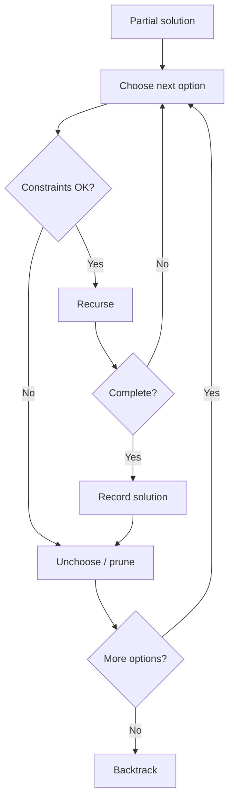

Retrocesso
**Tentativa e erro sistemáticos:** crie uma solução candidata passo a passo; quando uma escolha leva a um beco sem saída, **desfaça** (retroceda) e tente a próxima opção.

Mesma ideia de **DFS** em uma **árvore de estado** implícita de decisões.

## 1. Modelo
1. **Escolha** — tome uma decisão.
2. **Recurse** — resolva o resto.
3. **Desmarcar** — restaurar estado (retroceder).



Freqüentemente, podar ramificações antecipadamente com **restrições** (soluções parciais inválidas).

```java
// Compile: javac --release 22 …
import java.util.ArrayList;
import java.util.List;

/** All subsets of {0, 1, …, n-1} as bit-style lists. */
public static void subsets(int n, int start, List<Integer> cur, List<List<Integer>> out) {
  out.add(new ArrayList<>(cur));
  for (int i = start; i < n; i++) {
    cur.add(i);
    subsets(n, i + 1, cur, out);
    cur.remove(cur.size() - 1);
  }
}
```

## 2. Problemas clássicos

| Problema | Estado | Poda |
|--------|-------|---------|
| **Subconjuntos/combinações** | Incluir ou pular cada elemento | Nenhum ou limite de tamanho |
| **Permutações** | Bandeiras usadas em elementos | — |
| **N-queens** | Posicionamento de coluna linha por linha | Não há ataque de duas rainhas |
| **Sudoku** | Opções de células vazias | Conflitos de linha/coluna/caixa |
| **Coloração de gráfico** | Colorir próximo vértice | As cores adjacentes diferem |

## 3. N-queens (esboço)
Coloque as rainhas linha por linha; na linha **r**, tente cada coluna **c** não atacada pelas rainhas anteriores.

```java
// Compile: javac --release 22 …
public static void nQueens(int n, int row, int[] cols, List<int[]> solutions) {
  if (row == n) {
    solutions.add(cols.clone());
    return;
  }
  for (int c = 0; c < n; c++) {
    if (safe(cols, row, c)) {
      cols[row] = c;
      nQueens(n, row + 1, cols, solutions);
    }
  }
}

private static boolean safe(int[] cols, int row, int col) {
  for (int r = 0; r < row; r++) {
    if (cols[r] == col || Math.abs(cols[r] - col) == row - r) {
      return false;
    }
  }
  return true;
}
```

## 4. Complexidade
O pior caso geralmente é **exponencial** no fator de ramificação × profundidade - o retrocesso é para espaços de pesquisa **pequenos** ou **poda pesada**.

## 5. Retrocesso vs DP
- **Retrocesso:** enumere **todas** as configurações válidas (ou conte-as).
- **DP:** quando subproblemas **se sobrepõem** e você precisa de **valor ideal**, nem toda listagem de soluções.

## 6. Resolvendo com o JDK (já implementado)

Retrocesso é **recursão personalizada**; o JDK ajuda com **contêineres** e **contabilidade**:

```java
// Compile: javac --release 22 …
import java.util.ArrayList;
import java.util.Collections;
import java.util.List;

List<Integer> path = new ArrayList<>();
List<List<Integer>> answers = new ArrayList<>();

path.add(choice);
backtrack(/* … */);
path.remove(path.size() - 1); // unchoose

// Try candidates in different order (heuristic)
List<Integer> candidates = new ArrayList<>(List.of(1, 2, 3));
Collections.shuffle(candidates); // needs Random seed for reproducibility
```

| Necessidade de retrocesso | JDK |
|-------------------|-----|
| Caminho atual |`ArrayList`|
| Todas as soluções |`List<List<T>>`|
| Bandeiras usadas |`boolean[]`,`HashSet`|
| Copiar estado |`new ArrayList<>(path)`,`Arrays.copyOf`|

**Permutações/combinações** apenas para **n** minúsculos: existem bibliotecas, mas as entrevistas esperam o modelo **recursivo** em §1.
