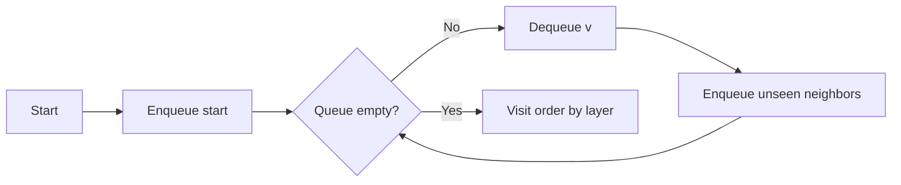
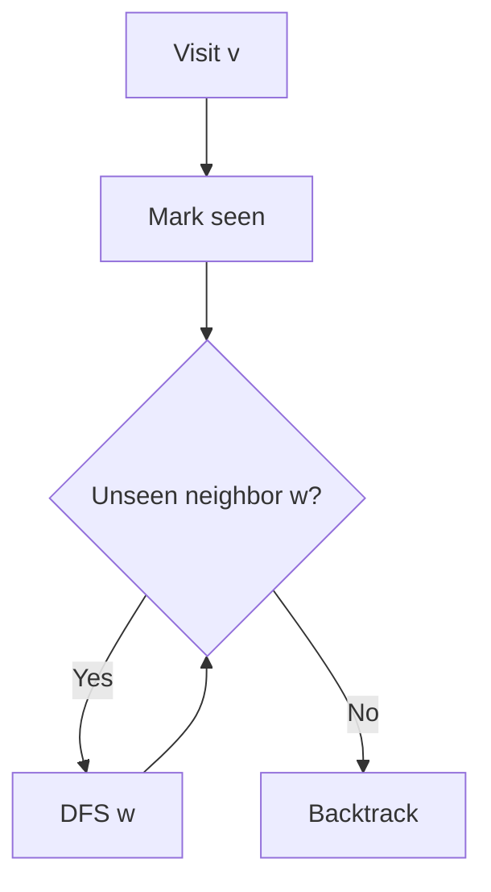

Percurso gráfico - BFS e DFS
Em um gráfico **G = (V, E)**, a travessia visita os vértices sistematicamente. Armazene o gráfico como uma **lista de adjacências** para gráficos esparsos — **O(n + m)** espaço e tempo para travessias quando **n = |V|**, **m = |E|**.

Consulte **Gráfico** [Gráfico](../data-structures/xi-graph.md) e **Nível III — Gráficos** (`iii-graphs.md`).

## 1. Pesquisa ampla (BFS)
Explore em **camadas** por distância (em bordas **não ponderadas**, contagem de saltos).

- **Queue** ADT — enfileira vizinhos, desenfileira atual [Queue](../data-structures/v-queue.md).
- **Tempo O(n + m)** com listas de adjacências.
- **Usos:** caminho mais curto em gráficos **não ponderados**, ordem de nível, conectividade.



```java
// Compile: javac --release 22 …
import java.util.ArrayDeque;
import java.util.ArrayList;
import java.util.List;
import java.util.Queue;

public static List<Integer> bfsOrder(List<List<Integer>> adj, int start) {
  int n = adj.size();
  boolean[] seen = new boolean[n];
  List<Integer> order = new ArrayList<>();
  Queue<Integer> q = new ArrayDeque<>();
  seen[start] = true;
  q.offer(start);
  while (!q.isEmpty()) {
    int v = q.poll();
    order.add(v);
    for (int w : adj.get(v)) {
      if (!seen[w]) {
        seen[w] = true;
        q.offer(w);
      }
    }
  }
  return order;
}
```

**Comprimento de caminho mais curto (não ponderado):** armazenar`dist[v]`quando descoberto pela primeira vez;`dist[w] = dist[v] + 1`.

## 2. Pesquisa em profundidade (DFS)
Vá **fundo** antes de retroceder — **pilha** ou **recursão**.

- **Tempo O(n + m)**.
- **Usos:** detecção de ciclo, classificação topológica, componentes conectados, exploração de labirinto.



```java
// Compile: javac --release 22 …
import java.util.ArrayList;
import java.util.List;

public static void dfsRecursive(List<List<Integer>> adj, int v, boolean[] seen, List<Integer> order) {
  seen[v] = true;
  order.add(v);
  for (int w : adj.get(v)) {
    if (!seen[w]) {
      dfsRecursive(adj, w, seen, order);
    }
  }
}
```

**Iterativo DFS** usa um explícito`Deque`como uma pilha (`push`-&#09;o`pop`no mesmo fim).

## 3. BFS versus DFS

| | BFS | DFS |
|--|-----|-----|
| Estrutura | Fila | Pilha/recursão |
| Caminho mais curto não ponderado | Sim | Não (a menos que seja atingido pela sorte) |
| Memória em gráficos largos | Pode ser uma grande fronteira | Somente profundidade do caminho |
| Ordenação topológica | Não | Sim (com estado extra) |

## 4. Classificação topológica (DAG)
**Gráfico acíclico direcionado** — ordene os vértices para que cada aresta vá **avançar** na ordem.

- **Kahn (BFS):** remova vértices repetidamente com **no grau 0**.
- **DFS:** ordem de término (pós-ordem reversa).

Se você não conseguir processar todos os vértices, o gráfico terá um **ciclo**.

## 5. Componentes conectados
Execute BFS ou DFS de cada vértice não visitado; cada execução rotula um **componente** (não direcionado) ou **conjunto alcançável** (direcionado).

## 6. Resolvendo com o JDK (já implementado)

Não há **não**`Graph.bfs()`na biblioteca padrão. Você mantém uma **lista de adjacências** (`List<List<Integer>>`ou`Map`) e use JDK **queues** / **sets**:

```java
// Compile: javac --release 22 …
import java.util.ArrayDeque;
import java.util.ArrayList;
import java.util.HashSet;
import java.util.List;
import java.util.Queue;
import java.util.Set;

// BFS — Queue from ArrayDeque (FIFO)
Queue<Integer> q = new ArrayDeque<>();
Set<Integer> seen = new HashSet<>();
seen.add(start);
q.offer(start);

// DFS iterative — Deque as stack
ArrayDeque<Integer> stack = new ArrayDeque<>();
stack.push(start);

// Track visited / in-degree for topo
int[] indegree = new int[n];
List<Integer> topo = new ArrayList<>();
```

| Função | JDK tipo |
|------|----------|
| Fronteira FIFO (BFS) |`Queue`+`ArrayDeque`|
| Pilha (DFS) |`ArrayDeque` `push`-&#09;o`pop`|
| Conjunto visitado |`HashSet`,`boolean[]`|
| Lista de vizinhos |`List<List<Integer>>`,`Map<Integer, List<Integer>>`|

**Classificação topológica:** Algoritmo de Kahn = **`Queue`** + matriz de graus; nenhum único`Collections.topologicalSort`.

Consulte **[Fila](../data-structures/v-queue.md)**, **[Pilha](../data-structures/iv-stack.md)** e **[Resolvendo com o JDK](xi-solving-with-the-jdk.md)**.
