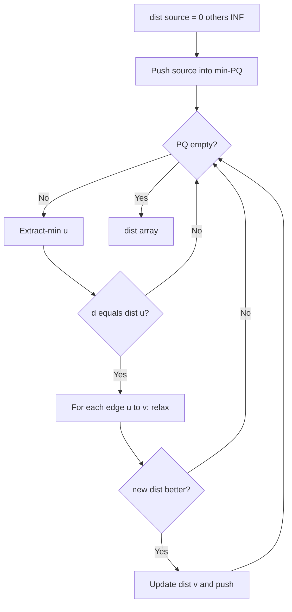

Caminhos mais curtos e árvores de abrangência mínima
Gráficos ponderados: arestas carregam **custo** ou **distância**.

## 1. Caminhos mais curtos de fonte única

| Algoritmo | Gráfico | Pesos | Tempo (típico) |
|-----------|-------|---------|----------------|
| **BFS** | Qualquer | Todos iguais (sem ponderação) | O(n +m) |
| **Dijkstra** | Dirigido/não direcionado | **Não negativo** | O((n + m) log n) com heap binário |
| **Bellman-Ford** | Qualquer | Permite negativo (sem ciclos negativos) | O(nm) |

### Dijkstra (pesos não negativos)
Ganancioso: sempre resolva o vértice não resolvido **mais próximo** usando uma fila de **prioridade mínima** [Fila de prioridade](../data-structures/ix-priority-queue.md).



```java
// Compile: javac --release 22 …
import java.util.Arrays;
import java.util.PriorityQueue;

/** adj.get(u) = list of (neighbor, weight); non-negative weights only. */
public static int[] dijkstra(List<List<int[]>> adj, int source) {
  int n = adj.size();
  int[] dist = new int[n];
  Arrays.fill(dist, Integer.MAX_VALUE);
  dist[source] = 0;
  PriorityQueue<int[]> pq = new PriorityQueue<>((a, b) -> Integer.compare(a[1], b[1]));
  pq.offer(new int[] { source, 0 });
  while (!pq.isEmpty()) {
    int[] cur = pq.poll();
    int u = cur[0];
    int d = cur[1];
    if (d != dist[u]) {
      continue;
    }
    for (int[] edge : adj.get(u)) {
      int v = edge[0];
      int w = edge[1];
      int nd = d + w;
      if (nd < dist[v]) {
        dist[v] = nd;
        pq.offer(new int[] { v, nd });
      }
    }
  }
  return dist;
}
```

**Não** execute Dijkstra em gráficos com pesos de aresta **negativos** sem ajuste — em vez disso, use **Bellman–Ford**.

## 2. Caminhos mais curtos para todos os pares (apenas nomes)
- **Floyd–Warshall:** **O(n³)**, programação dinâmica em triplos — gráficos densos, pequeno **n**.
- **Johnson:** reponderar + Dijkstra de cada vértice — gráficos esparsos com possíveis negativos (avançado).

## 3. Árvore geradora mínima (MST)
**Não direcionado**, conectado, ponderado: escolha **n − 1** arestas conectando todos os vértices com **peso total mínimo**, **sem ciclos**.

| Algoritmo | Idéia | Tempo |
|-----------|------|------|
| **Kruskal** | Classificar bordas; adicione se não houver ciclo (union–find) | O(m log m) |
| ** Primordial ** | Cresça uma árvore desde o início; sempre adicione a borda mais barata à árvore | O((n + m) log n) com heap |

Ambos são **gananciosos**; provas de correção usam **propriedade de corte** / **argumento de troca** [Greedy](vii-greedy.md).

## 4. Quando usar o quê
- **Mapas / roteamento (não negativo):** Dijkstra.
- **arbitragem de moeda (detecção de ciclo negativo):** Bellman–Ford.
- **Design de rede (conectar todos os sites de forma barata):** MST (Kruskal ou Prim).

## 5. Resolvendo com o JDK (já implementado)

**Dijkstra** e **Prim** usam **`PriorityQueue`** (pilha binária em JDK). **Kruskal** usa **`Arrays.sort`** nas arestas + **union–find** (você ainda implementa UF ou usa uma pequena classe auxiliar).

```java
// Compile: javac --release 22 …
import java.util.Arrays;
import java.util.Comparator;
import java.util.PriorityQueue;

// Min-heap for Dijkstra / Prim — already in §1
PriorityQueue<int[]> pq = new PriorityQueue<>(
    Comparator.comparingInt(e -> e[1]));

// Kruskal: sort edges by weight, then union–find scan
record Edge(int u, int v, int w) {}
Edge[] edges = { /* … */ };
Arrays.sort(edges, Comparator.comparingInt(Edge::w));

// Multi-source BFS (unweighted) — one Queue per wave or one BFS with Queue
```

| Algoritmo | JDK blocos de construção |
|-----------|---------------------|
| BFS (mais curto não ponderado) |`ArrayDeque`,`Queue`|
| Dijkstra / Prim |`PriorityQueue`,`Comparator`|
| Kruskal |`Arrays.sort`, union–find (personalizado ~20 linhas) |
| Borda não negativa relaxa |`Math.min`sobre`int[] dist`|

Bibliotecas de terceiros (por exemplo, JGraphT) adicionam algoritmos gráficos completos; **CS101** e entrevistas esperam que você escreva o **loop curto** usando **`PriorityQueue`**.
