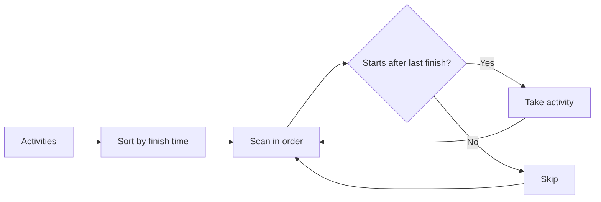

Algoritmos gananciosos
Em cada etapa, escolha a opção **melhor localmente** que parece boa agora — **sem** revisitar escolhas anteriores.

**Quando funciona:** você pode provar que a escolha local é segura (argumento de troca, matróide ou teorema conhecido). **Quando falha:** um contra-exemplo em que o ganancioso erra o ótimo global (por exemplo, **0/1 mochila** — use DP).

Veja também **Nível V — Paradigmas** [Paradigmas e limites](../v-paradigms-and-limits.md).

## 1. Problemas clássicos

| Problema | Regra gananciosa | Notas |
|--------|-------------|-------|
| Seleção de atividades | Escolha a atividade compatível com **acabamento** mais antiga | Ordenar por hora de término |
| Codificação Huffman | Mesclar dois símbolos menos frequentes | Usa min-heap |
| Mochila fracionada | Considere os itens pela relação **valor/peso** | Ótimo; A versão 0/1 não é gananciosa |
| MST (Prim/Kruskal) | Borda segura mais barata | [Caminhos mais curtos & MST](vi-shortest-paths-and-mst.md) |
| Dijkstra | Estabeleça a menor distância provisória | Necessita de pesos não negativos |

## 2. Seleção de atividades (esboço)
Classifique as atividades por **horário de término**. Faça a próxima atividade que **começa após** o último término escolhido.



```java
// Compile: javac --release 22 …
import java.util.Arrays;
import java.util.Comparator;

record Activity(int start, int finish) {}

public static int maxActivities(Activity[] acts) {
  Arrays.sort(acts, Comparator.comparingInt(Activity::finish));
  int count = 0;
  int lastFinish = Integer.MIN_VALUE;
  for (Activity a : acts) {
    if (a.start() >= lastFinish) {
      count++;
      lastFinish = a.finish();
    }
  }
  return count;
}
```

## 3. Hábito de prova
1. **Propriedade de escolha gananciosa:** alguma solução ideal pode usar a primeira escolha gananciosa.
2. **Subestrutura ideal:** após essa escolha, resolva o resto de forma otimizada.

Se a etapa 1 falhar, tente **DP** ou **branch and bind**.

## 4. Programação gananciosa versus programação dinâmica

| | Ganancioso | DP |
|--|--------|-----|
| Escolhas | Um passo comprometido | Explorar tabela de subproblemas |
| Subproblemas | Geralmente não sobrepostos | Sobreposição |
| Tempo | Frequentemente classificação + varredura linear | Freqüentemente pseudo-polinomial ou O(n²) |
| Exemplo de vitória | MST, Huffman | Mochila 0/1, LCS |

## 5. Resolvendo com o JDK (já implementado)

O código ganancioso geralmente é **sort** + **uma passagem** + às vezes um **heap**:

```java
// Compile: javac --release 22 …
import java.util.Arrays;
import java.util.Comparator;
import java.util.PriorityQueue;

// Activity selection — sort then scan (see §2)
Activity[] acts = { /* … */ };
Arrays.sort(acts, Comparator.comparingInt(Activity::finish));

// Huffman-style "always take two smallest" — min-heap
PriorityQueue<Integer> pq = new PriorityQueue<>();
pq.offer(3);
pq.offer(1);
int a = pq.poll();
int b = pq.poll();

// Fractional knapsack — sort by ratio
record Item(int w, int v) {}
Item[] items = { /* … */ };
Arrays.sort(items, Comparator.comparingDouble(it -> -(double) it.v / it.w));
```

| Passo ganancioso | JDK |
|------------|-----|
| Solicitar candidatos |`Arrays.sort`,`Comparator`|
| Pegue repetidamente o menor |`PriorityQueue`|
| Pegue o máximo atual |`Collections.max`,`stream().max`|
